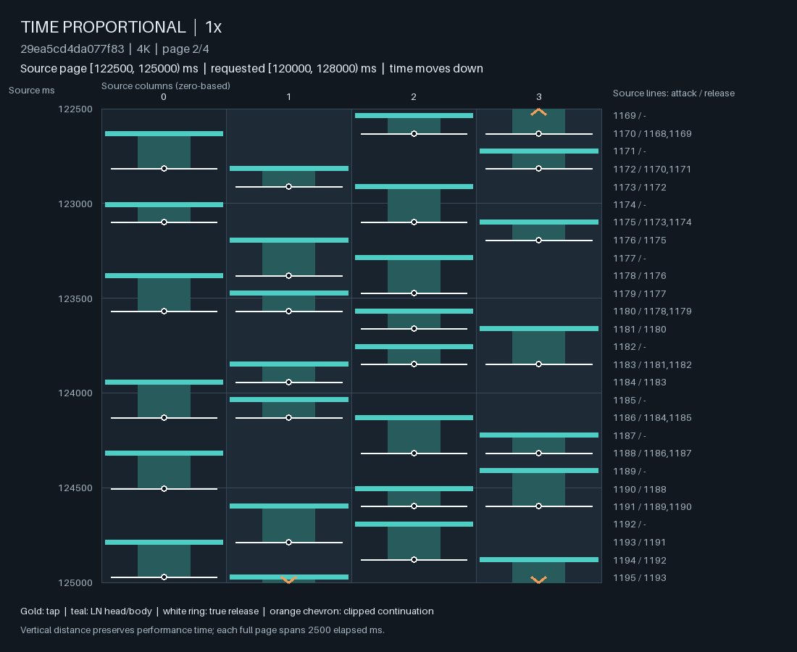
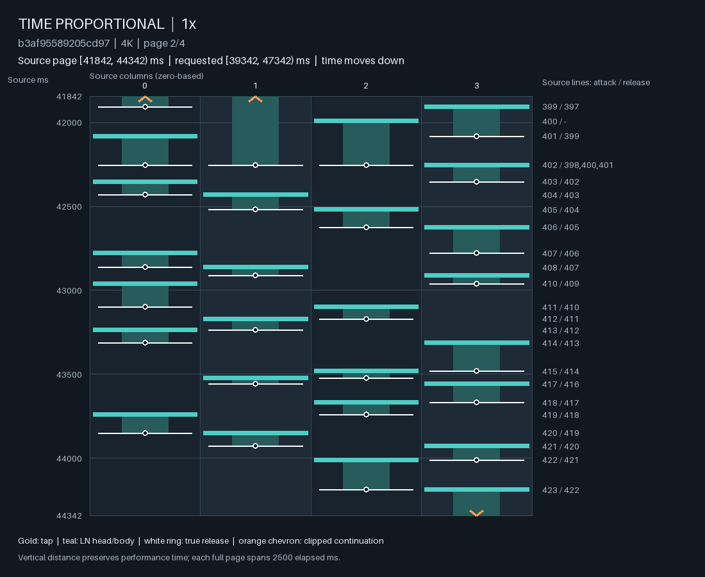
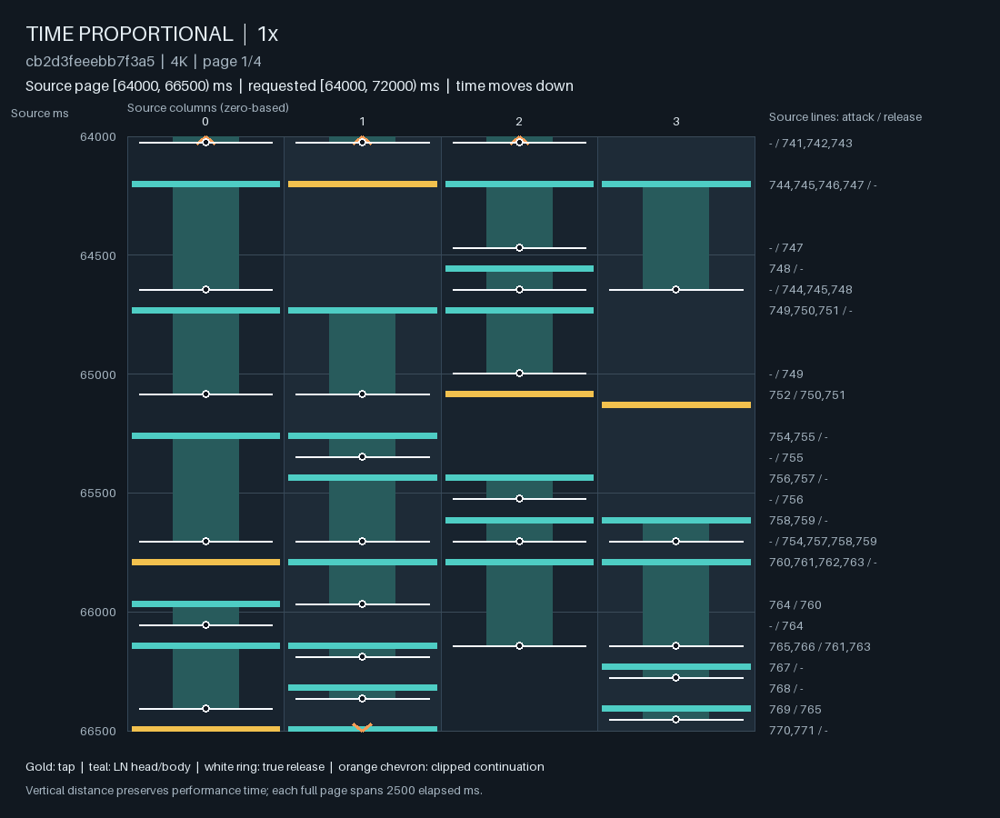
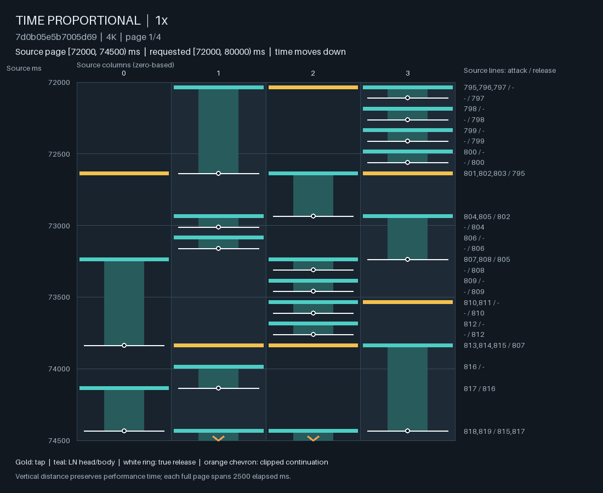
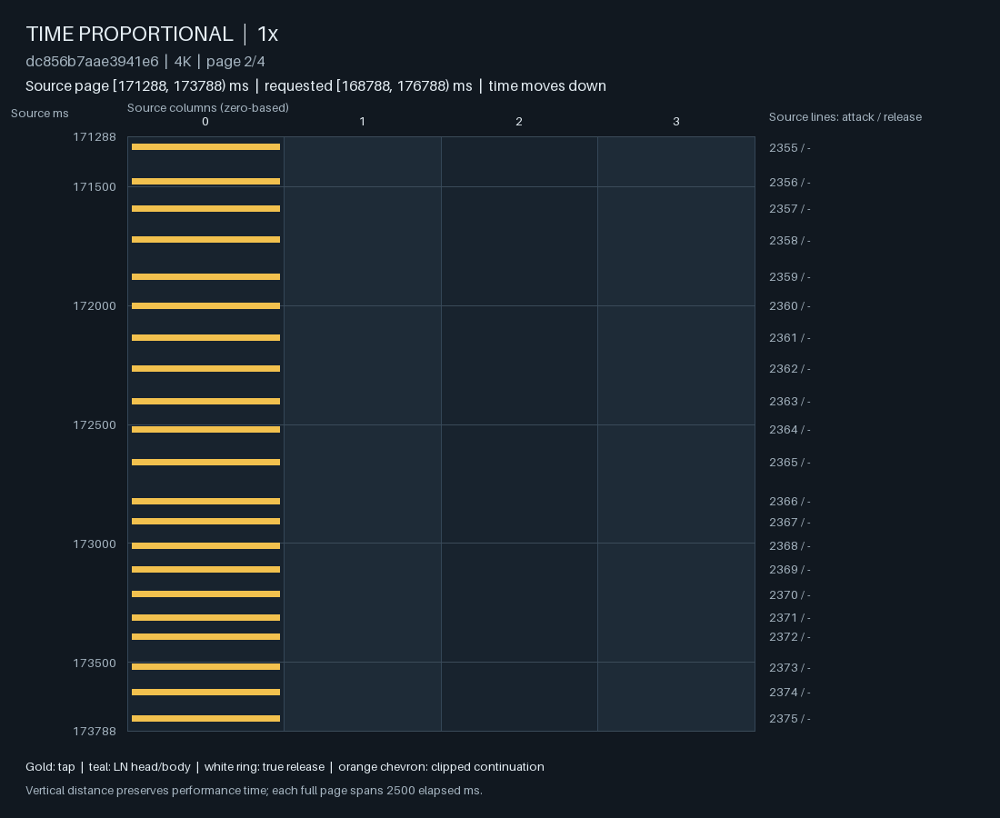
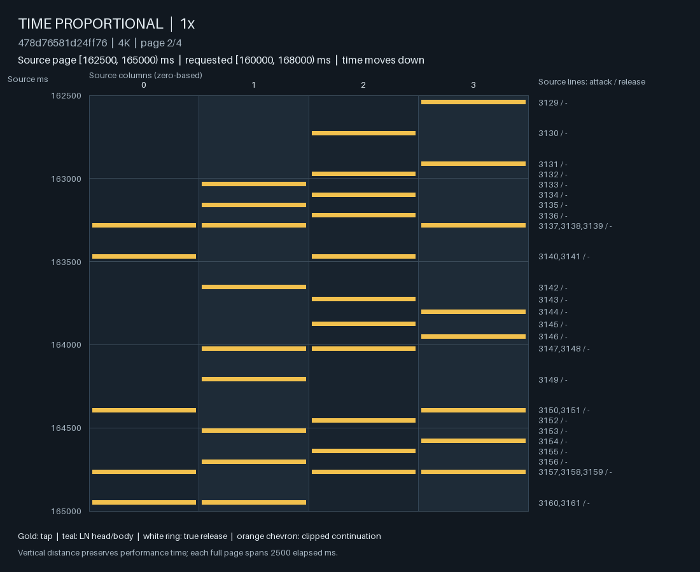

# 从手指协调轨迹理解 continuation 与 frontier

约 4★ 的生成仍会出现持续单指连打、细碎 LN、难以跟随的释放关系。只把这些现象分别转换成阈值，会遗漏共同问题：玩家已经在执行一组有时序关系的动作，下一段要求怎样延续、打断或重组它？稳定的重复可以减少协调转换，同时也可以让执行负担持续集中；短 LN 可以形成清楚的节奏，长 LN 也可以与其他手指的动作发生困难的冲突。

本研究主张把**从当前状态继续完成动作轨迹的需求**作为 continuation 的建模对象。它仍是待校准的研究假设，不是一个已经从数据识别出的生理模型。按 [V3 formulation](../formulation/gameplay-state.md)，固定四键手指映射、成功执行、左右对称；不推断个人肌肉疲劳、疼痛、失误或替代指法。

目前已经确认三处具体缺口：现有星级目标存在对 LN 释放组织完全不敏感的方向；局部 `frontier2` 没有独立的未来响应语义；实际 continuation 选择只使用攻击 excess，未利用它已经记录的释放与协调观察。真实谱面的对照则支持更具体的假设：应保留手指角色、动作先后与共同时间关系，而不能只保留频率、持有比例和当前占用。它们尚未确定各训练阶段对失败的因果百分比。

## 1. 对照的对象与证据范围

核心症状来自 mapper 的实际反馈：低难生成有过短 LN、释放后很快再按、连续变化且难跟随的 LN 长度，以及 Stream 请求下压力向 long jack 集中；音乐呼吸和多指压力变化不足。这里将这些作为需要解释的观察，不把“所有不等长 LN 都困难”或“所有 ranked 片段都容易”设为标签。

代码范围是 `de5d560ce06ca0185087488b982e15cab394b136`。生成对象来自
[H 音频条件交互研究](head_audio_control_interaction.md)的 additive、modulated 两个终点；两者均未晋级。它们共用父模型、完整音频、R/R1 权重和训练窗口，只对 H 进行匹配学习。均关闭 LN amount feedback，使用 HH/RH/HR 为 60/25/21 ms 的研究支持，保留已有 row preference。因此这里的 LN／long-jack 失败不需要以 LN feedback 开启为前提；但也不是 raw neural law 的无修正采样。

参考集为既有 ranked TRAIN 分组中的 **6,924 张谱**，重新计算 20241007 版本的星级后均在 2–6★。保留原始时间、列和 LN 端点，得到 **125,590 个不重叠八秒窗口**；无解析／重叠排除。按整谱星级分段，2–3、3–4、4–5、5–6★ 分别为 2,558、2,301、1,611、454 张。这不是全部 ranked 谱面的普查，也没有纳入原来的 held-out song groups。

整谱星级记作 $D_{\rm map}$。窗口 $[a,b)$ 的 $D_W$ 使用
[完整前缀 strain trace](../../src/ensomi_model/research/typed_audio_continuation/difficulty_targets.py)，继承进入窗口的 strain，以最多 400 ms 的区间峰值加权并作时长归一；它不是官方局部星级。LN fraction $\rho_W$ 是窗口中 LN heads／全部 heads，平均占用 $\bar o_W$ 是四列持有时间之和除以窗口长度。

先固定六个生成八秒片段，再检索相近 $D_{\rm map},D_W$ 的真实窗口；另一组检索同时匹配 $\rho_W,\bar o_W$ 和 H 频率。下表是后一组的最近邻。匹配近似而非严格相等，音频与编排也不同，不能把一个差异直接解释为难度的因果效应。

| 生成窗口，ms；请求均为 D4 | 生成 $D_{\rm map}/D_W$ | Ranked 对照；beatmap ID；窗口，ms | 对照 $D_{\rm map}/D_W$ |
| --- | ---: | --- | ---: |
| Modulated Blizzard，39342–47342 | 4.3803 / 2.5278 | Shizuku [Marble soda]；4185651；120000–128000 | 4.4491 / 2.6529 |
| Additive Blizzard，同上 | 4.3492 / 3.0303 | Non-breath oblige；4148629；32000–40000 | 4.3446 / 3.0687 |
| Modulated STYX，2300–10300 | 3.9356 / 3.0137 | Cafe + M!lk + Chocolate [Hot Chocolate {Insane}]；3880856；64000–72000 | 3.9036 / 3.0602 |
| Modulated Classic，87589–95589 | 3.7719 / 3.2092 | Kanzen ShouriEsper Girl [Esper]；4144572；104000–112000 | 3.8219 / 3.2794 |
| Modulated Stream Zenithfall，16657–24657 | 4.8915 / 2.7620 | INTERNET OVERDOSE [BLESSING]；3678786；40000–48000 | 4.8517 / 2.7981 |
| Additive Trill，168788–176788 | 5.4134 / 2.8901 | Swirls of the Stream [Glissumeru]；3866394；160000–168000 | 5.3369 / 2.9109 |

另检索同难度／占用邻域内释放关系复杂的真实窗口，防止只挑整齐的正例。六个生成、六个最近邻、五个反例共 17 个上下文，**68 页 Lens 图均已读完**。图与动作表保留进入的 hold、原始尾巴和相邻动作；时间向下，列从零开始，金色为 TAP，青色为 LN，白圈为实际 release，橙色为跨图延续。本研究没有新的人类片段标注、音频聆听判断或 playtest。

## 2. 真实低难 LN 的组织，比长度直方图更有信息

### 不同起点可以共享一个结束动作

Shizuku 对照八秒内有 23 个至少两指共同释放的时刻，其中 22 个来自不同起点；对应生成只有 2 个，均来自不同起点。Non-breath oblige 有 26 个共同释放时刻，其中 19 个不同起点；对应生成为 8／6。这里不是简单要求四列平均，也不是要求 LN 等长：**不同长度可能恰好把不同起点收束到同一协调动作**。

例如 Shizuku 中，列 2 在 121880 ms 按下、列 1 在 121973 ms 按下，两者在 122067 ms 共同释放；随后列 1／2 在 122161／122255 ms 进入，于 122348 ms 共同释放。持续时间不同，但两指反复形成相近的进入—收束关系。读起来应是连续的手内／手间组织，而非若干独立长度。



对应生成仍能产生较长 anchor 和局部共同释放，不能描述为完全没有组织。但更多尾巴跟随不同 H 逐个出现；其完整八秒内所有 release 都与某个 H 重合。**因此“消除离开 H 的 release”甚至无法改变这个问题案例。** 需要看头尾怎样组合成多指动作，以及 H 本身的节奏。



Hot Chocolate 对照提供另一种结构。65261、65437、65614 ms 分批进入的四列，在 65702 ms 一起释放；68261、68349、68437 ms 进入的三列，在 68525 ms 一起释放。中间可以包含短动作、TAP 和角色交换。生成 STYX 也有持久 anchor，但那不足以说明周围进入／释放的接续关系已经学好。



共同释放数量不是质量分数。它受 chord 数、LN 数和风格影响；最近邻的 head 数也没有严格匹配。这里的作用是指出模型需要表达的一种联合关系，而不是把该计数写成奖励。

### 短 LN 和独立释放也可以构成正常的协调节奏

特意检索的 Until the end of time [Himitsu's Hyper]，beatmap 3937519，在
$[72000,80000)$ ms 的整谱／窗口读数为 **3.6435／3.0843**。该窗口结束的 55 个 LN 中，34 个为 75 ms，其余为 150、300、600 ms。图中短 LN 成组重复，另一指持续持有，随后角色转移；75 ms release→下一 LN 的间隔也确实存在。



Someone In The Crowd [Soulmate]，beatmap 2910941，整谱 **4.4467★**，在
$[240000,248000)$ ms 中也有 58 ms LN 后隔 59 ms 再按同列 LN，以及长 anchor 配合其他指的 TAP／LN。Bedroom community [Eternal Slumber]，beatmap 3036683，整谱 **3.8466★**，所读窗口有不少独立 release，却没有共同释放组。

这些是故意搜出的复杂反例，不代表平均低难组织。它们说明长度、release 是否在 H 上、共同释放频率，都不能单独成为 BAD 标签。更有解释力的问题是：短动作是否形成可持续的节奏，当前持有角色是否允许这种交换，改变这些关系时有没有足够的时间。

### 统计上不突出的边际，也可能组成问题轨迹

Modulated Blizzard 的匹配邻域仅有 15 个窗口；其短 LN 比例等边际观察并不超出真实范围，release 不在 H 上的比例更是零。相反，Classic 的 release 距 H 不超过 40 ms、但不重合的比例为 .1290，在 2,424 个邻域窗口中高于约 99.1%。后者提供了有用检索信号，前者说明该信号不完备。

这里的邻域分位数按不重叠窗口等权，长谱和同曲多难度会贡献更多窗口，不能当成独立样本显著性或生理阈值。短间隔的描述保留原始值；没有通过删除、吸附或统一尾长来制造改善。

## 3. Long jack 的问题是持续执行，不是计数器何时归零

Modulated Stream 的八秒窗口中，四列 head 数为 **28／10／13／22**，最近邻真实谱为 **23／24／21／20**。生成先在多指间移动，随后列 0 连续承接 14 个 H，跨度 2,645 ms；早期伴随的其他列 TAP 消失后，单列继续。当前没有 hold 强迫这种分配。参考窗口则保持移动单键、和弦重音与短 LN 交换。

Additive Trill 的对照更强：生成窗口仅 64 个 head，分配为
**46／7／0／11**；真实参考有更多的 87 个 head，分配为
**17／25／25／20**，但两者窗口读数接近 2.89／2.91。





生成在 171093–174483 ms 出现 29 个 solo 列 0 TAP。一次列 1 TAP 打断了“每个连续 H 都含列 0”的计数，但列 0 在 **129 ms 后**继续，随后在窗口内又有 13 次。玩家的同一根手指没有因为别列插入一个音而获得一段恢复时间。响应应依赖实际经过的时间和后续动作，不能在模式标签、run 边界或控制边界重置。

这不等于要求所有窗口四列等量。真实的 Jack、Trill、anchor 与变奏都可能不均衡。应限制的是请求难度下不合适的执行需求，同时保留这些组织本身。一个仅以“规律／可预测”作为低成本的模型会偏爱上述失败；一个仅奖励高 lane entropy 的模型又会抹掉合法的重复。

## 4. 现有难度目标存在精确的释放组织盲区

### 评分的等价类比玩家任务的等价类更粗

设固定 head 时间 $T_H=\{h_k\}$ 与列分配，并令每个 LN 的尾巴都早于下一不同的 head 时刻。查看
[individual_strain_evaluate 与 overall_strain_evaluate](../../src/ensomi_model/osu_core/difficulty.py)：
先前不同时间开始的 hold 已经结束，同一 head 时间内的对象又不满足严格 start-time 差条件。因此相关 hold factor 为 1，individual／overall 的新增项分别为 2／1，与该间隔内的具体 release 时刻无关。release 本身不是一个独立 difficulty hit object。

于是，对满足上述条件的两种尾巴安排 $Y,Y'$，

$$
T_H(Y)=T_H(Y'),\quad
\operatorname{columns}(Y)=\operatorname{columns}(Y')
\ \Longrightarrow\
\begin{cases}
D_{\rm map}(Y)=D_{\rm map}(Y'),\\
D_W(Y)=D_W(Y')\quad\text{对每个相同窗口 }W.
\end{cases}
$$

这不是所有 LN 都不影响评分；跨越后续 head 的重叠关系会改变它。结论只指明一个确切的平坦方向。

构造 64 个四 LN 和弦，起点为 $1000+320k$ ms，$k=0,\ldots,63$。
比较所有长度为 160 ms，与每组四列长度为 25／295／75／245 ms：

| 同一个 20,480 ms 范围内 | 共同释放 | 四个错开的释放 |
| --- | ---: | ---: |
| H 数／head 数／release 动作数 | 64／256／256 | 64／256／256 |
| LN-head fraction | 1 | 1 |
| 平均占用列数 | 2 | 2 |
| 不同物理事件时刻数，head 与 release 的并集 | 128 | 320 |
| 整谱星级 | 2.975963 | 2.975963 |
| 整个范围的 $D_W$ | 2.990185 | 2.990185 |

两者的完整 per-head strain trace 逐项相同，不只是最后小数碰巧接近。当前
[attack-envelope 选择代价](../../src/ensomi_model/research/player_response/envelope.py)
也对它们完全相同，因为攻击时间和列没有变化。即使再加整段 LN 比例或占用积分，仍无法区分。

这是一项**目标投影的反例**，不是已经取得人类难度排序的合成谱。它说明，如果 canonical response 需要区别这些执行关系，当前目标和选择器就没有提供这种区别。不能要求一个优化该目标的 frontier 自发恢复未被定义的语义。

### 行似然里的 frontier 能量没有自动获得响应含义

当前 `RowConsequence` 读取候选行动后的一些时钟、占用、下一／下二个 H 以及行模型上下文，输出完整行能量。它可以影响 count/layout 概率，也可以利用上下文学习有用的偏好；但这不是“实际未来四秒的玩家响应”。

若最终 row score 写成

$$
s(a)=\ell_\theta(a)+g_\psi(a),
$$

行 NLL 只监督最终归一化概率。在两支都可表示某个 $k(a)$ 的范围内，
$\ell_\theta+k$ 与 $g_\psi-k$ 给出相同结果；NLL 不会单独识别 $g_\psi$ 的玩家代价含义。继续给它更丰富的输入，仍不等于给它一个独立的响应目标。

另一条实际路径
[ResponsePlanner](../../src/ensomi_model/research/controlled_audio_continuation/frontier.py)
展开四秒、提交两秒、最多四个候选；重试改变 R/R1，H 保持相同。它已有时间保留的 committed state，观察也包含 release、held time 与动作事件；**真正用于排序的是 attack excess**，遇到零 excess 即停止。缺口在被使用的目标与依赖，而不能简单归因于“state 完全没有保存 LN”。

## 5. 研究假设：执行积累与协调重组是同一轨迹的两种后果

为避免把 H 骨架和 formulation 的完整历史混淆，以下用 $P_t$ 表示已提交谱面前缀，$x_t$ 表示精确占用等 replay 事实，$Y$ 表示 $(t,e]$ 上的完整候选续写。canonical frontier 仍是

$$
\mathcal F_{P_t}(Y,e)=\mathcal C_0(P_t,t;Y,e).
$$

值得检验的假设是：$\mathcal C_0$ 必须能解释**正在维持的协调关系，在给定时间内完成下一段动作要付出什么额外需求**。同样的动作数与末端占用，不保证相同的继续方式。例如前缀刚建立 index→middle 的交换，与刚持续重复 index，接同一段未来时可能需要不同的转换；但慢速、充分间隔或自然收束也可能让这种差别消失。

由此有两条同时成立、不能互相代替的需求：

- **执行的持续性**：同一手指反复按下、反向释放再按、持续占用，以及这些动作留给后续动作的时间。稳定节奏不能自动抵消执行积累。
- **协调的重组**：当前保持／活动角色、手内先后、双手相位与共同收束关系发生怎样的变化。罕见、新颖或节奏复杂，不自动等于不合适。

这两项不是拟定的两列人工 reward，也没有指定固定权重。它们解释为什么单指均值、LN 平均长度、count 或局部 surprise 的一个总分不够。最终可用 ordinal comparisons 或多个有定义的响应量，不必先假设一个统一的“手部压力数值”。

真实对照支持“联合关系值得保留”，尚未直接证明“相同未来在两个匹配前缀后的困难顺序”。后者需要相同未来对两个前缀都合法、占用和速度等混杂得到控制，并有独立判断。把模型自己的分数当作该判断，会使 state sufficiency 的验证循环。

### 可以借用的 primitive

[Haken–Kelso–Bunz 的协调动力学](https://doi.org/10.1007/BF00336922)
提供“相对相位与协调模式可以随速度发生变化”的类比；
[Todorov–Jordan 的任务约束反馈控制](https://www.nature.com/articles/nn963)
提供“保留完成任务所需的关系，而非强制唯一动作轨迹”的视角。二者都不是四键游戏的标定参数。

[Neural controlled differential equations](https://arxiv.org/abs/2005.08926)
提供另一个表示层类比：状态轨迹由不规则时间中的观察持续驱动。这里没有必要直接引入通用 ODE 求解器，也不能把其时序预测结果当作游戏压力证据；有用的是时间流动与动作输入分开的构造。

## 6. 一个适合实时系统的状态候选

首先保留精确 $x_t$，再学习 chart-only 的协调记忆 $z_t$。音乐／编排记忆仍属于 proposal；canonical demand state 不借助未来真实谱面，也不因请求从 4★ 改为 3★而改变已发生的历史。

一个容易分析的实现候选是**连续时间演化加完整行更新**：

$$
\begin{aligned}
z_{k}^{-}
&=e^{A\Delta_k}z_{k-1}^{+}
  +\int_0^{\Delta_k}e^{Au}B\,o_{k-1}\,du,\\
z_k^{+}&=U_\psi(z_k^{-},x_k^{-},a_k).
\end{aligned}
$$

$o$ 是实际持有状态；没有新 row 不等于四指休息。$A$ 可用稳定的小块矩阵；若要保留节奏相位，可比较衰减实模态与衰减旋转模态。频率／时间常数属于学习或校准的表示参数，不是人体常数，也不是把所有采音吸附到一个 beat grid。

关键不在名字是 SSM、RNN 还是 attention，而在 $U_\psi$ 是否保留有用的顺序关系。一般允许

$$
U_b\!\left(V_\Delta(U_a(z))\right)
\ne
U_a\!\left(V_\Delta(U_b(z))\right).
$$

两个事件换序可留下不同记忆；一个 chord 则作为完整联合动作更新，不能按列遍历顺序伪造先后。每指、手内、双手之间应能交互，并通过参数共享保证 canonical 镜像性质。TAP 是一种已知按键动作，不捏造源文件里没有的 release 时间。

先用保留真实时间上下文的 sequence reader 作为较充分的响应参考，再比较紧凑状态是否保留已确认的响应区别，会比先猜十几个衰减特征更可靠。这里的 attention 可以读取动作角色与时间关系，而不是仅扩大 row count 感受野；密集片段不能因此缩短需要解释的真实时间范围。参考模型本身也需要独立响应校准，不能用“大模型一致”替代语义。

预测器读取 $x_t,z_t$ 与完整候选 $Y,e$：

$$
\widehat{\mathcal C}_\psi(x_t,z_t;Y,e).
$$

它应回答未来的执行／协调响应；较长后果可由额外真实时间 horizon 评估。不能为了四秒边界把未完 LN 关闭，或把所有跨边界 LN 收取同一末端罚分。若使用更远期 value，需要声明其后续 policy 与时间范围。

这一构造需要保持几个直接影响用户接口的 invariant：同一已提交前缀可重放；无事件的时间推进满足分割一致性；分支私有；控制切换不清除状态；只提交选中前缀；LN future endpoint 仍可后续发布。它不要求新协议，也不把 head 数、列或 TAP/LN 选择搬到 skeleton。

## 7. 训练 recipe 为什么可能保留、甚至放大这些缺陷

### Scalar outcome 没有监督被遗漏的协调方向

[Common-prefix outcome 学习](common_prefix_outcomes.md)训练全 R1，而冻结 audio/H/R。其 47 个训练前缀与 768 个训练 target continuation 全是 TAP-only；difficulty cost 是 scoped strain 误差的平方阈值，LN cost 约束 fraction 接近零。这不包含直接 LN outcome 学习。

更一般地，若两个合法未来在 $D_W,\rho_W$ 上相等，

$$
L_{\rm outcome}(Y,c)=L_{\rm outcome}(Y',c),
$$

则该目标不给它们之间的 LN 协调区别提供学习方向。第 4 节甚至让平均占用与 attack-envelope cost 也相同。源谱 imitation 仍可能学到正确关系，但 outcome 不能被解释为对它的额外保证。当前资料不足以把 long-jack 问题全部归因于该次 outcome；后续 source-only 和 H-only 学习同样发生退化。

### 条件均衡与默认编排先验是不同测度

[恢复支持后的联合学习](release_support_joint_learning.md)实际 population draw 中，
whole-chart LN fraction ≥ .5 的曝光为 **33.90%**，自然等 song-group 再等 chart 口径为 **6.09%**；LN condition 被隐藏的窗口仍有 **30.41%** 高 LN 曝光。

对带 missingness $M$ 的训练测度，最优条件似然学习的是

$$
q_{\rm train}(Y\mid A,c_{\rm observed},M),
$$

而不是自动恢复某个未定义的自然默认先验。增加稀有 LN/style 的学习是合理目的；但“明确请求这些条件”和“未请求时应该出现多少”需要分别指定。高覆盖曝光可以解释一种待检验的偏置机制，不能由这些比例直接推出短尾或不规则尾长的因果结论。

同一次 1,024-window H 学习中，不同真实编排在相同音频时间上重叠的 draw pair 仅八组；双方 whole-song difficulty 均已知的只有三组，且都在 BOS。模型主要从各自已包含编排信息的事实历史学习，而部署需要在自身生成历史上响应新的请求。这是改变取样与检验对象的理由，不是宣称只有成对编排才能训练。

### Row likelihood 与整曲状态分布之间仍有距离

每秒 NLL 对密集窗口含有更多 action 项；窗口均衡不等于动作或协调 episode 均衡。这并不说明 likelihood 的数学形式错误。应该同时报告 elapsed-time likelihood、宏平均行指标和实际 episode 曝光，确认优化改善来自哪些条件。

固定旧前缀 bank 的四秒 outcome 解决的是

$$
\mathbb E_{s\sim B,\;Y\sim q_\theta(\cdot\mid s)}L(s,Y),
$$

而整曲生成还改变进入状态的分布 $d^{\rm BOS}_{q_\theta}$。刷新后缀而不刷新进入状态，不会自动覆盖新策略制造的新失败。真实 source suffix 仍只能与其事实 prefix 构成监督世界；不能把任意生成前缀接回原尾巴，当成已知正确答案。

### LN 结束是生存过程，增加机会会改变真实时长

在固定一条仍存活的 LN 所面对的机会／条件路径时，令 $r_{c,j}$ 为第 $j$ 次机会释放列 $c$ 的条件概率，则

$$
S_c(u)=\prod_{j:t_j\le u}(1-r_{c,j}).
$$

这只是该给定路径上的条件生存式；完整系统还要对其他动作、状态依赖的 R 时刻和替代路径求和，不能把 R 当作独立外生网格。它揭示一个需要检查的近似：若模型在相近状态下沿用约为 $r$ 的逐机会释放倾向，单位时间内机会数从 $n$ 增加，生存就从 $(1-r)^n$ 更快下降。**不改 R1 权重，改变 H，也可能缩短 LN。** H-only 学习改变 native LN 的结果与这种耦合相容，但没有隔离它的贡献。

这给出比“把 LN 中位数拉长”更直接的诊断：按真实 LN age、局部 H 频率、进入的持有角色及控制分层，对比预测的结束概率与真实 source 的风险集；分别保留 H 上释放与纯 R 释放。跨窗口 LN 必须保留起点并处理删失，不能把 crop 边界当作结束。既有 source-H 对照中，部分生成仍偏向持续一个 H 间隔，而参考更常跨过多个 H，这使 R/R1 的持续策略也成为检查对象。

在表示层，可把释放看成同时允许连续时间机会和 H 上原子质量的生存过程；共同释放的 marks 仍由完整行联合选择。共享的持续意图／动作组关系可以维持跨事件的决定，不需要预先公布 LN 终点，也不需要硬指定某种尾长。是否要改参数化，应由上述条件校准和完整 native 对照决定，而非只看到短尾就添加统一延长偏置。

### 继承的局部纠错任务没有定义今天需要的 frontier

[Staged R1 restoration](r1_staged_restoration.md)的 frontier2 修正关注下两个 H 与短间隔等局部后果，不能因为名称相同就认定已经训练过 LN-entry/release coordination 的真实时间响应。R1 的已有上下文有表示能力，但它的训练身份首先是 actor。

目前 R 的神经条件还只读取允许的 timing、audio/control 和 LN 投影，缺少一般 TAP 布局历史；实际 support 又能通过恢复状态改变。这意味着同样 LN ages／占用、不同既往 TAP 协调的前缀，可能给出相同的 R 偏好。若未来响应确认这种差异重要，R 应读取明确的 committed coordination summary，或由完整分支评价改变 R 的边际选择。不能只让 R1 在一个已确定的释放时刻承担全部后果。

### 新增一个交互模块没有解决这些目标问题

匹配 H fit 的验证 NLL 均改善，但 D2 whole-star MAE 从父模型 **1.385** 变为 additive **1.614**、modulated **1.788**。三个 D2 输出的 mandatory-H 星级下界甚至超过 3，R1 无论怎样分配都不能进入 2±1 的范围。音频／control 交互的表达能力改善是真实的，生成收益没有建立。

这使“继续在继承终点上加小模块、用更低 NLL 决定下一轮”不再是推荐主线。需要同时恢复广泛真实的 proposal 分布，以及独立定义的未来响应；不能把任一问题都交给另一个模块弥补。

## 8. 接入 frontier：评估完整未来，同时保留 H／R／R1 分工

把 proposal 的完整续写分布记作 $q_\theta(Y\mid A,c,P_t)$。音频在训练和推理均可完整访问，H 与 R1 都使用音频；H 提议时间，R 提议纯释放时刻，R1 决定完整行的数量、列、TAP/LN 与释放子集。编排状态可以学习音乐与动作关系，响应状态则保留玩家任务相关的历史。

若有经独立校准的响应及请求代价 $\ell_c$，一种概念上的选择分布是

$$
p^*(Y)\ \propto\
q_\theta(Y\mid A,c,P_t)
\exp\!\left[-\beta\,
\ell_c\!\left(\widehat{\mathcal C}_\psi(x_t,z_t;Y,e)\right)\right].
$$

此式说明作用域，不要求直接精确采样它，也不要求把多个语义轴过早压成同一个分数。4★ 的 scope 不代表每个短时刻都应具有恒定压力；音乐的起伏、恢复和 LN 角色可以在范围内不同，控制验收仍分 range。

关键是修正必须作用于**联合未来**。若先提出释放时刻 $r$，随后只在其合法行集合内调整概率，那么这个 $r$ 本身已无法被拒绝；只有一个合法释放动作时，任何有限行能量在归一化后都失效。联合修正所需的 R 边际应包含

$$
p^*(r)\ \propto\ q_R(r)\,
\underbrace{
\mathbb E_{Y\sim q(\cdot\mid r)}
\left[e^{-\beta\ell_c(\widehat{\mathcal C}_\psi(Y))}\right]
}_{Z_{\mathcal C}(r)}.
$$

H 同理：若所有合理行实现都太难，应能重新提议尚未提交的 H，而不是要求 R1 越权删掉必须实现的 head。用 private continuation 选择实现这种边际反馈，并不让 skeleton 决定和弦或分指。H 神经模型是否还需读取小型 committed response summary，是另一个可以比较的条件依赖选择，不必和职责混为一谈。

因此推荐将现有 `frontier2` 明确视为快速 actor residual，另训练完整 continuation response。候选选择使用响应，再把得到的选择改善蒸馏回 proposal；不能假定旧 residual 的一个坐标已经是压力。实际实现采用有预算的候选搜索、分层筛选与缓存，保留发布 deadline；候选预算不足时报告实际取舍，不把“找到最小旧分数”写成可玩性保证。

## 9. 下一阶段的训练与评估选择

推荐开一条**干净的联合 proposal 训练线**，保留当前终点作为比较对象。固定外部接口、full-audio Mel 输入、完整行及增量 LN 协议，重新审查内部初始化和目标。可以保留经过验证的音频／事件算子，不要求重做数据工程；不应把旧 scalar-outcome 权重和任意 row energy 当成必须继承的玩家知识。

第一项比较应区分**初始化遗产**与**新训练测度**。在同一可用架构、真实 broad-corpus recipe 与实际采样 law 下，比较当前继承权重、scalar-outcome 之前的可恢复权重、以及新的随机初始化。按训练预算曲线与独立 native 质量比较；不能用继承模型收敛后的几百步作为从头训练的充分预算。难度／style／LN 的已知请求均衡与 unknown prior 分开，刻意覆盖同音频的不同真实编排，但不把另一编排的 difficulty 自动当作 H 的负标签。

第二项是**轨迹关系学习与响应校准分开**。真实 corpus 可以教模型什么联合动作常出现、什么时间关系可预测；条件化真实／生成判别也可以诊断 proposal 偏离。两者都不自动给出生理成本。玩家响应先从少量有明确对比意义的完整片段建立 ordinal／equivalence 判断：保持 vs 重组、短 LN 的有组织重复 vs 无组织扰动、持续单指执行 vs 留出真实恢复，以及不同前缀接同一合法未来。确定这些区别后，再学习或压缩事件状态，避免只回归星级又重现第 4 节盲区。

第三项是**把当前策略实际到达的状态接进学习**。真实 prefix 上保留 factual imitation；生成 prefix 上学习其实际未来后果或独立判断。跨多个真实时间 horizon 观察，必要时展开到相关 LN 的实际尾巴以计算离线目标，但不把未来真值送入在线 state。定期从 BOS 生成，旧失败 bank 继续作为回归集。

评估的核心不是再加一个加权“可玩总分”，而是能定位下面三种失败：

| 问题 | 可复用的对照算法 | 能支持的结论 |
| --- | --- | --- |
| 目标丢失了什么区别？ | 固定 readout／计数的轨迹对照，保留完整动作时间；第 4 节为可重建探针 | 识别目标投影碰撞；人类排序需独立给出 |
| 状态丢失了什么区别？ | 两个可比前缀接同一合法未来，在相同真实 horizon 上比较 full-history 与 compact-state 响应 | 定位压缩损失；只对已定义的响应家族有效 |
| 释放是否随机会密度失准？ | 对原始 LN 风险集按实际 age、H 频率、持有角色和 control 做条件生存校准，保留 H 原子／纯 R 与删失；再检查 native 分布 | 分开机会数量、逐机会持续偏好和真实时长，避免只优化长度边际 |
| 生成缺好候选，还是没有选中？ | 固定音频、prefix、controls 和候选 bank，分别记录独立可接受候选出现率、最佳可见候选及实际选中者；另比较允许重采 H 的 bank | 分开 proposal 覆盖与 frontier 排序 |
| 新评分是否误杀真实多样性？ | 固定本研究的短 LN trains、独立 release、不同长度与角色交换反例，与生成失败共同评估 | 防止把规则性／长度／lane 均衡变成硬模板 |
| 局部改善是否破坏整曲？ | 同 seeds 的 BOS native；按控制 range、真实时间、多尺度恢复与持续执行报告 witness | 阻止 NLL 或局部 bank 改善掩盖长期退化 |

在响应判断不足的样本上保留不确定性；corpus 罕见度可帮助找例子，不自动作为拒绝理由。自动回归 runner 应保存 source hashes、控制范围、输入 prefix、输出动作、评分和最坏 witness，使后续迭代可比较。新模型的吞吐与首窗仍需另行通过 30-row／八秒 playback benchmark，不能从小模型目前很快推断扩展后的保证。

## 10. 可重建证据与版本限制

全 corpus census 用单 CPU 进程完成，耗时 223.16 s，最大 RSS 82,608,128 bytes；没有本次新训练。来源为 TRAIN pairs，SHA-256
`13e4d8b7910f7d33ef18c078a27d12406317a2b7ecaf01fa9843752ef00dae9d`，
位于本地 `20260925-typed-contract-repair-v1/pairs.json`。新 owner 是
`artifacts/joint-audio/20260928-coordination-corpus-v1`。源谱身份与窗口在第 1 节，关键关系和 Lens 图已随本文保留，不依赖该本地目录才能理解结论。

匹配分数是

$$
\left(\frac{\Delta D_{\rm map}}{.25}\right)^2+
\left(\frac{\Delta D_W}{.25}\right)^2+
\left(\frac{\Delta\rho_W}{.10}\right)^2+
\left(\frac{\Delta\bar o_W}{.25}\right)^2+
\left(\frac{\log[(H{\rm Hz}+.1)/(H{\rm Hz}' +.1)]}{.2}\right)^2.
$$

仅 readout 的检索使用前两项。每种检索保留来自不同 song groups 的三个候选，图选第一项。复杂释放反例来自 $D_{\rm map},D_W$ 各相差不超过 .35、LN fraction 不超过 .15、平均占用不超过 .35、H 频率比在 .7–1.4 的邻域，以近但不重合的 release／H 和短 turnaround 描述检索，不是按“坏”标签检索。Stream 窗口里的 LN 触发了这一反例检索，其 Who 对照不应被误称为 long-jack 反例。

第一版描述量把无 LN 机会的比例除以 max(1,n)，错误地视为零；第二版保留 undefined，并从相应条件分位数中排除。旧结果仍留存。模型、六个目标窗口及匹配规则没有因此改变。

| 证据 | SHA-256 |
| --- | --- |
| Census 汇总 | `0fa4dbded449ade24f6c9df05250814951d5fa415dce059eda49e68ba3241206` |
| 匹配结果 v2 | `1f708db437bf420e1f32565af237b3108319326764c8f7926af175d90c38ea39` |
| 68 页阅读记录 | `da867c0d378d6410faa62dca448d1a1d232436dfcde6731b955ba90200116055` |
| 准确动作关系与合成碰撞 | `8b26d95dfd2b610aafd6b82e05e49b9ffd42bb3787ba83aac25ec6ea65b78e8d` |

Lens harness revision 为 `22e5c84f5cacb8493bdab5f1d0fdc09c5373dc60`。准确动作关系在图读完后计算，属于 post-hoc 机制诊断；没有用其计数选择一个通过的模型。六个生成片段是问题 witness，不是随机质量样本。群体频率、音乐对应、实际手部难度排序和 recipe 的因果份额仍需相应独立证据。

以下代码在上述源版本、仓库 MPS 环境中可重建第 4 节投影碰撞，不需要数据集：

```python
import numpy as np
from ensomi_model.osu_core.difficulty import (
    RawHitObject, ManiaStrain, create_difficulty_hit_objects,
)

def readout(durations):
    objects = [
        RawHitObject(1000 + 320*k, 1000 + 320*k + d, c)
        for k in range(64) for c, d in enumerate(durations)
    ]
    skill, trace = ManiaStrain(4), []
    for obj in create_difficulty_hit_objects(objects, 4, 1.0):
        skill.process(obj)
        trace.append((obj.start_time, skill.highest_individual_strain,
                      skill.overall_strain))
    return .018 * skill.difficulty_value(), np.asarray(trace)

common = readout([160, 160, 160, 160])
staggered = readout([25, 295, 75, 245])
assert common[0] == staggered[0]
assert np.array_equal(common[1], staggered[1])
print(common[0])  # 2.9759631159167492 at the pinned revision
```

相关机制的更广调查见
[原生生成失败的形式化分析](native_pattern_failure_analysis_zh.md)；
本文补充了匹配 corpus 的动作关系、目标投影反例和面向协调轨迹的状态假设。
