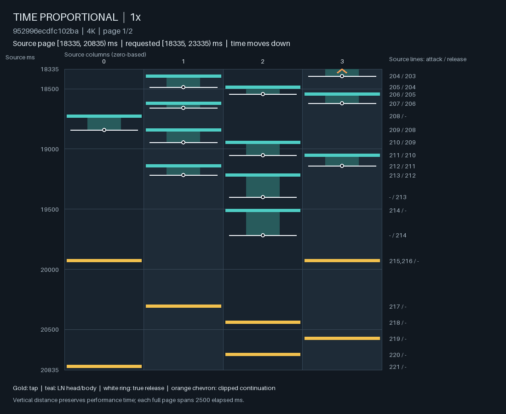
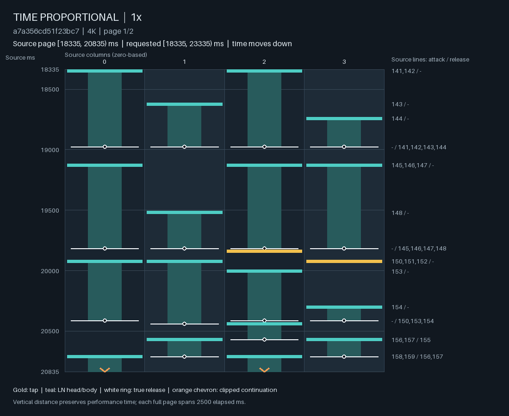

# 在选定释放时间之前，让 R1 决定保持还是结束

独立 R 时钟先决定“这里发生释放”，R1 再选择释放子集，会让部分保持决策发生得太晚。
只有一个可释放 LN 时，任何有限的行偏好在单一 mark 的归一化后都会消失。
另一条结束路径却一直存在：在 H 时刻，R1 可以主动结束 LN。
因此把所有短尾归因于 R，或只延后 R，都不足以解决实际生成。

实现增加了 `release_policy="r1_joint"` 研究模式。
非 H 时刻由完整 R1 对“继续等待／释放各子集”共同评分，R 的 hazard 从这个联合分布计算。
H 时刻仍由 R1 决定完整行，H 本身仍只给出 head-bearing 时刻。
旧的独立 R 模式保留为对照。新模式已完成小规模真实补训与 native 生成；
短 LN exposure 下降，但其他质量和服务检查仍失败，尚未通过可玩性验收。

## 实际短尾由谁决定

下表重放了[干净联合训练](clean_joint_proposal_learning.md)的 inherited-2048 输出。
“短”在此固定为持续时间 ≤80 ms 的描述坐标，不是生成的硬性最短时长。
两个请求均为 D4；Stream 没有指定 LN amount，STYX 指定整曲 LN fraction 约 .485。

| 观察 | Stream Zenithfall | STYX |
| --- | ---: | ---: |
| 全部 LN | 4,382 | 758 |
| ≤80 ms LN | 2,670，60.93% | 84，11.08% |
| 短尾发生于 H | 2,524 | 13 |
| 短尾发生于纯 R | 146 | 71 |
| 纯 R 短尾中，进入时只有一条 LN | 110 | 26 |
| 短尾命中非末尾强制 deadline | 0 | 0 |

所有这些 H 上短尾，在保持当前 head signature 不变时都存在继续持有的合法行。
因此 Stream 中 94.53% 的短尾是行策略在 H 上可改变的决定；
STYX 的近端责任却更多落在纯 R 时间。
这只是当前支持下的决策归属，不把早先的 H 密度、LN birth 选择和训练过程排除在因果链之外。

一种必要的整体检查来自持有库存：长期平均占用与 LN birth rate、平均持续时间相关。
在相同高 birth rate 下单纯延长尾巴，会减少可活动手指，可能把压力挤到少数手指；
硬 H 计划又可能迫使某些 LN 提前结束。改动必须同时检查同列压力、LN 数量、占用和 H 节奏。

## 已固定的红灯回归

[short_ln_exposure](../../src/ensomi_model/research/gameplay_evaluation/ln_fragmentation.py)
计算一个完整 scope 中

$$
B_{80}(Y)=
\frac{\#\{\text{LN heads with actual duration}\le80\text{ ms}\}}
{\#\{\text{all heads}\}}.
$$

参考来自[1,973 张 3.5–4.5★ ranked 谱](ordinary_fourstar_rhythm_and_holds_zh.md)，
每个歌曲组等权、组内谱等权。明确 LN request 选择其 source amount 层；
未指定则使用自然混合，不允许生成结果自行选择较宽松的参照。
未指定 amount 的 99 分位是 **.20014**。

固定的 inherited／early Stream 输出分别为 **.55245／.43933**，均失败。
16 张源谱 sanity controls 全部通过，包含普通长持有、短 LN、LN 主体和非二进制节奏来源。
这是对已知失败建立的回归，不是盲测，也不是把 80 ms 写入解码器。
其余 native checks 保留：少生成 LN 或统一拉长尾巴不能单凭这一坐标获得模型晋级。

## 共同的等待与释放分布

在一个尚未决定是否发生 R 的 native-ms 时刻 $t$，令 $\mathcal M_t$ 是可行的非空释放子集，
并加入虚拟动作 $\varnothing$ 表示这一时刻没有物理行。
R1 使用实际行历史、精确占用／时钟、完整音频、H preview 和 controls，
为这 16 种至多四键的 wait/release 动作给出分数 $s_\theta(a\mid\xi_t)$。
可选的已有 LN-origin audio cues 仍只读取真实起点，不读取未来尾巴。

令 $\eta$ 为 flow log scale，初始化为 $\log .001$，对应将秒尺度的相对 odds 投到 native-ms 查询；
它是可学习的强度坐标，不是最短 LN 时长。定义

$$
\begin{aligned}
Z_t&=\exp s_\theta(\varnothing)+
 \exp\eta\sum_{M\in\mathcal M_t}\exp s_\theta(M),\\
p_t(\varnothing)&=\exp s_\theta(\varnothing)/Z_t,\\
p_t(M)&=\exp[\eta+s_\theta(M)]/Z_t,\\
\operatorname{logit}h_R(t)&=
\eta+\log\sum_{M\in\mathcal M_t}\exp s_\theta(M)
-s_\theta(\varnothing).
\end{aligned}
$$

R 的事件概率为 $h_R=1-p_t(\varnothing)$，发生事件后的 mark law 为
$p_t(M\mid M\ne\varnothing)$。同一组分数因此同时影响“此刻是否放”和“具体放谁”。
不是先固定 R，再用一个无法拒绝事件的行评分补救。

在一个单 LN 状态，即使条件 mark 概率恒为一，提高 wait 分数仍会降低事件 hazard。
同样，作用于这个 release 的 soft recovery cost 现在改变事件 odds；
它不再只是在单一 mark 的归一化中消失。

对当前允许的 flat/no-count-prior/no-allocation 模式，
将 all-empty 加入纯 R 支持，只新增一个 count group；
非空行之间的相对 odds 与现有 R1 条件 mark law 一致。
实现对这项等价、梯度及实际 replay 作了检查，不要求近似独立地训练一个 mark surrogate。

## 时钟、约束与训练

虚拟 wait 不进入 row cache、skeleton cache 或玩家状态，也不会发给客户端。
调度器只提交抽到的非空行，保留 no-event coverage 和指数采样的剩余阈值。
在必须腾出按键的 deadline 或真实 audio end，仍有明确的强制释放 atom。
此前发布的行、未结束 LN 和控制切换语义保持原有协议。

新模式保留原始 survival law，到最后一个可行时刻才施加强制 atom：

$$
\Pr(T=t,M)=
\left[\prod_{u<t}(1-h_R(u))\right]h_R(t)\,
p_t(M\mid M\ne\varnothing),\qquad h_R(d)=1.
$$

它不再把整段 wait 重新归一为“已知某次释放必定在 deadline 前发生”的条件时钟。
否则在低强度近似下，整体降低 release odds 可能被条件归一化抵消。
这也允许按有限时间块评分，不必先计算一直到歌曲末尾的全部假想 wait。
强制 atom 仍只是物理可行性，不能证明该 H 计划或 LN birth 合理。

训练的时间项加上非空 mark 项，正是上述 joint wait/mark likelihood；
H 上完整行损失保持其原有意义。
旧 independent release MLP 在新模式下不再参与 R 的计算；
release 梯度改为进入 R1、共享音频和相关条件路径。
旧参数保留在兼容 checkpoint 中，不把它们的存在计作已参与学习的能力。

数据与调用必须匹配：

```python
batch = collate_interval(
    example, model.config, device, recovery=model.recovery,
    release_policy=model.release_policy,
)
encoded = model.encode_audio(complete_song_mel, real_frame_mask)
scores = score_interval(
    model, batch.inputs, None, controls=controls, encoded_full=encoded,
    recovery_preference=the_sampling_preference,
)
```

两种执行都使用完整音频。source H／历史的 teacher forcing 仍是训练的条件分解；
这没有消除 source-prefix 与 native 到达状态之间的差距。
训练时没有额外的真实 BPM／phase 输入，也没有把未来 LN 尾巴作为当前观测。

## 补训后的生成：短尾减少不等于编排修复

一个有界 learning pilot 从 inherited-2048 初始化，完整保留已有参数，
增加上述 joint release 和现有的 32-wide LN-origin audio cues。
cue 输出投影从零开始；新 flow scale 用八个 factual examples 做标量校准。
随后执行 16 次 batch-two 更新，完整音频、H、R1 共同训练。
数据是同一预先冻结 ledger 中的后续 32 个真实样本，保留其 controls、权重和历史。
行损失按当前 head signature $U$ 分解为
$L_U+2L_{\text{release}\mid U}$，针对先前观测到的 release 条件损失被总量掩盖的问题。

这同时改变了释放概率结构、音频 cue 和损失权重，不能解释为单变量因果试验。
M5 上 CPU 两线程耗时 91.34 s，峰值 task footprint 3.47 GB；
共享音频、H、R1、cue 和 flow 参数均有梯度，checkpoint 精确重载。
这些只验证学习路径确实运行。

同音频、seed 与 controls 的完整 native 结果如下。B80 分母均为全部 heads，
不是只统计 LN；数值格式和参照与上文红灯保持一致。

| 请求／样本 | B80：parent → 补训 | LN fraction：parent → 补训 | 补训后整曲 stars |
| --- | ---: | ---: | ---: |
| D4，STYX，LN .4853 | .0822 → .0298 | .7417 → .4690 | 3.53 |
| D4，Blizzard，LN .8380 | .0569 → .0241 | .6603 → .2871 | 4.05 |
| D4，Stream Zenithfall，LN 未指定 | .5525 → .0689 | .9067 → .5115 | 5.79 |

三个 B80 检查均通过，但 Blizzard 的 amount 与 Stream 的难度失败。
STYX 的整曲 amount 接近请求，却在固定 1.8–7.8 s 阅读段完全变成 TAP；
同样不能据此确认局部 LN 表达改善。
下面两图是同一首 Stream 请求的固定 18.335–20.835 s，纵轴均为真实时间：





补训后先有错开 entry、共同结束的多条 LN，后续继续较长的交叠和交接。
它减少了细碎尾巴，却没有获得所请求的突出 Stream。
整曲 LN duration 中位数从 73 ms 变成 191 ms；
1842 条 LN 中有 130 条结束于非末尾的强制 deadline，parent 对应为 0/4382。
旧时钟采用条件归一化、新时钟具有明确 deadline atom，
所以不能把这个计数差直接等同于新的坏 pattern 数量。
它提示需检查延长持有与未来 H 容量的关系，不能只看短尾消失。

CPU 两线程、已加载权重与缓存 Mel 为起点，包含完整音频编码，
取得至少 30 行并覆盖 8 s 的启动耗时分别 .97/.70/2.81 s；
最慢 2 s 服务窗口耗时 1.23/1.05/1.74 s。
Stream 未通过 2 s 启动要求。STYX 也在初次 8 s coverage 后出现一次约 14.6 ms
的 lookahead deadline 缺口，不能因整曲生成快而抹去。
当时另有 CPU baseline evaluation，这些是实际观测轨迹，尚非隔离负载的产品基准。

执行代码为 `965d670`，parent checkpoint SHA-256 为
`8f3eda8c5e206230838f172c9ee8d32015572d1740b4fa7a19860408357195eb`；
16-update checkpoint 为
`1ad052688ab39398614cc8c3b1e1946bacce88520d60ce6f71283832eb575a3b`。
以上是三个已知失败样本的定向检查，不是 held-out 总体质量估计，也没有模型晋级。

保持结构、optimizer 和损失权重，再用后续 128 个冻结 factual draws 训练 64 次，
得到累计 80-update checkpoint
`b57934728a77abfef0d4bd1ea6387d7cb6f8582c6e450bdd890bfeb1d380ebd6`。
这段耗时 321.31 s，峰值 footprint 4.13 GB；同样完成三首 native 与八页固定 Lens 阅读。
STYX／Blizzard／Stream 的 stars 为 3.69／4.36／5.83，
LN fraction 为 .6875／.6451／.4245，B80 为 .0386／.0737／.0656。
Blizzard 的 LN 使用增加，但仍未达到 .8380 请求；STYX 反而超过 .4853 请求。
Stream 的局部仍有大量长短不一的 LN 交替，并没有因继续补训变成目标 Stream。
三首的整体检查继续失败，不能据此扩大成一轮默认的大训练。

这也暴露了 B80 的覆盖局限：整曲 prevalence 可以低，同时局部仍有难跟随的 LN 组织。
需要在不同实际时间尺度保留局部 exposure、entry/release 关系和对应的 corpus 参照；
不能拿整曲的 99 分位直接充当每个短窗的阈值，更不能在看到输出后放宽原来的 amount 或难度检查。

## 当前实现范围与下一步

纯释放查询只评分 16 个候选，避免把 256 行的中间激活全部保存。
它与 dense scoring 的值和梯度一致。已检查 native hazard 与当前权重 replay、
publication partition、跨 control 边界、deadline atom、checkpoint reload 和 CPU/MPS 梯度。
这些检查建立概率与执行的一致性；生成质量由前述独立的 native 观察约束。

这次实现尚未重构 H 的节奏层级。后续 H 必须让难度在给定局部音乐速度下影响主 subdivision，
并允许更细修饰；不要求先得到唯一且无误的 beat/BPM 表。
内部时间单位或相位候选应从音频及 note-placement 目标共同学习，
避免修饰事件把主节奏参照一起重置。
[音频节奏层级设计](audio_rhythm_hierarchy_zh.md)给出了候选概率结构与不依赖 redline 的局部证据；
其层级 H 尚未实现。R1 仍负责 chord、分指、LN 类型与保持／结束。

在系统验收前，还需在更充分的真实样本上学习，并通过完整 native guards、真实谱面对照，
以及 `codex/stream-generation-benchmark` 的实际首窗／密集服务测试。
这个研究模式没有自动晋级。
