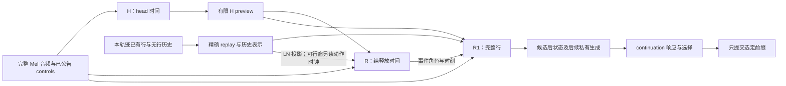

# 原生谱面生成的失配：目标分布、玩家响应与 H/R/R1 耦合

当前系统尚未达到稳定可玩的约 4★ 生成质量。主要问题包括：LN 的持续与释放缺少可跟随的组织，局部质地被长时间铺满，Stream 条件下出现持续单列攻击，以及整体难度标量接近请求却掩盖局部压力异常。

这些问题不能统一归因于模型太小，也不能用禁止短 LN、强制均匀分列或定期插入休息来解决。诊断需要区分两个条件：**提案分布能否产生合适的完整续写；玩家响应与 continuation 选择能否接受其中合适的续写。** 本文记录已确认的机制、完成的对照和仍待验证的架构／训练假设，没有宣布新的可玩模型。

系统目标是完整音频到实际可玩的 4K、2–6★ 谱面，星级按 osu!mania difficulty algorithm 定义；本报告重点观察约 4★。实验中的全图重算使用仓库的 `compute_mania_star_rating_20241007`，metadata 分层与局部 strain proxy 另行标明，不能混称同一个难度量。训练和推理均可使用完整音频。接口和语义以 [V3 formulation](../formulation/README.md) 为准：提交后的历史不可修改，LN 可以跨发布边界保持开放，控制按各自声明的范围生效。

H 指必须出现至少一个新 head 的时间；head 包括 TAP 和 LN press。R 指纯释放事件的时间；带 head 的行也可以释放其他列。R1 负责完整同时行，包括 head 数、列、TAP/LN 类型和释放哪些 LN。H 不负责和弦大小或分指。

目前最强的结论有三层。**表示层**：LN 比例、单次恢复间隔、局部星级都不能识别目标要求的时序组织。**学习层**：真实源谱条件似然、固定旧前缀上的 outcome 与从 BOS 开始的部署质量，是不同的统计目标；一个正确实现的梯度仍可能优化错误的任务。**决策层**：现有 local frontier 没有独立的未来响应监督，实际 continuation planner 又只比较持续攻击 excess。已完成的 192 条同前缀候选诊断进一步证实了这个选择通道的盲区；它没有证明其他候选都可玩。另一个可从实现与归一化直接确认的限制是：纯释放时间已经由 R 选定后，R1 的释放代价不能再否决该事件；行评分与完整续写接受不是同一种操作。

本文的数学分别用于定义对象、证明实现的表达限制、分解可观测风险和提出待验证的近似。没有把尚未定义完成的 canonical response 写成一个已经校准的人体模型，也没有将候选架构写成既定 V3 契约。

更具体的诊断命题是：**现有系统能表示大量合法行，但用于学习和选择的若干投影，把目标要求区分的未来合并了；在这些投影上优化，再经生成历史反馈，可能稳定地产生不合适的组织。** 这里的“合并”有可证明的实例：同 LN 总量／时长仍有不同持有关系，同攻击轨迹仍有不同 LN 后果，同 count 的不同布局不受 count-only 更新直接影响。“稳定地产生”描述重复观测，不声称已经证明了动力系统吸引子。以下将对象定义、代数限制、受控实测和待验证机制分别论证。

本文的解释链是：**目标要求区分哪些谱面 → 模块实际保留哪些区别 → loss 奖励什么 → 采样变换怎样改变概率 → 新动作怎样改变后续状态 → evaluator 是否能发现结果偏离**。结论的强度分为三类：

| 类型 | 已经能够成立的命题 | 对架构决策的意义 |
| --- | --- | --- |
| 定义或代数结论 | LN 比例／时长边缘不能决定 LN 交互；仅有攻击计数的响应不能区分相同 press 轨迹的不同释放；仅由最终行 NLL 不能唯一识别 proposal 与 frontier 能量的语义 | 给 readout 加参数无法恢复它的输入或目标已经合并的区别 |
| 受控实测 | Source-H 改善部分 LN 时间关系；同 H 的完整 R1 续训改善若干 Stream 分指；关闭 feedback 或 count-only 学习未稳定修复组织 | H 与材料化策略各有可改变的贡献；单一充分解释已被反例削弱 |
| 待验证机制 | 当前策略的历史会自我强化某些组织；范围累计分配信息不足；跨事件音频关系没有被有效利用 | 需要对应的同前缀、同支持或匹配学习比较，尚不能宣布为唯一根因 |

这里的“异常偏好”具体指部署条件下，不合适未来的概率质量及其持续性；它不等于某一种 row、LN 长度或 Jack 名称非法。用户对异常的判断给出诊断方向，真实 ranked 反例限制诊断的外推范围。

## 原始问题判断及其证据状态

以下保留目标提出者的原始立场：**“NLL is just a proxy”**；**“模型有没有学到实际更广的数据分布”**；**“sample 到正确合法的形态，并且被 frontier + continuation 接受”**。这分别约束最终效用、提案学习和选择能力，不能用其中一项的进步代替另外两项。关于音频／attention 的判断属于机制假设；可玩性、职责、控制与发布语义属于目标要求；“4★ 真实谱通常长什么样”属于应由 corpus 对照约束的经验判断。下表不把这三种地位混在一起。

| 原始判断／要求 | 对应证据 | 目前能得出的结论 |
| --- | --- | --- |
| 可玩性是最终目标，NLL 和星级只是 proxy | 极端持续单列攻击仍可得到约 4.14 的 scoped proxy；最新匹配学习又出现 row NLL 下降、同 H 上 21-head 单列攻击回归，以及 D2 请求生成 4.4602★ 的分离 | 单一 likelihood／星级不能作晋级条件；不等于正确的联合 likelihood 没有统计意义 |
| R1-restored 的多阶段微调是否存在 target／evaluation 错位，长程问题有多少来自它 | 后继 actor 的 outcome 使用 47 个固定前缀、source H 和难度／LN 数量目标；source-only 继续训练也有 native 退化；后来完整 R1 fit 又恢复部分分指 | 已定位具体目标与部署任务的差距，但没有隔离整个 restoration 谱系的因果份额；不能给“R1 问题占比”一个未经定义的百分数 |
| 约 4★ 的面条图可以覆盖很高，但 LN 通常有可跟随的 stream／协调组织；生成的细碎感不对 | 2,506 张源谱、108 张高覆盖参考，以及本报告的 LN 关系和 source-H 对照 | 高覆盖和短时长本身不能定义坏；时间关系与持续策略需要分别诊断 |
| Stream 不应退化为极端 long jack，压力应能按实际组织在多指间转移 | 同 H 的 34 heads 中有 31 个落在一列，其他列未被占用；较早端点能分散承担 | 至少存在 R1 偏好／学习退化，不是列资源被用尽；正常带反向声部的 ranked jack 仍须保留 |
| 玩家状态应由已提交历史形成，包含 entry/release、coordination、jack 累积和恢复；看未来真实时间，不是固定 row 数 | 局部 HH 成本对大于约 107ms 的连续攻击可一直为零；同前缀诊断的 160 条 LN 候选中，159 条在 16 秒攻击 excess 上为零 | 当前响应覆盖不完整；增加一个名为 state 的向量并不自动获得这些语义 |
| 缺少多尺度呼吸、variation 和与音乐的呼应；音频进入编排的作用可能有限 | memory Hysteric 的 16 秒四列攻击为 `[93,97,96,104]`；最新 Joint 的另一个 16 秒为 `[67,91,86,66]`，已逐页检查，相关 excess episode 持续 30.205 秒；共享加法条件存在下述代数限制 | 问题既可能是分配，也可能是所有列都承压；音频“被输入”不证明其能调节所有相对编排偏好。后一个案例没有长同列 run，仍须检验持续负担；没有据此宣布所有连续 stream 都坏 |
| Attention／更大容量可能必要，但须根据整体职责来决定 | 4.584M→7.617M 的匹配 memory 实验完成后仍未晋级；换 source H 却能改善部分 LN 关系 | 不能仅凭参数少判断根因；目标、信息交互、状态分布和容量应分别验证，允许在证据支持时 scaling |
| 首先要学到广泛真实分布，其次要能采到并接受合适续写 | outcome recipe 只有 47 个固定前缀场景；当前选择器未覆盖 LN／协调响应 | 提案覆盖与选择能力是两个独立可失败的条件，须分别量化 |
| 应考虑按难度平衡各 style 的学习；4★ 的 Stream／LN 组织不能照搬高难压力 | 普通完整 R1 fit 的两份 Stream 输出为 5.071／5.134★；Zenithfall 不设 style 也偏高，降低 neural 难度码又在四例都增加同列连续性；最新分层学习将高 LN 谱（全曲 fraction ≥ .5）曝光从等 group 参考的 6.09% 提至 33.90%，隐藏 LN control 后仍为 30.41% | 条件覆盖、训练权重和 unknown 下的先验须分开设计；不能把偏高全部归为 Stream 标签，或假定均衡曝光自动保留原先验 |
| 应由 continuation/frontier 根据后果拒绝坏提案，而非写形态禁令 | 短 LN 在真实高覆盖谱中普遍存在；多数被检查的短尾有继续持有的合法替代；一张重算 4.485903★ 的 ranked 谱含有 38–48ms LN，当前 HR=50 支持将这些关闭动作排除 | 合法性、研究支持与后果评价必须分开；需要比较具体候选，不能通过删除真实组织让坏例统计变好 |
| 控制可独立缺省并在中途限定范围生效；不同范围不能混合抵消 | Stream-only 条件曝光很少；全曲 LN request 被 override 打断后存在评估单位陷阱 | 缺失模式、范围语义和状态连续性属于训练／评估契约，不是 UI 细节 |
| Mel 初级表示已经人工确认；先让可解释的 audio encoder 直接 condition skeleton 和 R1，联合学习 | H/R/R1 已读取 Mel 派生表示，但部分条件路径存在候选 odds 抵消；source-H 与 native-H 结果不同 | 应检查具体交互及联合目标，不把“音频是否充分”当成先决评估；不能预设已有大规模音乐预训练的能力或额外语义标签 |
| 高 fraction Tech、规律 subdivision、单个声音展开为 dump／long jack，都应有表达空间；redline 不是 target | 原生整数毫秒事件与完整行不要求固定 beat grid，也不要求一个声学 onset 对应一个 head | H 是编排的时间随机变量，不能退化为必打点检测；合理 jack 与低难度过载必须由上下文区分 |
| 和弦大小、分指、LN/TAP 决策属于 R1，相关 control 必须进入 R1；LN 占用又会影响 timing 可行性 | 同 H 可产生集中与分散布局；R/R1 会经占用、释放窗改变未来条件 | 保留决策所有权，同时审查信息依赖，不能用把 head 数转移给 H 的方式修复 R1 |
| R1 当前状态可以调整；模块、规模与 recipe 都可改变，最终接口、控制、质量、实时性和 V3 formulation 才是约束 | memory 扩大及多种微调均有完整 native 失败；旧端点仍有运行余量 | 失败不要求固守小模型，也不支持无目标扩容；每个扩展须说明新增哪种可区分关系 |
| 增量 LN 协议可以在 head 发布后再发布 release；首窗不能依赖真实 30 行种子 | native session 从 BOS 建立历史，普通发布边界保持开放 LN；benchmark 有 30 行／8 秒 readiness | 新模型要生成自己的启动上下文，不能为渲染预先闭合所有 LN，或只评估已成功生成足够行的前缀 |

最初试玩对应提交 a99519ccee60925dce10a4200f88a6c049d37964；用户明确只设置了 Stream control，没有保留生成文件。后续数字来自同模型谱系、相同控制类型的复现，不声称重建了那次具体输出。上述用户判断、ranked 源谱事实、程序测量和模型侧 Lens 阅读具有不同证据来源；不把它们合并成新的人类标注。

这些立场共同要求的不是“尽量接近一张参考谱”，而是**在约 4★ 及所请求 style 的条件下，保持真实编排中可接受的多种组织及其随音乐变化的关系**。原始问题是生成分布的偏好：为什么进入、持续、释放和压力转移经常组成不合适的序列。单个短 LN、单次同列重复或高 coverage 只是观察对象，不能直接充当这个问题的定义。下文用支持、条件概率、存活过程和 continuation 响应分别约束这一命题。

用户对 `<20ms` 同列 attack 的强烈排除、对 21–36ms 的担忧以及“4★ 不应有这种极端 long jack”的判断，是任务的玩家侧依据；其中 attack 明确指 TAP／LN press。它们不是本研究测得的生理阈值。已有 recovery census 也显示研究支持并非无损：60/50/50ms profile 与 8,774 张 ranked 谱中的 558 张至少一个关系冲突，60/50/40ms 对应 420 张。该结果要求审计支持覆盖，不能推导这 558／420 张整谱或其中所有窗口都应被丢弃。

对 long jack 的 corpus 依据也需要保留正反两侧。极端例子的四秒列计数为 `[1,31,1,1]`；后来找到的两张 ranked 3.769631／4.260980★ 参考则各有连续 16 个同列 TAP，并伴随 12 个其他列 head，cadence 与前述极端案例不同。它们支持“该难度存在有组织的 recurring anchor”，并不推翻用户报告的极端集中。不能把“16 次”直接写成坏模式阈值，也不能把增加伴奏当作减轻该手指负担的证明。来源、时刻与已读范围见 [完整 R1 学习报告](full_row_learning_and_difficulty_response.md#combining-the-broader-row-model-with-the-same-neural-offset)。

## 对象、空间与概率：不能混为一谈的四层

设完整音频为 $A$，时刻 $t$ 前已公告的 scoped controls 为 $c_{\le t}$。一张谱是有序完整行序列

$$
\mathcal B=((t_i,a_i))_{i=1}^{N},\qquad
a_i\in\{0,\mathrm{tap},\mathrm{press},\mathrm{release}\}^{4},\quad t_{i+1}>t_i.
$$

这里 $0$ 是某列在该行无动作，整行不能全空。已提交历史 $h_t$ 还包括截至 $t$ 的无行决定。精确状态 $x(h_t)$ 由 replay 确定，包括 LN 占用、起点和最近动作时钟；它不是学习得到的难度状态。

需要分别定义：

1. $\mathcal L(h_t,e)$：在 $(t,e]$ 上满足 V3 语法与物理执行的合法未来。私有／发布 horizon 可以保留开放 LN；真正音频 EOF 则必须满足终止闭合规则。统计 scope 另用 $[a,b)$，不混用端点约定。
2. $\mathcal S_\kappa(h_t,e)\subseteq\mathcal L(h_t,e)$：研究 recovery profile $\kappa$ 和实现约束留下的支持。合法空间不应被某次实验的支持反向定义。
3. $q_\theta(Y\mid A,c,h_t,e)$：提案模型在该支持上的概率。概率高表示模型偏好，不直接等于玩家能承受。
4. $\mathcal C_0(h_t,t;Y,e)$：formulation 要表达的 canonical 玩家响应。其值域记为 $\mathcal R$，不预设为一个星级标量。音乐适切性另外依赖 $A$；玩家响应、音乐组织和控制符合度共同参与评价。

因此有三种本质不同的失败：好未来被排除在 $\mathcal S_\kappa$ 外；好未来仍有支持但 $q_\theta$ 几乎不给概率；好未来已经采到，但响应／选择器偏好更差的未来。单看最终输出或一个总分不能识别是哪一种。

完整音频训练／推理对称，表示 $A$ 在两者中都可用；它不意味着历史分布对称。训练常见 $h_t\sim d_{\mathrm{data}}$，部署实际到达 $h_t\sim d_{\pi_\theta}^{\mathrm{BOS}}$。同时，R1 在源谱训练中看到真实 H，在部署中看到生成 H。source-H 干预检查的是这个条件分布差异的一部分，不是在测试 Mel 是否包含足够信息。

### Skeleton 是谱面的投影，释放是持续对象的终止

对完整谱定义两个确定投影：

$$
\mathsf H(\mathcal B)=\{t_i:\exists k,\ a_{i,k}\in\{\mathrm{tap},\mathrm{press}\}\},
\qquad
\mathsf R(\mathcal B)=\{t_i:t_i\notin\mathsf H(\mathcal B),\
\exists k,\ a_{i,k}=\mathrm{release}\}.
$$

$\mathsf R$ 只含纯释放行；H 行上的 release 仍由 R1 决定。因此“生成 onset/LN-release skeleton”不能误写成先独立预测全部尾点，再让 R1 只摆列。LN 是从 press 到其匹配 release 的持续对象，两种事件路径共同决定它的终止。

固定边界、支持与 H，定义其材料化集合

$$
\mathcal Y_\kappa(T_H;h_t,e)
=\{Y\in\mathcal S_\kappa(h_t,e):\mathsf H(Y)=T_H\}.
$$

H 选择一个时间投影；R/R1 在对应集合中生成行与纯释放。这个集合中可以同时存在稀疏单键、和弦、TAP、LN、交接和不同分指。H 不需要预先规定这些选择，R1 也不能在已承诺的 H 上自行取消所有 head。可玩性取决于这个集合中有哪些适当未来、模型分给它们多少概率、最后选了哪一个。

对声明时间测度下、支持在 $\mathcal S_\kappa$ 内的分布 $P$，有

$$
P(T_H,Y\mid A,c)=P(T_H\mid A,c)\,
P(Y\mid T_H,A,c),\qquad Y\in\mathcal Y_\kappa(T_H;h_t,e).
$$

固定的 $h_t,e$ 在条件记号中省略。对完整合法目标分布也成立同一分解，但要将集合换成合法空间；不能默认 corpus 全部落在研究 recovery 支持内。这只是完整条件分解。实际系统采用有限 H preview $P_j$、有限 summary $m_j$ 和状态投影 $\chi_R$ 时，则另作了近似，例如

$$
P(a_j\mid A,c,T_H,h_j)
\approx q^1_\theta(a_j\mid A,c,P_j,m_j,x_j),
\qquad
P(e_j\mid A,c,T_H,h_j)
\approx q^{\rm wait}_\theta(e_j\mid A,c,P_j,\chi_R(h_j)).
$$

必须检验的是这些有限条件是否保留所需关系，而非反复争论链式分解是否“足够 joint”。在密集段，固定 16 个 H 的 preview 对应的秒数更短；它可以足够维持短期可实现性，却没有因此覆盖所要预测的数秒 gameplay 后果。

音频给出声音的证据，谱面给出对声音的动作表达。规律 subdivision、高 fraction 采音及单个 onset 展开为一串动作，都是 $P(T_H,Y\mid A,c)$ 中可以不同的关系；不需要构造一个由音频到唯一必打点的函数。当前整数毫秒是实现的时间测度，V3 的绝对时间契约不以它重新定义。

图中的音频同时到达 R1 和 skeleton。R1 的动作经后状态影响后续 R/R1；H 网络当前不读取通用动作 embedding。图描述职责及信息流，不意味着已实现的选择器覆盖了所有响应，也不意味着需要由 scheduler 代作谱面创作。

### 谱面、音乐解释、玩家响应是不同的对象

固定音频 $A$ 通常对应多种真实编排。令 $P_{\rm corpus}(\mathcal B\mid A)$ 表示声明采样总体中的编排分布，而非一个唯一正确答案。完整行是输出对象；H/R 是它的分解；Mel 是条件表示；网络隐状态是计算表示。不能因为某个分解难以表达，就把真实谱面的合法空间缩小成该实现的支持。

对同一段谱，需要分开三个观察算子：

$$
\mathcal M(A,h_t,Y)\quad\text{音乐对应与组织},\qquad
\mathcal C_0(h_t,t;Y,e)\quad\text{canonical gameplay 响应},\qquad
\mathcal O_W(h_t\oplus Y)\quad\text{声明 scope 的控制读出}.
$$

$\mathcal O_W$ 包括不同语义的 difficulty、style 与 LN-head fraction，不要求它们彼此独立；它们应有独立的缺失标记和比较规则。这里的 $\mathcal M$ 和 $\mathcal C_0$ 是目标记号，不是假装已有完整 oracle。osu!mania 星级是一个具体读出，不能等同于这三个对象的联合。

真实 ranked 谱提供高价值的可行组织实例和经验分布，但没有直接提供“每一种反事实续写对玩家造成多少负担”的标签。仅有 beatmap+audio 时，至少有三项无法由数据自动确定：没有出现的编排是否坏、相同音频下未记录的风格组合是否可达、两个生成未来中哪一个更适合当前玩家状态。style 标注也不自动回答这些问题。需要从真实例子、失败见证和独立相对判断定义响应，而非把低 corpus 密度直接命名为 BAD。

这还区分了三种 memory：精确执行 memory 保存不可近似的占用／时钟；音乐组织 memory 保存本次生成已经作出的编排选择及其音频关系；玩家响应 memory 保存会改变未来需求的历史后果。它们可以共享计算，但训练语义不同。用完整音频替代音乐组织 memory 不充分，因为不同编排听到的是同一首歌；用音乐 history embedding 代替玩家状态，则还缺响应充分性的验证。

### 信息契约与本体：谱、状态、解释、控制不是同一变量

在本文中，“玩家状态”始终指 V3 canonical profile 下的 gameplay-demand 表示。用户关于手部能力、jack 累积和协调的判断决定需要保留哪些区别；现有 beatmap+audio 数据没有测量某个真实玩家的疲劳、疼痛或失误概率。将一个可计算衰减状态称为真实生理状态，会超出 formulation 与数据依据。

给定完整音频，生成的信息集合可以写为

$$
\mathscr I_t=\sigma\!\left(A,h_t,c^{\rm announced}_t\right).
$$

训练与推理都允许读取未来音频；未来源谱不在这个集合中。私有候选 $Y$ 是基于 $\mathscr I_t$ 产生的假设；只有选定前缀提交后才扩充 $h_t$。这使“audio 非因果”与“chart history 因果”同时成立，二者不矛盾。

一个分析用的运行状态拆分是

$$
S_t=(x_t,m_t,d_t,\Omega_t,w_t).
$$

| 分量 | 所表示的对象 | 充分性／正确性针对什么 |
| --- | --- | --- |
| $x_t$ | 精确占用、LN 起点、最近动作时钟等 replay 事实 | 行合法性及声明的执行约束；不能用 learned prediction 覆盖事实 |
| $m_t$ | 本次编排已经选择的音乐／动作组织 | 未来提案的条件分布；同一音频的不同编排可有不同 $m_t$ |
| $d_t$ | 历史对可能未来的 gameplay 响应 | 下文的 frontier 响应等价关系；不要求保存歌曲语义或 motif 身份 |
| $\Omega_t$ | 当前请求的身份、作用范围、已实现数量及剩余范围 | scoped-control accounting；不是均匀前缀配额，也不是人体负担 |
| $w_t$ | 已提交覆盖、可撤销的计划、缓存／随机流的所有权 | 发布和分支协议；未来 H preview 不等于已提交谱面 |

这不是要求五个互不共享的网络。它要求所有被保存的信息有明确用途：缺失的 scope 累计 LN 数不能靠改名为 player state 解决；完整音频不能说明这一遍生成选择了哪种伴奏组织；更长的内容 cache 也不自动成为经过校准的 frontier。

对某模块输入投影 $\chi(S_t,A,c,Y)$，若存在两个待比较对象 $z,z'$ 满足

$$
\chi(z)=\chi(z'),\qquad \mathcal C_0(z)\ne\mathcal C_0(z'),
$$

任何仅依赖 $\chi$ 的确定 readout 都无法区分它们。这是**输入投影限制**。若输入已可区分，但训练标签仍把两者赋为相同目标，则是**监督投影限制**。若两者均可区分，实际 rollout 仍偏向错误未来，则需要审查学习、支持和闭环选择。三者可以共存，不能用同一种“模型不理解音乐”笼统代替。

Ranked 的证据角色也可形式化。声明总体内观察到的是 $P_{\rm ranked}(\mathcal B,A,\mathcal O)$，其中 $\mathcal O$ 是可用 annotation／difficulty 读出。若两个响应函数 $\mathcal C_0$ 与 $\mathcal C'_0$ 对这些观察给出相同解释，却在未标注的反事实续写上不同，现有数据不能唯一选择其一。这不削弱 ranked 作为高质量正常谱面依据的价值；它界定了从“学习真实组织”到“比较任意生成后果”之间仍需补充的响应定义和对照。

### 架构的表达损失与有限学习损失可以严格区分

取一个声明的事实 query 总体。令 $I$ 是该 query 在生成时允许知道的完整条件，$Z$ 是待预测决定；例如 $Z$ 可为某毫秒的事件／无事件，或给定 H/R 角色的完整行。训练中的目标 $Z$ 不放进 $I$。模块实际读取 $U=\chi(I)$。即使允许任意复杂的 readout，最优的 log-loss 预测也只能是

$$
q^\star(z\mid U)=P(z\mid U).
$$

使用同一数据总体、自然对数且有关熵有限时，任意 $q_\theta$ 的误差有精确分解

$$
\begin{aligned}
\mathbb E[-\log q_\theta(Z\mid U)]-H_P(Z\mid I)
&= I_P(Z;I\mid U)\\
&\quad+\mathbb E_U\mathrm{KL}\!\left(P(Z\mid U)\Vert q_\theta(Z\mid U)\right).
\end{aligned}
$$

第一项是输入投影相对于完整允许条件丢失的预测信息；第二项包括有限网络类、数据和优化留下的误差。因为 $U$ 是 $I$ 的函数，恒等式来自交叉熵分解和 $H(Z\mid U)-H(Z\mid I)=I(Z;I\mid U)$。改变 $\chi$ 才可能消除第一项；仅扩大同输入的 readout 不能。反过来，第一项为零也不保证有限训练已把第二项降到足够小。

这不是要求估计 Mel 的“绝对信息充分性”，也不是一个新的选模指标。具体用法是检查任务所需的条件区别：同一 LN 起点音频在有限 row history 外是否丢失；同一精确状态下较早的集中攻击是否仍可区分；不同 scope 分配事实是否映射成同一输入。已有 scope-state 碰撞给出最后一种实例，但没有测得上式的互信息，更没有证明它就是全部数量漂移的原因。

该恒等式仍只谈**所选事实标签分布**。若 $Z$ 只是 $J_{\rm attack}$ 产生的标签，它再准确也不能补出标签没有定义的 LN coordination 判断。因此架构分析要先说清目标随机变量，再讨论信息量；不能用更多 audio/history token 回避监督对象的缺失。

### 从真实分布到受控选择，而不是从一个总分定义所有好谱

一个分析用的选择目标是，在学到的广泛提案 $q$ 附近偏好符合请求且后果合适的未来。固定音频、历史、scope 和 horizon，若 $J(Y)$ 是**已经有独立依据**的某个有限响应损失，则

$$
\min_{\pi\ll q}\;\mathbb E_\pi[J(Y)]+\tau\,\mathrm{KL}(\pi\Vert q)
\quad\Longrightarrow\quad
\pi^\star(Y)=\frac{q(Y)\exp[-J(Y)/\tau]}{Z},\qquad \tau>0.
$$

这是对 proposal 与 preference 职责的解释，不是已选择的训练 recipe 或一个新的可玩性总分。它与 [control as inference](https://arxiv.org/abs/1805.00909) 的分布重加权思路相近；这里 chart replay 是已知的，未知的是响应语义和音乐适切性，并不存在现成的环境 reward 可直接套用。

这个公式揭示两个限制。若 $q(Y)=0$，重排不可能找回它；若 $J$ 对两种后果给出同值，选择器无法依据该通道纠正它们。提高搜索预算也不能补上这两类信息缺失。实践仍须分别检查响应通道、控制区间和音乐判断，不能让一个加权总和把 LN 退化与攻击减轻抵消掉。

### 生成因子与支持条件化

令 $T_H$ 是 H 时间序列，$e_j=(t_j,\zeta_j)$ 是下一个材料化事件及其 H/R 角色，$a_j$ 为完整行。略去确定性的音频编码后，当前模型可写为下式。它针对固定控制日程和当前单向 H 实现；动态请求按公告更新可用信息，不提前读取尚未公告的控制。引入 committed-response feedback 的变体需要重新声明条件依赖。

$$
q_\theta(T_H,\{e_j,a_j\}_j\mid A,c)
=q^H_\theta(T_H\mid A,c)
\prod_j q^{\mathrm{wait}}_\theta(e_j\mid\mathcal I_j,T_H;W_\kappa)
q^1_\theta(a_j\mid\mathcal I_j,e_j,\operatorname{preview}(T_H)).
$$

$\mathcal I_j$ 含当前因子允许读取的该轨迹前缀；私有分支使用自己的已生成历史，不把它写入全局已提交状态。$W_\kappa$ 是由状态与 H 推导的释放窗口。$q^{\mathrm{wait}}$ 包含 R 发生前的 survival，以及直到下一 H 都不发生 R 的概率；不是只给已有 release 行打分。R1 的选择改变下一步 LN 状态和窗口，所以“网络参数分开”不等于“生成过程互不依赖”。H 不直接读 R1 embedding，也不消除这种下游耦合。

其关键依赖是 $a_j\to x_{j+1}\to W_{\kappa,j+1}\to(e_{j+1},a_{j+1})$，而 $A,c$ 还直接进入 R1，不能把行编排画成只依赖 skeleton。整条 $q(T_H,Y)=q^H(T_H)q(Y\mid T_H)$ 分解本身不丢失联合表达能力；限制来自各条件核实际只读取哪些变量、多少 preview，以及训练是否覆盖这些组合。有限 H preview 不是完整编排计划。当前 H **调用核**不读取已提交动作内容是一项架构选择，也不应误写成整个联合分布在观察 R1 动作后仍具有同样的后验条件独立性。

若只截取普通 horizon 的轨迹，末尾未发生事件的 survival 项也必须保留。该观察边界不等于真实 EOF，不能用强制 LN 闭合替代右删失。

### 模块独自合法，不等于组合后仍有可实现的未来

这里只讨论由精确 replay 和 recovery profile 决定的支持，不把 learned preference 当成支持 mask。固定 $(g,e]$ 内一个未提交 H 计划 $T_H$、边界 $g$ 和终点 $e$，定义

$$
\mathcal V_\kappa(g,T_H,e)
=\{x:\exists Y\in\mathcal S_\kappa(x;g,e),\ \operatorname{Heads}(Y)=T_H\}.
$$

$\operatorname{Heads}$ 只抽出出现新 head 的行时刻，不包含和弦大小。$\mathcal V_\kappa$ 是“至少存在一个实现”的状态集合。已经可实现的 H 计划，并不允许 R1 任意选择当下合法行；所选行还须留下一个可延续的后状态。概念上是

$$
x\in\mathcal V_\kappa(g,T_H,e),\qquad
q^1(a\mid x)>0
\Longrightarrow
x^+(a)\in\mathcal V_\kappa(t_a,T_H^{>t_a},e),
$$

其中也要推进事件／无事件边界并保持 release 可实现性。这是支持闭合要求，不是新增的 pattern 禁令。

当前 [spacing 实现](../../src/ensomi_model/research/planned_audio_continuation/spacing.py) 已包含一个具体的存在性构造：H 满足四列 HH 容量；R1 从候选后状态检查未来 H 能否以每次一个 TAP 和最早合法释放实现。原占用／最近动作造成的限制在 $\max(HH,HR+RH,1+RH)$ 毫秒内消退，之后由四-H 容量约束承接。该有限检查以足够 preview、整数毫秒、当前 recovery profile 和真实 EOF 为前提；不是对任意更复杂支持条件的通用证明。

例如 HH=60ms 时，H 为 $0,10,20,30,40$ms 的五次新攻击不能由四列完成，必须被 H 容量条件排除。反之，一个可以“每次一键”完成的计划，仍可能与请求的低难度、LN 声部或自然呼吸不相容。**可实现性只回答存在合法续写；frontier 要比较这些续写的后果；提案还要把足够概率分给合适续写。** 不能把这三个量词层次混成“有可行性检查，所以生成应可玩”。

若原始逐毫秒 release hazard 为 $p_k$，且必须在可行窗 $[a,b]$ 内释放，则第一事件分布是

$$
q_R(t\mid a\le T_R\le b)
=\frac{p_t\prod_{k=a}^{t-1}(1-p_k)}{1-\prod_{k=a}^{b}(1-p_k)}.
$$

因此即使很少命中最后的 $b$，窗口条件化仍可能影响全部早期概率。诊断必须同时记录原始 hazard、条件化窗口和 R1 的释放选择；只数 forced-deadline 事件会漏掉作用。本报告还区分 H 行释放，才得以排除窗口作为所列短尾的普遍充分解释。

### 局部可行性归一化与完整未来条件化不同

可行性检查回答“是否至少存在一个后续实现”；概率模型还必须决定在剩下的实现间如何分配质量。为单独说明这层区别，考虑有限时域的基准决策核 $q_0(z_j\mid h_j)$，每步仅做支持投影：

$$
Z_\kappa(h_j)=\sum_{z\in\mathcal S_\kappa(h_j)}q_0(z\mid h_j),\qquad
q_\kappa(z\mid h_j)=
\frac{q_0(z\mid h_j)\mathbf1\{z\in\mathcal S_\kappa(h_j)\}}{Z_\kappa(h_j)}.
$$

假定每个到达状态 $Z_\kappa>0$，并把终止后的过程补成吸收状态。沿完整支持内的轨迹 $Y$，有

$$
q_\kappa(Y)=q_0(Y)\prod_j Z_\kappa(h_j(Y))^{-1}.
$$

相比之下，基准过程对“整个未来符合支持”的一次性条件化只使用一个总体归一常数：

$$
q_0(Y\mid Y\in\mathcal S_\kappa)
=\frac{q_0(Y)\mathbf1\{Y\in\mathcal S_\kappa\}}
{\Pr_{q_0}(Y\in\mathcal S_\kappa)}.
$$

两者通常不同，因为前一个乘积随到达历史变化。即使没有一步选到非法行，逐步删除不可行选项也可能改变不同完整组织的相对质量。这个推导是对“仅投影”机制的分析；实际系统还含 count 内归一、frontier、recovery preference 和 feedback，不能用一个 $Z_\kappa$ 冒充全部实际 law，也尚未测得它对所列退化的贡献。

工程上的结论是保留三份明确对象：未施加该变换前的偏好、同状态的实际采样概率、实际到达的轨迹。当前 [sampling replay](../../src/ensomi_model/research/controlled_audio_continuation/sampling.py) 已能重构默认 recovery／LN feedback 下的部署行分布；新 preference 必须声明对应的重构。即使训练与采样一致，支持投影对 corpus 表达范围和完整组织的影响仍是独立问题。

### 正确的行概率分解不等于正确的响应语义

令 $m(a)$ 为完整行内部的 head/LN/release 数，$\ell_\theta$ 为布局 logit，$g_\theta$ 为 `frontier2` 分数。其核心组合形式是

$$
q^1_\theta(a\mid u)\propto
p_\theta(m(a)\mid u)
\frac{\exp\ell_\theta(a,u)}{\sum_{b\in\mathcal S_\kappa(u):m(b)=m(a)}\exp\ell_\theta(b,u)}
\exp g_\theta(a,u).
$$

$u$ 汇集该行的合法条件。把 $g$ 放在组内归一化之后是必要的：同组共享代价若放在分子／分母内会抵消。当前实现保留了这个正确结构。

但仅用最终行 likelihood 训练时，$g$ 的“玩家代价”含义没有被识别。一般的 proposal-energy 组合 $\pi\propto q_b\exp g$ 满足

$$
q'_b\propto q_b\exp f,\qquad g'=g-f
\quad\Longrightarrow\quad \pi'=\pi.
$$

这说明在可表达这些重分配的函数范围内，同一个输出分布可以对应不同的内部能量解释。网络被命名为 frontier、或 score 确实改变了概率，都不能代替独立响应目标与验证。

部署还有 neural law 之外的变换。记 recovery preference 作用后的行为分布为 $\bar q$，$\gamma(a)=(n_{\rm head},n_{\rm release})$，$n_{\rm LN}(a)$ 为新 LN 数，则当前 LN feedback 相当于

$$
\pi^1(a)=\bar q(\gamma(a))\,
\frac{\bar q(a\mid\gamma(a))\exp(b_t n_{\rm LN}(a))}
{\mathbb E_{z\sim\bar q(\cdot\mid\gamma(a))}\exp(b_t n_{\rm LN}(z))}.
$$

它保留当前行的 head/release-count 边缘分布，却改变后续占用、release window、行数和未来分布。不能从这一瞬时不变量推出全轨迹 head 数或 workload 不变。基础训练使用的 neural law 与后续 `replay_row_scores` 重构的 deployed law 也应区分；memory384 的源谱行损失使用后者，包含真实前缀重建出的反馈。

## 1. 模块实际做了什么

| 组件 | 当前实际作用 | 尚未由它保证的性质 |
| --- | --- | --- |
| 音频编码与 H | 从完整 Mel、H 历史和控制产生未来 head 时间，满足四列短期容量条件 | 音乐上的持续节奏组织、呼吸和长程负担 |
| R | 从音频、H/R 时间历史、LN 占用／年龄和控制产生纯释放时间；scheduler 提供可行时间窗 | 释放与当前 LN 声部、后续编排的音乐／协调后果相符 |
| R1 | 读取直接音频、完整行历史、精确状态、H preview 和控制，给完整行分布 | 整段 native 续写维持真实 ranked 的组织与可玩性 |
| `RowConsequence(frontier2)` | 为候选行增加随行似然训练的能量项 | 对实际未来续写的独立、已校准玩家响应 |
| `CommittedPlayState` | 保存攻击、释放、持有、近期行和多尺度事实，随真实时间推进 | 这些事实已经等价于协调难度或人类疲劳 |
| 可选 `ResponsePlanner` | 展开若干条私有未来，按持续攻击 excess 选择，提交其中一段前缀 | LN entry/release、协调、音乐组织和所有控制均被评价 |

实现入口：[H/R/R1](../../src/ensomi_model/research/controlled_audio_continuation/model.py)、[native session](../../src/ensomi_model/research/planned_audio_continuation/session.py)、[候选行后果](../../src/ensomi_model/research/bounded_typed_continuation/consequence.py)、[玩家状态](../../src/ensomi_model/research/player_response/state.py)、[continuation planner](../../src/ensomi_model/research/controlled_audio_continuation/frontier.py)。

### Frontier 的功能差距

V3 的 frontier 是同一已提交历史对不同合法未来的响应函数：

$$
\mathcal F_{h_t}(Y,e)=\mathcal C_0(h_t,t;Y,e).
$$

它必须区分具体未来动作序列 $Y$ 和真实时间终点 $e$。空白时间也有意义；持有中的空白不能当作休息。

当前 `frontier2` 的显式特征主要是候选动作后的占用、攻击／释放间隔、LN 年龄，以及推进到前两个 H 的被动时钟。[native 特征构造](../../src/ensomi_model/research/planned_audio_continuation/features.py) 中的 `next_r=now+1` 是可能的下一事件机会，不是预测的释放，更不是已有恢复规则下承诺会发生的释放。该模块没有实际 continuation 输入，也没有独立的响应目标。

其 learned context 可以包含更长历史、音频和控制，因而不能断言它理论上无法识别长 jack。已确认的缺口是：**训练只要求提高观察行的概率，没有要求其分数正确比较未来的累计压力与协调后果。** “frontier2 已存在”不足以证明坏续写会被拒绝。

R/R1 还有一个决策顺序：R 选中纯释放时间后，R1 必须在该事件实现至少一次释放。R1 可选释放哪列，却不能把该事件整体撤回。因此只改行评分无法纠正所有不恰当的 R 时间；私有完整续写的比较应能撤销其中的时间提案。带 H 行的释放是另一条路径，不能把所有 LN 尾归咎于 R。

### 时间决定与行决定之间缺少什么，才能共同拒绝一次释放

固定同一前缀和 H preview。令 $E$ 表示直到下一 H／观察边界的首个纯 R 时间，另加 $E=\varnothing$ 表示此前无 R；在有 R 的条件下，$a$ 是必须含 release 的完整行。对无 R 分支使用一个占位 mark，仅用于概率记账，不材料化为空行。省略固定条件，联合提案为

$$
q(E,a)=q_R(E)\,q_1(a\mid E).
$$

假设希望用一个已定义的即时偏好 $C(E,a)$ 对这个**联合决定**重加权，$\tau>0$，则

$$
\begin{aligned}
\widetilde q(E,a)&\propto q_R(E)q_1(a\mid E)e^{-C(E,a)/\tau},\\
Z_C(E)&=\sum_a q_1(a\mid E)e^{-C(E,a)/\tau},\\
\widetilde q_R(E)&=\frac{q_R(E)Z_C(E)}
{\sum_{E'}q_R(E')Z_C(E')},\\
\widetilde q_1(a\mid E)&=\frac{q_1(a\mid E)e^{-C(E,a)/\tau}}{Z_C(E)}.
\end{aligned}
$$

只执行最后一行会得到另一个分布：$q_R(E)\widetilde q_1(a\mid E)$。事件边缘仍是原来的 $q_R$。如果在某个纯 R 时刻只有一条合法行，其条件概率恒为 1；无论给该行多大的有限正代价，都不能降低这次事件已经获得的概率。即便有多条行，所有行共同承担的代价也会在条件归一化中消失。

例如两个可行释放时刻原先各有 .5 概率，每个时刻只有一个可选行；设较早时刻代价为 $\log9$、较晚为 0、$\tau=1$。联合重加权应将两时刻变成 .1／.9；只重排行则仍为 .5／.5。这个有限例子证明局部行惩罚与事件否决的区别，不是在建议某个 LN 时长阈值。

当前实现正需按这个决策范围理解：[session.step](../../src/ensomi_model/research/planned_audio_continuation/session.py) 先从 release logits、可行 mask 和条件窗口采时间；随后 [ControlledSession.prefer_rows](../../src/ensomi_model/research/controlled_audio_continuation/generation.py) 调用 [recovery_cost](../../src/ensomi_model/research/controlled_audio_continuation/sampling.py)，对被选时刻的关闭动作加入 LN-age 代价。这个 controlled 路径没有将 $Z_C(E)$ 送回 release clock。别的研究路径中存在同名或类似的 release preference，不能据此推断这里已使用它。

这确认的是**评分作用域限制**，不是已测得的 LN 退化责任占比。当前代价也不是完整、已校准的 $C_0$，所以直接把 $Z_C$ 接入时间模型并不构成已验证的修复。合理的架构方向有明确分工：R 学习真实持续／无释放的时间概率；R1 学习该事件中的释放身份与同时动作；continuation 对包含时间和动作的私有未来共同评价。若蒸馏未来价值到局部 timing/row 因子，就必须保留相应边缘与条件归一化，而不是仅提高行 penalty。

学习上的对应关系也要写明。若 $\theta_1$ 只属于 R1，真实前缀 replay 不依赖参数，R 的条件核也没有共享该参数，则 teacher forcing 下

$$
\nabla_{\theta_1}\!\left[-\log q_R(E_{\rm ref}\mid h_{\rm ref},A,c)\right]=0.
$$

因此同一模型中同时存在 R 与 R1，不意味着只更新 R1 就训练了 R 的等待／存活决策。共享音频参数参与联合目标时，两项可以共同训练音频表示；原生 rollout 中 R1 又会通过新占用改变 R 的条件。后两条是明确的信息／参数路径，不能拿来否定前述固定真实前缀下的零梯度，也不能反过来声称冻结 R 后实际释放时刻永远不变。

这个结论与 H 行不同：H 已承诺有新 head，但可在合法情况下选不释放的行。因此多数被检查短尾发生在可选择继续持有的 H 行，仍将责任指向 R1 的持续选择及其条件；纯 R 的上述限制不能解释掉这批证据。

## 2. 证据和测量定义

固定权重端点分别称为 actor128 与 memory384。前者属于已报告 long-jack 回归的谱系，后者是未晋级的联合音频／history-memory 实验。其初始化、训练及恢复 profile 不同，**不是隔离的容量对照**。因果比较只在各端点内部进行。

| 项目 | actor128 | memory384 |
| --- | --- | --- |
| HH / RH / HR，ms | 60 / 50 / 50 | 60 / 50 / 40 |
| 原生 H 与 source-H 对照 | 各 4 首歌 × 2 seeds | 各 4 首歌 × 2 seeds |

四首歌是 Max Burning、Classic Pursuit、STYX HELIX、Blizzard Heights；请求 difficulty 4、原参考全曲 LN-head 比例，style 未指定。原生输出来自已完成的反馈对照；新增 16 份 source-H 输出只替换 head 时间，不提供源谱列、和弦、LN 类型或尾点。参考 H 均为整数毫秒，没有重新量化。

还核验了 2,506 张 metadata 难度位于 `[3.5,4.5)` 的 ranked 源谱及文件哈希。这个总体用于描述，不等于已分割的训练校准集，也不同于先前按本地难度实现重算的 TRAIN 总体。

测量区分以下量：

- **LN-head fraction**：新 LN 数 / 全部 head 数，不是占用时长。
- **Any-held fraction**：至少一列被持有的时间比例；高值可对应正常面条图。
- **LN duration**：真实尾点减起点；跨范围的 LN 不截短，未知尾点不伪造。
- **H span**：把真实 H 时间线线性映射到 H 序号后，LN 尾与头的坐标差。它描述跨过多少 H 间隔，不是 beat fraction。
- **相邻 LN 组长度变化**：按不同 LN onset 时间分组；对当前 LN，在前一组找最接近的长度，计算绝对 log 比值。前一组最多相隔 2 秒。分别在毫秒和 H 坐标计算，同时起始的长短 LN 另计组内差异。

后两项拆分 timing 与 release-span 的影响，**不以越小越好为目标**。Tech、不同声部和有组织的长短交替都可能有较大变化；前一组很丰富时，nearest-match 也会低估组织差异。

### LN 的对象是区间及其关系，不只是一个类型计数

一个 LN 是 $I_i=(s_i,e_i,k_i)$，分别为起点、终点和列。当前列占用是

$$
x_k(t)=\sum_{i:k_i=k}\mathbf 1\{s_i\le t<e_i\}.
$$

合法情况下同列这些区间不重叠。对 scope $W=[a,b)$，head 比例和占用是不同函数：

$$
\rho_W=\frac{\#\{i:s_i\in W,\ i\text{ 为 LN}\}}{\#\{\text{所有 heads in }W\}},
\qquad
u_W=\frac{1}{|W|}\int_W\sum_{k=1}^{4}x_k(t)\,dt.
$$

无 head 时 $\rho_W$ 未定义，而不是零。$u_W$ 包含从 scope 之前进入的 LN；积分也不要求在 scope 结束时释放。同样的 $\rho_W$ 可以对应截然不同的 $u_W$、释放频率、两手重叠与可恢复时间。因此用 LN 比例监督不能识别完整 LN 组织。

LN stream 的组织还在多个区间之间：entry 的次序、tail 与其他 entry 的相位、哪些列交接、同手是否同时承担持有和新攻击、关系是否在音乐重复时延续或变奏。这是一个带列标记的时间区间关系问题；只建模时长边缘分布 $p(e_i-s_i)$ 也会丢掉它。

可以把这种关系表示为图，而不把某种图形规定成唯一好 pattern。顶点是 LN 区间，边描述时间接近或交互的两个对象，例如

$$
r_{ij}=\left(k_i,k_j,\ s_j-s_i,\ e_i-s_j,\;
\frac{|[s_i,e_i)\cap[s_j,e_j)|}{\min(e_i-s_i,e_j-s_j)}\right).
$$

对不同列的 LN，重叠比例可能代表不同协调组织；同列合法 LN 不重叠。$e_i-s_j$ 的符号区分交叠、恰好交接和空隙。用 H 坐标或局部时间尺度再表达这些量，可以检验关系是否被 timing 扭曲；毫秒量仍须保留，因为同一相对形态在不同速度下的游玩需求不同。实际建图必须声明邻接范围，开放尾点则保持未知。

该表示的作用是说明监督缺口：两个分布可以有相同的 LN 比例与时长直方图，却有不同的 $p(r_{ij},r_{jk}\mid A,h,c)$。独立采样好看的单个 LN 时长，不保证得到可跟随的连续关系；把所有长度拉齐同样没有解决这个联合分布问题。

### 一个可执行的非充分性反例：边缘统计相同，动作关系不同

LN 也与 TAP 及其他 LN 的离散进入／释放动作交互。定义行前已开始、且该行不释放的持有指示

$$
L_k^\circ(t)=\sum_{i:k_i=k}\mathbf1\{s_i<t<e_i\},
\qquad
B^{HT}_{kk'}(W)=\sum_{t\in W\cap\operatorname{RowTimes}(\mathcal B)}
L_k^\circ(t)\,\mathbf1\{a_{k'}(t)=\mathrm{tap}\}.
$$

$B^{HT}$ 是“某列继续持有时另一列 TAP”的 pair 数；把 TAP 换为 LN press 或 release，可得到不同关系。再按 canonical hand mapping 分为同手与异手。一次 TAP 位于两个持续 LN 下时贡献两个 pairs，但仍只有一次 TAP；这些不是可直接相加的生理负荷单位。开放 LN 使用已观察前缀确认的继续持有事实，不读取 horizon 之后的尾点。

[关系回归测试](../../tests/research/gameplay_evaluation/test_hold_interactions.py) 构造了两张合法谱：H、每个 head 的列和类型、LN 数、时长直方图、H-span 直方图、总占用以及 any-held 比例都相同，只改变部分尾点与 LN 对象的配对。其 hold–TAP pairs 分别为 **7 与 5**，hold–LN-entry pairs 为 **3 与 5**。因此，令 $M$ 收集上述边缘统计，$B$ 收集关系统计，则有

$$
M(\mathcal B_1)=M(\mathcal B_2),\qquad B(\mathcal B_1)\ne B(\mathcal B_2).
$$

不存在仅由 $M$ 恢复所有 $B$ 的函数。这是表示非充分性的构造证明，不是这两张合成谱谁更好的判断。相应 [LN interaction observer](../../src/ensomi_model/research/gameplay_evaluation/hold_interactions.py) 已接入 scope report，也分别报告 release–head 同时关系及 co-start 的错开释放。它补充了原 duration/span 指标的盲区；没有把“更多关系”或“更少关系”设为奖励。

对生成结构的含义是：可解释 primitive 应能跟踪 LN 对象的起点、仍持续的角色、与其他动作的关系，以及完整行的联合选择。它可以实现为有起点音频信息的四个 occupied-lane tokens、带状态的 hazard 或其他关系网络；不能只给四列各采一个“合理长度”。这些是待比较的表达方式，均不要求 head 发布时预先固定未来 release，也不要求僵化的 chorus／section 标签。

### LN 尾由两条释放路径共同决定

考虑一条已经在 $s$ 开始、列为 $k$ 的 LN，尾时刻为随机变量 $T_k$。它可以在 H 行被 R1 关闭，也可以在 R 事件中被选为释放对象。固定开始时可用的信息 $\mathcal I_s$，在整数毫秒 $u>s$ 定义两个条件风险：

$$
\alpha_k^z(u)=\Pr(T_k=u,\zeta_u=z\mid T_k\ge u,\mathcal I_s),
\qquad z\in\{H,R\}.
$$

这两个事件互斥，且风险对仍存活到 $u$ 的所有中间历史作了条件平均。因此完整存活函数为

$$
\Pr(T_k>v\mid\mathcal I_s)
=\prod_{u=s+1}^{v}\left[1-\alpha_k^H(u)-\alpha_k^R(u)\right].
$$

沿某个实际到达的 H 前缀 $h_{u^-}$，即尚未选择该行时的历史，局部释放概率则是

$$
r_k^H(h_{u^-})=\sum_{a\in\mathcal S_\kappa(h_{u^-})}
\pi^1(a\mid A,c,h_{u^-},H)\,\mathbf1\{a_k=\mathrm{release}\}.
$$

单条 replay 上的这些局部概率不能直接相乘冒充总体存活分布，因为其他列的动作和 R 事件会改变后续历史。这正是需要实际 continuation 的原因。仅优化 R 的时间分布也不能修复 H 行上的提前结束；只延长 R 的 deadline 更无法保证 LN 关系。

一个简化模型可解释“一 H 间隔持续”偏好：忽略 R、假定每个 H 的条件关闭概率恒为 $r$，则 H-span $K$ 服从 $\Pr(K=m)=r(1-r)^{m-1}$，$\mathbb E K=1/r$，且 $r\ge .5$ 时中位数为 1。真实系统不满足这些平稳假设，不能用测得的整行释放数直接估算 $r$；该例只说明反复施加局部关闭偏好，会在轨迹层形成短跨度主导，无须任何 deadline 强迫。

### H 几何与持续决策的精确关系

对相邻 H 时间 $\tau^H_j,\tau^H_{j+1}$，定义仅用于分析的坐标

$$
\phi_H(t)=j+\frac{t-\tau^H_j}{\tau^H_{j+1}-\tau^H_j},\quad t\in[\tau^H_j,\tau^H_{j+1}].
$$

令 $\sigma_i=\phi_H(e_i)-\phi_H(s_i)$。当两端都在已观察的 H 范围内，LN 的毫秒长度精确满足

$$
e_i-s_i=\sum_j\omega_{ij}(\tau^H_{j+1}-\tau^H_j),\qquad
\omega_{ij}=\left|[\phi_H(s_i),\phi_H(e_i)]\cap[j,j+1]\right|.
$$

因此长度由 H 间隔和 LN 跨度／相位共同决定。所有 $\sigma_i=1$ 时，H 间隔从 `[100,100,100]` 变为 `[110,80,120]`，相同的“一间隔后释放”决策也会产生不同的实际节奏。这个关系不使用 redline，不要求任何固定 subdivision，也不排除高 fraction 采音或 dump。

相邻组描述量具体为

$$
v_i^{\rm ms}=\min_{j\in G_{\rm prev}}\left|\log\frac{e_i-s_i}{e_j-s_j}\right|,
\qquad
v_i^{H}=\min_{j\in G_{\rm prev}}\left|\log\frac{\sigma_i}{\sigma_j}\right|.
$$

未知尾点不进入上述完整长度比较；超出最后 H 的尾没有 $\sigma$，不会外推一个虚构 head。该分解解释来源，不定义“统一长度最优”。

### 长度分布同时选择了起点总体与存活策略

“生成 LN 变长”不能直接解释为“同一 LN 更愿意持续”。固定音频、controls 和 LN 起点 scope $W$，令 $z_i=(s_i,k_i,h_{s_i})$ 包含该 LN 进入后的完整状态。对完成到真实 EOF 的生成，定义按 LN 对象汇总的起点分布

$$
\nu_\theta(B)=
\frac{\mathbb E_\theta\sum_{i:s_i\in W}\mathbf1\{z_i\in B\}}
{\mathbb E_\theta N_{LN}(W)},\qquad
\mathbb E_\theta N_{LN}(W)>0,
$$

以及条件存活 $S_\theta(d\mid z)=\Pr_\theta(e_i-s_i>d\mid z_i=z)$。则汇总的长度分布满足

$$
F_\theta(d)=\int[1-S_\theta(d\mid z)]\,\nu_\theta(dz).
$$

假定两策略在所比较的起点状态上均可定义续写，可以精确拆成

$$
F_1(d)-F_0(d)
=\underbrace{\int[S_0(d\mid z)-S_1(d\mid z)]\,\nu_0(dz)}_{\text{固定起点总体的存活变化}}
+\underbrace{\int[1-S_1(d\mid z)]\,(\nu_1-\nu_0)(dz)}_{\text{LN 进入总体改变}}.
$$

这个先后顺序是一种声明的分解，不是唯一因果责任划分。第二项说明：减少某类短 LN 的进入，即使其他 LN 的关闭倾向没变，也能把最终长度分布推长。反过来，恢复大量合理短 LN 会使中位长度下降，却可能改善组织。上述式子是按对象汇总；“每张谱中位数再取总体中位数”有不同的权重，不能直接代入。

Count-only 实验恰好出现了需要这一区分的现象：Classic 的中位 H-span 从 1 变为 2，同时 LN 比例降至 .048／.019；固定旧前缀的预期 release/H 却增加。已经观察到的是生成总体改变，尚未测得同一起点下完整存活曲线的改善。后续 LN 评估应同时保留起点条件、H/R 两条释放路径及与其他动作的关系。对尚未结束的私有 horizon 使用右删失，不能把“截至目前未释放”当作已知的短时长或无限长 LN。

## 3. LN 异常的具体定位

### 短 LN 本身不是异常

Ranked 总体中，108 张谱满足至少 50 个 LN 且有效谱面段 any-held fraction ≥ .75。其“每张谱 LN 长度中位数”的总体中位数是 **164ms**。参考 Blizzard 的 LN 长度中位数为 **89ms**，actor 与 memory 原生输出分别为 **171ms、101ms**。

因此“细碎”不能自动翻译成“长度太短”。需要解释的是短长关系、持续声部、释放与新按键的协调，以及这些关系如何连续发展。短 LN 比例只作诊断，不产生采样屏蔽。

### 多数被检查的短尾不是 deadline 强迫的

从生成行重建释放前的精确状态和 release window，区分 H 行、非条件化 R、deadline 条件化 R。条件化只表示某次释放必须在有限窗内发生，不等于恰好撞到强制 deadline。

| memory、seed 0、完整歌曲 | `<200ms` LN 数 | H 行结束 | 非条件化 R | 条件化 R | 命中 deadline |
| --- | ---: | ---: | ---: | ---: | ---: |
| Classic Pursuit | 310 | 298 | 11 | 1 | 0 |
| Blizzard Heights | 1,060 | 917 | 120 | 23 | 1 |

Classic 的全部 H 释放行中，保持原行 head 数、列和 TAP/LN 决策，只把释放改成继续持有，仍满足现有短期支持检查；Blizzard 对应比例约 **99.88%**。这比“存在另一个同 head 数布局”更严格。

这排除了“恢复窗口把这些 H 行普遍逼成短尾”作为充分解释，却没有证明继续持有一定更好。支持检查只保证短期存在合法实现，好坏仍取决于后续释放、协调和压力。应学习这些可选持续／释放决策的后果，而不是放宽 floor 或把 LN 普遍拉长。

### H 的组织会传到 LN，R1 也有自己的偏好

仅替换为真实 source-H 后，memory Classic 的相邻组毫秒长度变化明显下降；在原生 H 上，其 H-span 变化中位数已经是零。重复相同的释放跨度，也会被不规则 H 间隔转换成不规则的实际 LN 长度。

下表是整曲相邻 LN 组绝对 log 长度变化的中位数，两个 seed 不合并：

| 端点／歌曲 | 原生 H，seed 0 / 1 | Source H，seed 0 / 1 | ranked 参考 |
| --- | --- | --- | --- |
| actor Classic | .495 / .479 | .425 / .439 | .0047 |
| memory Classic | .274 / .336 | .0093 / .0093 | .0047 |
| actor Blizzard | .358 / .363 | .172 / .094 | .0113 |
| memory Blizzard | .269 / .333 | .129 / .203 | .0113 |

H 是这些观测差异的一个原因，但干预同时改变间隔、数量与音乐对应，不能进一步声称已经单独定位为“毫秒 jitter”。这也不是部署修复，因为推理不能依赖源谱时间。

持续偏好差异仍存在：Classic 参考的 LN H-span 中位数为 **2**；memory 在原生 H 和 source H 下都为 **1**。更规整的 H 没有自动恢复该参考中的持续组织，actor Classic 的变化也有限。但源谱只是多种有效编排之一，不能单凭 1 对 2 的中位数判定 R1 错误；需要多参考分布与同前缀 continuation 响应来判断这种偏好是否不适合。

形式上，令 $G_\theta(A,c,T_H,\xi)$ 是给定 H 和随机种子后的完整生成，$M$ 为某一声明的观察量。source-H 对照测量

$$
\Delta M=M(G_\theta(A,c,T_H^{\rm ref},\xi))-M(G_\theta(A,c,T_H^{\rm native},\xi)).
$$

它是替换 H 的总体作用，包含 R/R1 因条件、到达状态和后续抽样位置改变而产生的中介作用。相同 seed 不意味着后续离散选择可以逐行相减；本对照不能识别“纯 timing 几何贡献”和“R1 重新响应贡献”各占百分之几。

### 为什么不能给 H 与 R1 分一个责任百分比

首先必须声明所归因的响应损失 $L$；以下分解针对这个通道，不假定存在统一可玩性标量。“像参考谱”与“可玩”不是同一个量。对固定 $A,c,h_t,e$ 和一个可实现 H，令 $\mathcal S_\kappa(T_H)$ 为可材料化的未来集合，定义理论最优后果

$$
L^\star(T_H)=\inf_{Y\in\mathcal S_\kappa(T_H)}L(h_t,Y).
$$

对实际提案 $q$ 有恒等分解

$$
\mathbb E_q L
=\mathbb E_{q^H}L^\star(T_H)
+\mathbb E_q\left[L(h_t,Y)-L^\star(T_H)\right].
$$

第一项是在给定前缀、H、支持和损失下，即便最佳材料化也要承担的后果；第二项是该条件下材料化／选择的剩余差距。第一项不等于“H 自己的错误”：已提交坏历史、过窄 recovery 支持或矛盾请求也会提高它。当前既没有完整 $L$，也没有算出 $L^\star$，不能把 source-H 前后某个 descriptor 的下降比例称为责任占比。

有限候选实验只能给出

$$
L^\star(T_H)\le\min_{Y\in\mathcal Y_K}L(h_t,Y)
\le L(h_t,Y^*).
$$

候选中出现一个更好的续写，可以证明已选结果并非该条件下最优；32 条都没有好结果，仍不能证明骨架不可救。不同通道的最小值也可能由不同续写达到，不能把它们拼成一个实际不存在的最佳谱面。下一步要增加的是这种**固定条件下可达后果**的证据，而非对 H 或 R1 作整体归罪。

也有不需要质量 oracle 就能确定的 H 限制。对任意 scope $W$，记 $N_H(W)$ 为 H 行数、$N_P(W)$ 为 TAP 与 LN press 总数、$N_k^P(W)$ 为第 $k$ 列 head 数。只要所有 H 均被实现，就有

$$
N_H(W)\le N_P(W)\le4N_H(W),\qquad
\max_k N_k^P(W)\ge\left\lceil\frac{N_H(W)}4\right\rceil.
$$

因此 R1 可以减少和弦和转移承担，却不能消除 H 给定的总攻击下界。固定 $T_H$ 的材料化集合中，如果 $N_H(W)>0$，无新攻击的整个 $W$ 就不可达；反之，$N_H(W)=0$ 也不保证休息，因为可能有持续 LN 或 release。这个下界不是 star-rating 公式，也不强制四指平均分配。它只说明“多尺度呼吸”有一部分必须进入 H 的提案／选择，另一些部分属于 R/R1 的占用与压力组织。

由此，对原始两类观察应作不同归因：`[1,31,1,1]` 与同 H 的 `[11,14,10,14]` 对照证明存在下游布局差异；source-H 的长度关系改善证明 H 条件改变能改善部分结果。两者要求同时审查两条路径，却未证明必须同时改动两模块，也没有互相给出另一模块的失败率。

18 页新 Lens 检查覆盖两个端点在 Classic `[88589,93589)` 和 Blizzard `[40342,56342)` 的 source-H 输出。memory Classic 的局部 LN/TAP 交织与节奏关系更清楚；actor Classic 仍在早段 LN 后转为较长 TAP 段。Blizzard 的 entry 更规整，但两端点仍以大面积持有为主，其持续／释放编排没有获得完整质量确认。高覆盖本身不是失败条件。第二个 seed 未做同等视觉检查；没有新的听音或玩家实测结论。

### 总量反馈不是充分解释

[LN feedback 对照](ln_feedback_scope_ablation.md) 已完成 36 份输出，18 对 H 完全相同。反馈额外偏好前缀比例均衡，真实且整体比例正确的纯 TAP 前段也可能把它推到上限。但移除反馈使 actor STYX 从约 .50 LN 比例变成约 .94，memory Classic 从约 .21 降到 .07，未形成跨歌曲的稳定组织改善。

需要检查 LN 类型分布、持续／释放分布、解析 ratio tilt 与训练策略之间的适应关系。只删除或加强反馈都没有获得本次证据支持；局部组织也不能通过全曲数量达标验收。

### 同前缀 192 条候选：供给有变化，当前响应看不到多数 LN 差异

这项诊断固定模型实际从 BOS 到达的前缀，随后仅改变 R/R1 随机流，H、音频和 controls 保持相同。每个前缀生成 32 条未来，在 2／4／8／16 秒观察；共六个前缀、192 条。Classic 的边界为 88,588ms，Blizzard 为 40,341ms，memory STYX 为 1,799ms，actor Stream Zenithfall 为 41,093ms。五个 LN 案例请求 D4、参考全曲 LN 比例且 style 未指定；Stream 案例只指定 D4 和 Stream prominent，LN 比例未知。

所有原生前缀和 candidate 0 的 16 秒未来都与冻结输出逐行一致。普通 horizon 保留开放 LN；Lens projection 仅为显示追加真实生成的尾，不把这些尾提前送入响应。该比较没有替换权重，也没有使用源谱动作后缀。

下表每行是**独立的 32 候选总体**。八秒 LN-head 数是 min／median／max；“span 中位数为 1”是候选数，不是所有 LN 的比例。

| 到达状态 | 八秒 LN-head 数 | 八秒 LN H-span 中位数为 1 | 16 秒攻击 excess 为零 |
| --- | --- | ---: | ---: |
| actor Classic | 3 / 23 / 32 | 16 / 32 | 31 / 32 |
| memory Classic | 18 / 36 / 42 | 30 / 32 | 32 / 32 |
| actor Blizzard | 39 / 47 / 54 | 18 / 32 | 32 / 32 |
| memory Blizzard | 35 / 57 / 64 | 21 / 32 | 32 / 32 |
| memory STYX | 19 / 27 / 31 | 29 / 32 | 32 / 32 |

五个 LN 组的前四候选在四秒成本上均为零，现有 planner 都会在 candidate 0 提前停止。总计 159/160 条在十六秒成本上也为零；唯一非零值是 actor Classic candidate 7 的 .000441899。这个结果不能说成“159 条 LN 可玩”，而是**攻击通道几乎不提供选择这些 LN 组织的信号**。

原因可以直接从响应定义推导。以秒为单位，令 $N_k^P(t)$ 为累计 TAP／LN press 数，$\mathcal T$ 为 .5／1／2／4／8／16 秒窗口集，$U_\tau(D)$ 为 TRAIN ranked 的参考 rate。在 difficulty 已知的范围，当前响应是

$$
J_{\rm attack}(h_t,Y)=\int_t^e\frac{1}{|\mathcal T|}
\sum_{\tau\in\mathcal T}\sum_{k=1}^4
\left[\frac{N_k^P(v)-N_k^P(v-\tau)}{\tau U_\tau(D(v))}-1\right]_+^2\,dv.
$$

它正确保留历史残余负担、跨控制范围分段比较；但只要两个合法未来的 press 时间和列相同，就有相同 $J_{\rm attack}$，无论 LN 持续、释放时刻或交接关系如何变化。因而即使无限精确地学习该目标，也不可能从它恢复缺失的 LN／协调响应。全零候选更不会因为增加 `maximum_candidates` 就自动被区分。校准来自 6,923 张 ranked TRAIN、按 song group 加权的 chart-max q99，不是人体能力测量。

Stream 正对照说明该通道在其实际覆盖的维度上有用：candidate 0 的四秒／十六秒 excess 是 .006503／.014369；前四候选中被选择的 candidate 2 为 0／.000867，candidate 3 为 .000028／.000028。十六秒零成本候选有 4 条。**这些长尾是未经再次规划的 proposal**，实际 planner 两秒后会重规划，因此不能据此把 candidate 2 的十六秒成本称为闭环部署 regret；它揭示的是观察 horizon 与目标内容都需要审查。

已读 Lens 为 Classic 六条候选的 24 页，均覆盖 `[88588,96588)`：actor 0／4／23，memory 0／8／19。更长 LN 候选会移动或延长 TAP/LN 块，并非必然改善音乐上的组织。memory 19 相比 0，在同为 114 heads 的八秒内，LN heads 从 27 增至 41，any-held 从 .316 增至 .634，显示更长交叠和较多混合，同时提高占用。因此尚未给这些候选作整体优劣标签，也没有完整 semantic coverage 估计；其他候选未完成同等阅读，未新增听音、试玩或人类标注。

### 神经偏好、局部 frontier 与数量反馈如何共同作用

在 candidate 0 的已占用 H 查询上，先保留完全相同的输入与支持，移除 $g$ 并重新归一化，测量整行预期 release 数。memory Classic 为 .806→.866，memory Blizzard 为 .696→.843；actor Classic 为 .744→.869，actor Blizzard 为 .688→.764。箭头分别是加 $g$ 前后，不是新生成的前后。

这说明这些状态的释放倾向大部分已经存在于基础神经分布，$g$ 在此又加强了它。它不证明 $g$ 单独造成坏 LN，也不证明关闭 $g$ 会改善 rollout：后续到达状态、合法支持与学习适应都没有在这个局部诊断中改变。

另一个诊断对候选按**同一个 H 时刻、相同完整行支持 mask、四列均无 LN 占用**分组，比较 neural law 在 recovery preference 与数量 feedback 之前的

$$
\eta(h)=\frac{\mathbb E_{q^1(\cdot\mid h)}n_{\rm LN}}
{\mathbb E_{q^1(\cdot\mid h)}n_{\rm head}}.
$$

这是期望 LN-head 数除以期望 head 数，不是某一列 LN 的概率。以下两组都有完全相同的 80 个可选行；$b$ 是下一步数量反馈偏移。

| 同时刻、同支持的两个历史 | 较低 $\eta$ / 其 $b$ | 较高 $\eta$ / 其 $b$ |
| --- | --- | --- |
| actor Classic，100,474ms，候选 27 / 6 | .00972 / +.259 | .89659 / −.980 |
| memory Classic，91,522ms，候选 6 / 28 | .01793 / +2.000 | .94793 / +.320 |

两组音频和控制完全相同，LN 占用与支持也相同，神经 LN 倾向却相差约 .887／.930；低 LN 倾向的历史反而获得更强促增反馈。于是“数量控制器把它推向这个方向”不足以解释这些查询。历史内容与精确动作时钟仍同时变化，不能把差异单独归给 memory、证明形成了吸引子，或认定大的历史敏感性本身是坏事。需要进一步区分**合理的编排延续**与**偏离后自我强化**，而不是把 history 的影响统一压小。

## 4. Long jack 的问题链与训练 caveat

[持续压力研究](time_horizon_player_responses.md) 记录了四星 Stream 回归：Zenithfall 某四秒段有 32 个 H、34 个 heads，列计数为 `[1,31,1,1]`，其他列没有被 LN 占用。同一 H 上较早 core 的计数为 `[11,14,10,14]`。该例不是 skeleton 强迫单指承担。

局部 recovery preference 在 difficulty 4 下，对超过约 107ms 的单次 HH 间隔不产生 HH rarity cost。连续数秒重复这种间隔，也不会由该项累积出独立 long-jack 负担。`frontier2` 可能从隐状态学到相关信息，但没有独立监督这种累计响应。

难度 proxy 也有漏洞：合成的 16 秒、每秒 12 个 H 的单列重复得到约 **4.141**，四列轮转为 **2.600**。它区分了两者，却仍可能让“达到 4 左右”的目标奖励难以接受的集中。这是 proxy 能力不足的反例，不是人类难度标注。

### Long jack 是条件持续过程，列均衡是边缘统计

令第 $i$ 个 H 的 head 列集合为 $P_i$。某列 $k$ 的连续 H 成员年龄为

$$
n_{k,i}=\mathbf1\{k\in P_i\}(n_{k,i-1}+1).
$$

这个可计算量不定义 Jack 风格或难度；它保留“这一指连续承担了多少次 H”的顺序事实。固定某个 run 的起点条件，令 $L_k$ 为其最终连续成员长度。对仍有正存活概率的 $n$，定义条件延续概率

$$
\beta_{k,n}=\Pr(L_k\ge n+1\mid L_k\ge n,\text{起点条件}),
\qquad
\Pr(L_k\ge m\mid\text{起点条件})=\prod_{n=1}^{m-1}\beta_{k,n}.
$$

这是条件概率恒等式，不假设各次独立或 $\beta$ 恒定；它对满足既有持续条件的实际历史作平均。一次 query 的 repeat probability 很小地改变，并不能直接推出完整 run 尾部只小幅改变。反过来，最长 run 缩短，也不能反推出所有旧状态的重复偏好都已修复。

已完成的固定历史对照与 native 结果正有这一区别：broader fit 在四组旧前缀上的一-TAP-family repeat probability 从 .470／.700／.415／.742 降至 .406／.685／.387／.739，而完整原生最长段从 21／16／8／17 降至 8／7／7／6。后续到达历史、不同 count-family 与占用都参与了这个结果。它是完整 R1 能力改善的证据，不是某一个独立 routing 分数承担全部收益的证据。

更基本的反例是两条四秒、32 个相同 H 的轨迹：一条逐次四列轮转，另一条每列连打八次再换列。两者每列都为八个 heads，现有 D4 攻击 excess 都为零，连续成员最大年龄却为 1 与 8。[对应测试](../../tests/research/gameplay_evaluation/test_head_recurrence.py) 已实现这个对照。因此全图 lane balance 与 rate 阈值不能替代压力转移的时间组织。还必须保留真实 HH 间隔、run 秒数、LN 状态和伴随声部；同样的 run 长度可以有完全不同的节奏和任务含义。

用户所说“压力在多指分配本身也有节奏”在这里对应对联合时间过程的要求。修复方向应让 R1 提案和 frontier 识别连续承担、转移、恢复的不同后果；不要求每四次均匀换指，也不把上述 $\beta$ 强制设为随长度单调下降。合理 dump、Jack 与 recurring anchor 都需要保留。

### 提案学习必须独立审查

源码及运行记录确认以下事实：

| 阶段 | 实际优化与覆盖 | 风险或未证明的性质 |
| --- | --- | --- |
| Scoped joint 基础训练 | 主要为 8 秒真源谱窗口；75% group/chart、25% human-chart 采样；音频编码冻结；恢复 profile 不兼容时重采样 | 接受分布不再严格 group-uniform；继承的预训练能力与新条件学习不能混为一谈 |
| `main-2000` 本阶段 | 接受 3,872 窗口、2,286 张谱；随后 500 步阶段为 1,000 窗口、787 张谱 | 不证明充分学习整个 corpus 或整曲状态；阶段之间谱数不可直接相加 |
| actor128 outcome | 47 个固定生成前缀场景，128 updates；每次 3 个真源谱 anchor、每请求 3 条独立续写；H/R 冻结 | 主要目标是难度标量和 LN 数量，缺少 LN 组织及累计协调响应；好标量可能由坏编排实现 |
| memory384 匹配实验 | 768 个曝光样本、417 张谱、383 song groups；全音频、H/R/R1 联合训练 | 有限学习对照；两个继续训练端点均有 native 退化，不能只归因于 outcome learning |

actor 的真源谱 anchors 与生成状态上的 outcome 分开，没有将生成前缀接源谱后缀冒充事实。问题在目标和状态覆盖仍不足。源谱项按时间归一化，outcome 的 score-function 项使用整段 chosen log-probability sum，乘固定权重 10。该求和符合轨迹梯度，不是数学错误；但权重的实际影响随事件数、horizon 和优势尺度变化，不能靠数字 10 判断广泛分布是否被保住。

memory 的已核验曝光只有 **6.368 秒**具有“只知道 Stream prominent、其他 style 未知”的条件。已知 style 范围为 .260–10 秒，生成请求可长达 144–358 秒；style dropout 主要按整组处理。独立可选 controls 的接口不等于训练覆盖了相应缺失模式。固定前缀 scope-clock probe 只产生较小 H 变化，因此该覆盖差距是待测 caveat，不能直接宣布为主要根因。

### 后续训练证据：哪些解释已经被缩小

[匹配 count-only 研究](contextual_ln_count_learning.md) 与完整 R1 续训使用相同 actor128 父模型，以及 256 个八秒事实窗口、224 张谱、214 song groups 和 22 个验证窗口。所有 factual 样本都保持其真实过去；控制可独立缺失，完整音频始终可用。两种研究均关闭 LN amount feedback，保留 60/50/50ms recovery 和默认 recovery preference。

Count-only 只更新 143,011 个 composition 参数。固定历史、支持和 counts $m$ 时，布局与释放身份的条件分布不变；KL 链式分解为

$$
\mathrm{KL}(\pi_0\Vert\pi_1)
=\mathrm{KL}(\pi_0(m)\Vert\pi_1(m))
+\mathbb E_{\pi_0(m)}
\mathrm{KL}\!\left(\pi_0(a\mid m)\Vert\pi_1(a\mid m)\right).
$$

被测 count-only 更新的第二项最大为 $5.84\times10^{-14}$ nats，符合其代数限制。它不能直接修复同 counts 下的分指或释放身份。允许真实 LN request 进入 contextual readout 后，两种 count-only fit 都改善验证 NLL，却使 Classic 的 LN 比例从 .145／.191 降到 .048／.019；中位 H-span 从 1 变成 2 伴随着 LN 消失，不能解释为持续组织变好。Contextual 路径的独立 NLL 优势仅 .000088 nats/row，没有观察到对应质量收益。

完整 R1 研究放开 history、exact/readout、layout、routing、release、composition 和 local frontier 等 **2,753,715 / 4,600,369** 个参数，仍冻结共享 audio encoder 与 H/R 网络。普通分支保持完整历史；辅助分支在固定的 64/256 窗口隐藏 learned history observation，以 TRUNCATED 表示代替，实际占用、时钟、最近行、音频、H preview 和 target 均不改。不是用生成历史冒充真实前缀。两分支各 128 updates、batch 2；主要条件／composition 路径 LR $10^{-4}$，其余 R1 为 $3\times10^{-5}$，AdamW、weight decay $10^{-4}$、gradient cap 1。训练目标仍为按时间归一的源谱行 NLL。

验证值为 22 窗口的 macro mean nats/row，各观察条件分别计算。这些 chart 对本次 fit 留出，不声称模型祖先从未见过或此前研究未检查过：

| 权重 | 完整历史观察 | 缺失 learned-history 观察 |
| --- | ---: | ---: |
| actor128 初始 | 1.730817 | 2.957741 |
| 普通完整 R1 fit | 1.618333 | 3.008688 |
| 缺失观察辅助 fit | 1.623110 | 2.335572 |

辅助分支学到了对应缺失条件的鲁棒性，但这不是“音频被更好利用”或“原生生成更好”的测量。所有 native 评估都恢复完整历史，从 BOS 使用模型生成 H。14 个 cases 包括四首 LN/control 歌各两 seed、一个中途 override、两个 Stream seeds 和三个 style guards。两个 fit 共 28 份输出，加 3 份新增初始 guards；原来的 11 份 baseline 按身份复用。逐 case 导出核验表明，初始／普通／辅助三者 **H 时刻完全一致**。

| 歌曲／条件 | 初始 LN 比例，s0 / s1 | 普通完整 R1 fit | 缺失观察辅助 fit | 请求 LN 比例 |
| --- | --- | --- | --- | ---: |
| Classic | .145 / .191 | .217 / .154 | .198 / .040 | .217 |
| STYX | .939 / .933 | .519 / .487 | .438 / .428 | .485 |
| Blizzard | .993 / .993 | .972 / .953 | .947 / .908 | .838 |

普通 fit 改善 STYX 的数量，Classic 不再出现 count-only 的大幅 LN 丢失，但 Blizzard 两 seed 仍未通过数量条件。该结果支持“训练真正拥有布局／历史／释放选择的 R1”作为后续研究父模型；它没有隔离其中哪个模块贡献，也没有证明扩大可训练参数本身是原因。

对只指定 D4 和 Stream prominent 的两份 Zenithfall，LN 未指定；下表的 $J_{\rm attack}$ 是前文定义的全曲 excess，单位秒：

| Seed | 初始 stars / $J_{\rm attack}$ | 普通完整 R1 fit | 缺失观察辅助 fit |
| --- | --- | --- | --- |
| 271200 | 4.861 / .043476 | 5.071 / .011005 | 5.012 / .030037 |
| 271201 | 4.984 / .106111 | 5.134 / .023828 | 5.236 / .087103 |

普通 fit 降低这个攻击通道，却增加整体 stars，证明两者不能互换。辅助 fit 没有稳定优于普通 fit；两 seed 的攻击 excess 都超出相对普通 fit 的 .005 秒 guard。其他 style 也不能由 Stream 结果代替：Tech guard 的初始／普通／辅助 $J_{\rm attack}$ 为 1.30685／2.95179／3.50569，stars 为 5.801／5.964／6.082。普通 fit 的 Jack 与 Trill guards 分别为 5.069、5.644★。

这些 style guards 都在同一 Zenithfall 音频上，不能据此把难度偏高全部归因于 style。普通完整 R1 端点后来完成了三个 LN 片段、两个 seeds 的 24 页 Lens 阅读：Classic 恢复混合组织，STYX 的全曲数量改善未证明局部组织修复，Blizzard 的参考持有声部／TAP 关系仍未恢复。全曲音乐语义、辅助端点与更广 style 检查仍未完成，两个端点均未晋级。它们足以拒绝“只要改善 source NLL 或隐藏历史就能解决异常组织”的推断，但不否定更广 source 学习、音频交互或历史表示的价值。

[进一步的完整 R1 学习与控制对照](full_row_learning_and_difficulty_response.md) 又增加了 1,024 个事实窗口和 512 次更新。验证 NLL 降到 1.572470，四个 Stream 案例的整曲最长连续同列 H 段从 21／16／8／17 降到 8／7／7／6；已读见证中有真实的跨列 TAP 流动改善。但 Classic 请求 .217 LN 比例时升到 .360／.438，中途 .6 请求达到 .941，因此仍未通过控制检查。另一个固定模型对照中，调低 neural difficulty code 虽降低部分 stars，却在四个案例都增加同列连续性。两种干预的效果不能混为一谈：更广编排学习有可保留的能力收益，控制与到达状态的耦合仍需修复。

[恢复 release 支持后的匹配联合学习](release_support_joint_learning.md) 又区分了 R/R1 与完整 audio/H/R/R1 更新：两者各训练 512 次，并完成 92 份新 native 输出。R/R1 的六例 LN fraction MAE 改善至 .061129，却在同 H 的 Stream case 重新出现 21 次单列 head；Joint 的验证 row NLL 更好，D2 Zenithfall 却达到 4.4602／4.1993★。两者均未晋级。新的 H-only 星级下界进一步显示，全曲 H 数下降不保证峰值负担下降；它区分低难目标在给定 H 上的不可达部分与仍留给 R1 的选择空间，不重新定义谱面合法性或玩家响应。

### 为什么固定状态的小变化会变成原生轨迹的大变化

为使不同权重可比较，这里把 $S_j$ 定义在完整行／无行历史、时钟和协议事实的共同空间上，各模型从它重算自己的 learned summaries。$K_{\theta,j}$ 是从一个生成决定到下一个决定的概率核，包含真实 elapsed time、状态更新和已声明的 sampling transforms。变长生成可在终止后用吸收状态补齐到有限最大步数；普通 horizon 的 no-event 决定也属于过程。到达分布满足

$$
d^\theta_{j+1}=d^\theta_jK_{\theta,j}.
$$

从同一初始分布出发，两策略的精确差可写成望远镜和：

$$
d^{1}_{n}-d^{0}_{n}
=\sum_{j=0}^{n-1}
d^{1}_{j}(K_{1,j}-K_{0,j})
K_{0,j+1}\cdots K_{0,n-1}.
$$

末项之后的空乘积取恒等算子。这个恒等式说明，结果不仅取决于源谱状态上的单步偏差，还取决于新策略访问的状态以及后续转移如何传播差异。它没有假设每次误差都会单调放大，也不证明某种吸引子存在。

已完成的 crossed-prefix 诊断在 15,642 个共同 H 时刻上，分别把新旧权重放到各自真实 native 历史，测量 $F_{wh}=\mathbb E[n_{LN}]/\mathbb E[n_H]$。对每个共同查询：

$$
\Delta_w=\tfrac12[(F_{10}-F_{00})+(F_{11}-F_{01})],\qquad
\Delta_h=\tfrac12[(F_{01}-F_{00})+(F_{11}-F_{10})],
\quad \Delta_w+\Delta_h=F_{11}-F_{00}.
$$

在两边都无占用且完整行支持相同的子集，mean $|\Delta_h|$ / mean $|\Delta_w|$ 在 Classic 两 seeds 为 **6.42／7.57**（696／703 queries），STYX 为 **25.89／6.35**（21／26 queries）。历史项包含动作内容、精确时钟及累计事实；不是 TCN 的因果责任比例。它说明仅比较旧前缀上的新 logits 会漏掉显著的到达状态作用。

同一 count-only fit 在固定旧前缀上的预期 release/H 反而增加：Classic 为 .00551／.00995，STYX 为 .03307／.03819。实际 LN 中位长度变长，可以来自 LN 起点和存活对象总体改变，不能自动解释为“学会继续持有”。这要求区分条件决策、对象存活选择和最终边缘统计。

[DAgger 的原始研究](https://proceedings.mlr.press/v15/ross11a.html) 为“策略改变自己将见到的状态”提供了直接方法论类比；这里没有能给任意生成前缀提供正确下一行的 expert oracle，不能直接搬用其保证。需要在当前策略真实到达的状态上学习有依据的后果，同时把事实 source imitation 保持为独立、条件一致的目标。

### 目标、采样分布与梯度的区别

完整 teacher-forced likelihood 的正确形式是

$$
\mathcal L_{\rm joint}=\mathbb E_{\mathcal D}\left[
-\log q^H_\theta(T_H\mid A,c)
-\sum_j\log q^{\rm wait}_\theta(e_j\mid\mathcal I_j,T_H)
-\sum_j\log q^1_\theta(a_j\mid\mathcal I_j,e_j,T_H)
\right].
$$

在足够数据、可实现模型和充分优化下，likelihood 学习真实联合分布具有统计依据。问题是有限训练、条件覆盖、模型归纳偏置和部署策略使这些前提未被满足；“NLL 是 proxy”不等于应放弃或错误实现联合概率。

更准确地说，在固定的 $(A,c)$ 分布、相同支持和**同一个完整生成 law** 下，令 $P$ 是目标编排分布，则

$$
\mathcal L_{\rm NLL}(q)-H(P)=\mathrm{KL}(P\Vert q).
$$

若把完整有限时域过程编码为含终止／无事件决定的随机序列 $Z_{1:M}$，链式法则给出

$$
\mathrm{KL}(P\Vert q)
=\sum_{j=1}^{M}\mathbb E_{h_j\sim P}
\mathrm{KL}\!\left(P(Z_j\mid h_j)\Vert q(Z_j\mid h_j)\right).
$$

所以完整联合 KL 足够小时，对任何已经定义的失败事件 $E$，都有 $|P(E)-q(E)|\le\sqrt{\mathrm{KL}(P\Vert q)/2}$。这是 ideal likelihood 的作用，不是现有训练已经满足的界：报告的平均 row NLL 既未减去目标熵，也未覆盖完整时间／survival；小的每步误差可以在长轨迹累加；反馈、支持变化和 planner 还可能把 $q$ 改成另一个部署 law。降低某个局部 NLL 数字不能代替验证这些前提。

#### 用同一个响应通道追踪完整失配链

为避免把所有偏离都称作“exposure bias”或“模型没学会”，可以对一个**已经定义**、有限期望的响应损失 $L$ 做记账。固定同一个音频／control 总体，令：

- $P_0$：声明的真实编排参考分布；它是 empirical reference，不是真实玩家效用的全部定义。
- $P_a$：完整参考编排经可比较的采样／支持选择后的分布。
- $q^\star$：声明模型类和拟合目标下的一个理想总体解。
- $q_\theta$：实际训练端点的基础完整生成分布。
- $\bar q_\theta$：加入所声明 recovery／feedback 变换、但尚无搜索选择的完整分布。
- $\pi$：有限候选、响应排序、提交和后续重规划产生的实际策略分布。

在这些分布确实定义在同一对象和条件总体上时，记 $R_L(P)=\mathbb E_P L$，有精确望远镜分解

$$
\begin{aligned}
R_L(\pi)-R_L(P_0)
={}&[R_L(P_a)-R_L(P_0)]\\
&+[R_L(q^\star)-R_L(P_a)]\\
&+[R_L(q_\theta)-R_L(q^\star)]\\
&+[R_L(\bar q_\theta)-R_L(q_\theta)]\\
&+[R_L(\pi)-R_L(\bar q_\theta)].
\end{aligned}
$$

五项分别定位总体选择、模型／目标投影、有限拟合、部署变换和搜索策略。这不是五个非负错误率，也不是可直接相加的责任百分数；某项可以改善 $L$，另一项可以抵消它。$q^\star$ 按 likelihood 最优不意味着按 $L$ 最优；它也可能不唯一，必须先声明比较对象。

尤其不能把实际八秒窗口重采样伪装成已存在的 $P_a(\mathcal B)$：接受窗口与前缀的权重未必对应一个相容的整曲分布。现有 recipe 的直接对象是 query／区间测度 $\mu$；若没有建立其与完整 $P_a$ 的对应，只能在该测度上讨论拟合，并直接测从 BOS 的 $R_L(\pi)$，不能估报上式各项。这个缺口本身就是训练目标与整曲任务之间需要解释的近似。

对照应沿这条链定位。Support census 约束第一项的具体来源；count-only 与完整 R1 的表达比较约束第二、三项；同权重 feedback 对照定位第四项；同前缀候选与独立响应排序定位第五项。Source-H 干预改变条件和后续到达分布，不能强塞进其中一个单项。现有数字不足以估计所有项，但已经足够拒绝把局部 NLL 下降当作整条链改善的证明。

一个独立的风险是控制条件本身的曝光。训练时的 style／LN／difficulty 常从真实谱面计算或标注，缺失模式为 $M$，实际学习近似

$$
P_{\rm train}\bigl(\mathcal B\mid A,\mathcal O_M(\mathcal B),M,W\bigr),
$$

其中 $W$ 是控制范围。给模型提供用户本来就能请求的条件，不是偷看未来谱面；但这不保证任意请求组合、缺失模式和范围长度都在训练分布内。“Stream prominent 且约 4★、其他未知”的条件不能靠“所有 style 都已知”自动覆盖。按难度平衡 style 学习值得比较，但须同时保留真实条件相关性、未标注维度和每个 strata 的有效样本数，不能创造 corpus 中没有支持的精确可控性。

恢复约束还改变有效训练总体。若原采样分布为 $p_{\rm draw}(g,w\mid b)$，$g$ 是 song group／chart，$w$ 是窗口，$b$ 是 population 或 human 分支，接受条件为 $A_\kappa(g,w)$，则保持分支不变重采样得到

$$
p_{\rm accepted}(g,w\mid b)
=\frac{p_{\rm draw}(g,w\mid b)\mathbf 1[A_\kappa(g,w)]}
{\Pr_{p_{\rm draw}}(A_\kappa\mid b)}.
$$

这不是原始 group-uniform 分布。必须记录实际曝光和拒绝，不仅记录采样意图；“某张谱存在一个被排除关系”也不等于整张谱的所有窗口被拒绝。

#### 支持过滤确实改变了哪些真实监督

一项已完成的只读 census 检查了预处理总体内 **6,923 张 TRAIN、metadata 2–6★** 谱面的原始关系和缓存行。它们已有初始 37/25/21ms 支持选择，不能代表未经筛选的全部 ranked corpus，也不能把该总体的最短间隔当作人体下限。以下 HH 是同列连续 head 间隔，RH 是 release 后下一 head 间隔，HR 是实际 LN 时长：

| HH / RH / HR，ms | 至少一关系冲突的谱数 | HH / RH / HR 冲突数 | 按关系预测受影响的非空八秒窗口 |
| --- | ---: | --- | ---: |
| 60 / 50 / 50 | 457 | 500 / 2,910 / 11,620 | 2,313 |
| 60 / 40 / 35 | 117 | 500 / 324 / 563 | 425 |
| 60 / 25 / 21 | 27 | 500 / 0 / 0 | 135 |

总体共有 131,611 个非空八秒窗口。预测受影响计数不是逐个运行 collator 的接受率；它定位目标关系可能被排除的位置。实际训练 collator 又对固定抽取的 64 个预计恢复窗口逐一检查可接受性：60/50/50 接受 0 个，60/25/21 接受 64 个；64 个普通窗口两者均接受；64 个仍有 HH 冲突的窗口两者均拒绝。另有 16 个无 row 但全窗仍有 LN 占用的八秒窗口，两种支持均接受，仍含释放 survival 监督。

这给“模型有没有学到更广真实分布”一个具体机制：即使数据文件存在，真实 release 关系也可能在样本接受前被删去。它不证明这些少数关系是全部 native 异常的根因，也不说明普遍降低间隔会改善可玩性。支持恢复、正确的 R survival／行联合学习、完整 native 后果应分开测量。

更直观的 ranked 见证是 Without Boundaries，重算 4.485903★，在 115483–117038ms 有十四次同列 LN press，median HH 为 120ms，并有另一列持续持有。LN 时长包含 38、40、42、44、46、48ms，六个关闭动作被 HR=50 排除。这是实际的 articulation 支持损失，不能靠多训同一支持内的 R1 恢复；其原始上下文和图见 [scoped allocation 对照](scoped_ln_allocation.md#a-concrete-support-restriction-found-in-the-reference)。这项读证没有新增对该片段的人工标签或生成质量结论。

#### 难度分层均衡不等于有效监督均衡

最近两项完整 R1 fit 使用实际采样 row law，训练目标为窗口 row NLL 按秒归一。令 $w$ 为被接受的事实窗口，时长 $\Delta_w$ 以秒计，$n_w$ 是其真实完整行数，$\ell_{\theta,j}$ 是该行的负 log probability，则

$$
\mathcal L_{\rm row/time}
=\mathbb E_{w\sim p_{\rm accepted}}
\left[\frac{1}{\Delta_w}\sum_{j=1}^{n_w}\ell_{\theta,j}\right].
$$

它诱导的 query 测度可以写成

$$
\mu(B)=\mathbb E_w\left[
\frac{1}{\Delta_w}\sum_{j=1}^{n_w}
\mathbf1\{(u_j,a_j)\in B\}\right],
$$

其中 $u_j$ 是该行完整条件。相同时长、相同窗口抽取概率下，64 行窗口贡献的行项数是 16 行窗口的四倍；这不意味着梯度范数一定四倍，因为每项的方向与大小不同。按星级／LN strata 平衡抽样只能调整 $p_{\rm accepted}$，不能自动平衡 $\mu$ 中的密度、交接类型、缺失条件或 scope 长度。

报告的验证数则是窗口内 nats/row 再取 macro mean：

$$
\mathcal L_{\rm val,row}
=\frac1{|\mathcal W_{\rm val}|}
\sum_{w\in\mathcal W_{\rm val}}
\frac1{n_w}\sum_{j=1}^{n_w}\ell_{\theta,j}.
$$

两者权重不同，且都只测 source 条件中的行分布。按秒计算联合事件 likelihood 有明确概率意义，不是应立即修掉的 bug；但在“难度均衡各 style 的学习”这个建议下，必须同时报告窗口曝光、行曝光和对应 native 结果，不能只凭四个难度桶数量接近便宣布学习均衡。若改为每窗口／每 style 等权，它也改变了所拟合的总体，需要明说。

已有 broader fit 的难度桶窗口数为 238／258／259／269，LN 请求已知的窗口为 835/1,024。它让四个 Stream 案例的连续同列最长段显著缩短，却新增三个 LN 数量失败。这证明 recipe 可以改变实际能力组合；尚未证明上述权重选择就是数量漂移的原因。下一步可以比较目标关系的条件误差和实际梯度贡献，不应直接把所有高密窗口降权、或把缺失 style 标签补成 absent。

#### 完整音频可用与共同优化音频是两项不同事实

将参数按实际 ownership 写为 $\theta=(\theta_A,\theta_H,\theta_R,\theta_1)$。最近完整 R1 fit 的干预满足

$$
\nabla_{\theta_A}\mathcal L=
\nabla_{\theta_H}\mathcal L=
\nabla_{\theta_R}\mathcal L=0,
\qquad
\nabla_{\theta_1}\mathcal L\ \text{参与更新}.
$$

冻结的是共享 audio encoder 和 H/R 网络；R1 内 audio readout、history 交互和行因子仍能学习。它不是用户最初提出的完整 audio–skeleton–R1 联合训练，也不能修正 H 自己的休止分布。固定 H 的原生对照正好隔离了 R1 的部分可改善空间。R1 改变占用后，冻结 R 在不同输入上的输出仍可能改变。

因此，“音频条件进入有限”的判断仍有两种不同机制：可用表示或交互缺少所需区别；表示已有区别，但当前冻结／目标／曝光没有训练到相应功能。更广行学习的成功没有否定联合训练，memory384 的失败也没有证明音频关系无用。需要针对新增依赖及其目标比较，避免把 row NLL 的改善解释成已完成整条音乐生成链的学习。

actor 的 outcome 实验还固定了源谱 H，并验证生成未改变这些 H。因此它优化的任务更接近

$$
J_B(\theta)=\mathbb E_{(h,T_H^{\rm ref},c)\sim B}
\mathbb E_{Y\sim\pi_\theta(\cdot\mid h,T_H^{\rm ref},A,c)}
\left[L_D(\widehat D(h\oplus Y),c)+L_{\rm LN}(\rho(Y),c)\right].
$$

部署则同时涉及生成 H、从 BOS 到达的状态分布，以及尚未被 $L_D,L_{\rm LN}$ 充分表达的响应。即使 $J_B$ 得到正确梯度，也没有自动优化整个部署任务。改善旧前缀的续写不保证新策略不会制造新的坏前缀；只在 authored H 上学会响应也不保证对 generated H 鲁棒。

将这个偏差写清楚，定义部署时刻分布 $\mu(t)$，有

$$
J_{\rm deploy}(\theta)=\mathbb E_{t\sim\mu,\ h_t\sim d_{\pi_\theta}^{\rm BOS}}
\mathbb E_{Y\sim\pi_\theta(\cdot\mid h_t,A,c)}L(h_t,Y).
$$

固定 bank 训练同时冻结了进入状态的分布，并可能截短 $L$ 的后果 horizon；只重新抽四秒后缀没有刷新 $d_{\pi_\theta}^{\rm BOS}$。反过来，真实源谱后缀只对它自己的真实前缀成立。把生成 LN press 替换进前缀后仍要求原来的 TAP／release 标签，改变了条件世界，不能称为自动获得纠错监督。[Huszár 对 scheduled sampling 的分析](https://arxiv.org/abs/1511.05101) 提供了这种不一致性的理论类比；并非所有使用生成状态的训练都不一致。

可用的分工是：真实谱面项保留完整事实前缀；当前策略的生成状态使用它自己实际展开的后果或独立判断；历史可见性辅助项可以隐藏观察但不伪造动作，并明确 unknown 不等于 BOS。哪种组合有效仍要比较。新策略 BOS 状态、真实 source 状态以及旧失败 bank 应分别报告，后者保留为定点回归而非总体替代。

若只更新 R1 参数，冻结音频/H/R，对实际轨迹的 score-function 梯度可以只包含 R1 项：

这里假定该更新步骤的响应损失没有显式 $\theta$ 依赖，baseline 对本次抽样动作独立；若响应模型共同更新，须分清其显式梯度和策略梯度。

$$
\nabla_\theta\mathbb E_{\pi_\theta}[L]
=\mathbb E_{\pi_\theta}\left[(L-b)\sum_j\nabla_\theta\log\pi^1_\theta(a_j\mid h_j)\right].
$$

R 的实际结果仍会随先前 R1 改变的状态而变化，这个间接作用已经由轨迹分布承担，不要求对冻结 R 虚构一个参数梯度。反之，共享音频／H/R 参数参与更新时，不能沿用“只记行概率”而遗漏这些参数实际进入的随机因子。baseline $b$、得分 horizon 和控制 scope 也必须符合该估计的条件。

### 音频能到达 readout，不代表能改变所需的相对偏好

一个已确认的结构例子是未启用 layout modulation 的主行头。两手输入为 $z_L=h_L+d(A,T_H,c)$、$z_R=h_R+d(A,T_H,c)$，其完整候选 score 对这两个输入是仿射的：

$$
J(z_L,z_R)=L_Lz_L+L_Rz_R+b.
$$

由于左右镜像等变和共享加法，对候选 $a$ 及其反射 $Ma$ 有

$$
\frac{\partial}{\partial d}\left[J_a(h_L+d,h_R+d)-J_{Ma}(h_L+d,h_R+d)\right]=0.
$$

因此这条主路径不能让音乐／style 根据当前历史改变“继续原组还是换到镜像组”的相对偏好。相同 count-family 的 composition 与 LN amount feedback 也在该比较中抵消。非线性 routing、frontier 和已实现的乘性 modulation 可以打破限制，所以这不是完整模型对音频盲目的证明。详见 [条件—历史交互的推导及对照](row_condition_interactions.md)。actor 已启用 modulation，故不能把其剩余失败再次简单归因于缺少该路径。

该恒等式固定历史及支持，只针对共同加法条件进入主 readout 的路径。额外 history reader 也可能通过改变 $h_L,h_R$ 引入条件交互，完整 rollout 还能经先前动作产生间接影响；这些都须保留在实际架构审计中。

这个例子支持一种研究方法：先检查需要表达的条件交互是否能改变相关候选的 odds，再决定是否加网络、换接口或扩大容量。它比“已有 audio embedding／attention，所以信息充分”更具体。

另一个具体入口是 LN-count 的条件方式。被测端点在主要 type-count 路径上，以参考 $\rho_0$ 替代实际 LN 请求，再施加 $\delta(\rho)=\operatorname{logit}\rho-\operatorname{logit}\rho_0$ 的解析偏移。固定其他输入 $u$、支持与 head/release-count family，两个 LN 数 $l,l'$ 的局部 odds 满足

$$
\log\frac{p(l\mid u,\rho)}{p(l'\mid u,\rho)}
=f_l(u,\rho_0)-f_{l'}(u,\rho_0)+(l-l')\delta(\rho),
$$

$$
\frac{\partial}{\partial\operatorname{logit}\rho}
\log\frac{p(l\mid u,\rho)}{p(l'\mid u,\rho)}=l-l'.
$$

这条显式路径不能学习“同样提高 LN 请求，在不同音乐／历史中应如何不同地改变类型倾向”。已经实现并比较的 contextual 变体让 $f_l$ 直接读取实际 $\rho$，仍保留解析偏移作为先验；它不需要让 skeleton 接管 LN 数或和弦。**这是路径表达能力的结论，不是已验证的质量修复。** 实际完整 law 的 frontier、layout 和 memory 条件路径还会贡献控制依赖，memory 的 $u$ 本身也可能依赖实际请求，所以不能把上述导数当成整个模型的导数。上述 count-only 对照已分别测量未训练的 law 变化、匹配真实源谱学习与最终 native 质量，未建立修复收益。

### 训练中的 invariant、研究近似与质量命题

以下三类陈述决定了如何解释一次实验；通过第一类，不会自动证明后两类正确。

| 层次 | 必须声明的性质 | 已有证据或未解决的问题 |
| --- | --- | --- |
| 事实 invariant | 行 target 属于其真实前缀；占用、LN 起点与时钟一致；未来音频可用，未来源谱只作 target／明确 oracle 干预 | factual source 与 generated outcome 分开；历史隐藏实验改变观察，不改谱面世界 |
| 概率 invariant | scoring 重构采样实际使用的支持、preference 和归一化；私有候选的 native 概率不冒充搜索选择后的概率 | 默认 deployed-row replay 有直接对照；新增 controller／selection law 要重新定义相应 likelihood |
| 计算 invariant | 在当前参数下重算 learned history；只有不变的编码器才复用其编码缓存；fork、空白推进和控制切换保留正确事实 | 这保证运行／梯度语义一致，不保证历史是足够的音乐或玩家表示 |
| 有限表示近似 | R1 的有限行历史、有限 H preview、LN 投影压缩完整条件 | 密度改变它们覆盖的秒数；短期 support 充分不等于音乐／响应充分 |
| 统计近似 | 有限 source 样本、固定 bank、单个 scoped 星级／数量目标代表部署需求 | 已有 NLL、数量、星级与局部组织互相分离的实测 |
| 规划近似 | 有限 $K$、有限 forecast、固定 H 搜索和局部 prefix commit 近似完整未来比较 | 需要供给、误排序、末端债务和闭环 native 结果分别验证 |

据此，现有结果不能简化为“实现正确，所以只能继续加数据”，也不能简化为“NLL 不代表可玩，所以训练无意义”。明确的研究问题是：哪个近似首先丢掉了用户关心的区别，怎样恢复这一区别，以及恢复后是否真的改善模型自己到达状态上的生成。

## 5. 架构应该如何按职责调整

需要保留 H/R/R1 的决策所有权，并把**提案概率、玩家状态、未来响应、选择／提交**分开。

### 条件提案模型

提案学习音频与控制下合法、多样的编排分布。音频必须直接进入行编排；只有 beat 或 skeleton 不足以表达音色、层次与音乐重复。各因子可以共享音频表示，也可以增加为关系建模服务的模块。

待比较的两个假设是：H 是否需要更明确的跨事件节奏关系／共享局部音乐变量；R1/R 是否需要可持续追踪的 LN 起点音乐信息和 entry–continuation–release 关系。年龄、TCN 和 attention 理论上可能学到它们，现有实验没有证明已经学会。新增表示应提高不同后果的可分辨性，而不只是增加 token。

这里已有一个值得保留的局部结果：[LN 起点音频检索](active_ln_audio_cues.md) 在匹配的 1,500-update 学习后，改善了 Shippaisaku 片段的释放组织，但没有恢复 Starry Jet 中跨多个 H 的持续声部。该比较只用了 source H，没有 native-H 通过结论。因此“四个有起点信息的 occupied-lane tokens”是有局部依据的 primitive，“有起点就有持续角色”仍不成立。

持续角色还需要关于**下一段关系**的条件：哪一个既有 LN 延续，哪些新动作形成伴随声部，哪次 release 改变后续协调。可以由对象级记忆、关系 attention、条件 hazard 或共享的局部编排 latent 表达；它们都是实现候选。监督应来自完整源谱关系与有依据的 continuation 对比。仅把静态 origin 特征加宽，或对每个 LN 独立拟合 duration，都没有直接恢复联合关系的保证。

H 神经网络完全不读已提交动作摘要，是研究选择而非 V3 必然。有限、声明清楚的玩家响应摘要可以成为比较方向；不能因此把 head 数／布局转移给 H，或重新允许无法解释的 generic R1 hidden state 支配所有 timing。

下面给这些方向一个可讨论的参数化，而不是仅列模块名称。对每条活跃 LN 保留准确的 $(s_k,k)$，并读取

$$
o_k(t)=f_\eta\!\left(F_A(s_k),F_A(t),t-s_k,k,m_t\right),
\qquad k\in\{k:x_k(t)=1\}.
$$

$F_A$ 同时含细 Mel 证据和完整音频上下文；$m_t$ 只能从该分支已发生的编排更新，不能存入未提交真实尾点。$o_k$ 表达持续对象，不是提前承诺的 duration，也不声称已识别某个乐器。让 R 的候选时间与 R1 的候选完整行分别查询这些对象，可以表达“当前声音与这条尚未结束的 LN 有何关系”，保留 R 的时间所有权与 R1 的释放身份所有权。对象间／手间交互仍需进入完整行或后果模型，四个独立尾长分布不能代替它。

共享音频也不自动等于共享编排选择。一个更简单、仍待验证的备选是整次生成只采一次的小变量 $z$；三个因子共同读取同一个取值。在固定已公告 controls 的条件下，其联合模型可写为

$$
q(T_H,Y\mid A,c)
=\sum_z q(z\mid A,c)\,
q_H(T_H\mid A,c,z)\,
q_{R1,R}(Y\mid T_H,A,c,z).
$$

这里 $z$ 不是 style／difficulty 的替代输入，也不是每行重抽的风格开关。音频与 controls 仍直接到达各因子；中途新请求更新未来条件，不把事前未知的请求送入 $q(z\mid A,c)$，也不清空已有 LN／玩家状态。若将 $z$ 改为读取已生成行的在线状态，则需要另外声明 H 允许读取哪些摘要，并把更新放回逐步生成核，不能沿用这个先采完整骨架的实现解释。

这个假设的价值是让多个因子共享一次编排的持久选择；它不会自动提供局部变化，现有自回归模型原则上也可能保留这种选择，所以它不是必需新模块。真正的比较对象是条件关系是否恢复：源谱上的 entry–continuation–release 预测，以及从 BOS 生成的音乐对应、scope 控制和可跟随组织。若训练使用读取整张参考谱的 latent posterior，必须另设只读允许输入的 prior，并只用 prior 生成做资格评价。这里没有采用或训练该扩展，长程音乐检索也不是解决上述归一化与监督缺口的前提。

### Scope 控制是对完整结果的条件，不是每一步的配额

固定已公告的请求和范围 $W=[a,b)$，令 $\Lambda_W(\mathcal B;c)>0$ 表示对完整范围结果的软符合度。比如 LN 总量通道可用

$$
\Lambda_W(\mathcal B;\rho)
=\exp\!\left[-\lambda
\left(\frac{N_{LN}(W)}{N_{\rm head}(W)}-\rho\right)^2\right],
\qquad \lambda>0,\quad N_{\rm head}(W)>0.
$$

这是说明条件语义的例子，不是新采用的 reward；无 head 的情形必须另行声明，不把比例设为零。Difficulty、style 可以有各自的符合度或比较规则，ordinal style 不因此自动变成等距实数。若用于联合选择，还要声明冲突处理，不能让某一通道改善抵消另一通道不可接受的退化。

在固定 proposal $q$ 上，对完整未来按 $\Lambda_W$ 重加权。定义未来期望符合度

$$
\Psi_W(h)=\mathbb E_{Y\sim q(\cdot\mid h,A,c)}
[\Lambda_W(h\oplus Y;c)].
$$

令 $z$ 是完整生成过程的下一个决定，包含其时间／无事件或终止语义，$h'=h\oplus z$。在 $\Psi_W(h)>0$ 且未来覆盖该范围时，重加权后的下一步分布精确满足

$$
\pi_W(z\mid h,A,c)
=q(z\mid h,A,c)\frac{\Psi_W(h')}{\Psi_W(h)}.
$$

归一性来自条件期望的塔式法则。这是完整结果条件化的恒等式，不要求现在就实现精确求和，也不引入新的谱面合法性。它是前文分布重加权在序列上的具体含义。

关键是 $\Psi_W$ 依赖音乐、剩余范围、已经分配的 heads/LNs，以及当前状态下还可能怎样继续；通常不只是 $\rho N_{\rm head}^{\rm prefix}-N_{LN}^{\rm prefix}$ 的函数。纯 TAP 的前半段与后半段 LN 可以整体满足请求，不应仅因前缀比例偏低便受到同样的固定校正。这为替代前缀反馈提供了直接方向：学习范围结果或未来可分配量，而非加大纠偏 gain。

最小可解释的 accounting 输入可包含

$$
\Omega_W(t)=
\left(N_{\rm head}(W\cap(-\infty,t]),N_{LN}(W\cap(-\infty,t]),t-a,b-t,\operatorname{id}(W)\right),
\quad a\le t<b.
$$

这只是实际已完成部分的事实。未提交未来的 counts 是预测，不是这个状态中的事实。当前 plain actor 的精确 replay 保留总行／head 数而没有累计 LN starts，有限 history 也不能保留任意久之前的分配。后续已构造两段合法历史：精确 replay、head/row 总数和最后 512 行相同，scope 的 LN 总数却相差 64。这确认了可观测信息缺口。

[范围分配学习](scoped_ln_allocation.md) 又进行了匹配比较：只训练 69,953 个新增参数，已有 R1/H/R/audio 保持不变。六个 native LN 案例的比例误差由 .153796 降至 .099117，但不读取范围进度的同规模模块也达到 .114877；新增信息的额外收益未达到预设条件。事实训练既少见大的后期数量偏差，也没有重叠的 LN 请求。因此“现在可读这个状态”和“已学会从实际偏差中恢复”仍是两项不同能力，尚不能把此前生成回归归为单一缺失输入。

中途 override 必须按请求身份处理已拥有和剩余的范围；被打断的两段不能各变成一份新的全量要求。重新计算新请求的未来符合度不需要清空 $x_t,m_t,d_t$。玩家侧仍请求 4★ 时，若研究内部 difficulty-code 校准，必须保持响应参照与评价仍为 4★，不能把调低模型输入偷换成降低验收标准。

### 玩家状态与 continuation response

以精确 replay 和按真实时间保留的历史为基底，响应表示需要保留这些区别：

- 一列持续重复，与总量相同但负担转移的攻击历史；
- 正在持续、刚进入、刚释放的 LN，以及释放后衔接其他动作；
- 两手／同手动作的相位、重叠和协调，而不只是四个独立 rate；
- 释放后的真实恢复，与没有新 head 但仍在按住的时间。

这些是需要校准的对比，不是预先规定的生理曲线。ranked 难度与 scoped style 提供证据，不能单凭相关性把隐变量命名为疲劳。

“呼吸”和“分指”也需要拆开。令 $r_{k,\tau}(v)=[N_k^P(v)-N_k^P(v-\tau)]/\tau$，定义多尺度总攻击强度与分配

$$
I_\tau(v)=\sum_k r_{k,\tau}(v),\qquad
p_{k,\tau}(v)=\frac{r_{k,\tau}(v)}{I_\tau(v)}\quad(I_\tau(v)>0).
$$

保持 $p$ 接近均匀，只能避免部分集中，不能避免高 $I$ 长时间持续；改变 $p$ 的时间次序，则是在同样总量下把负担从一指／一手转移到另一处。上述 Hysteric `[93,97,96,104]` 正说明“全曲列数均衡”不是呼吸充分条件。$I=0$ 时分配未定义；若仍有 LN，占用需求也未消失。

因此所需关系至少涉及 $(I_\tau(v),p_{\tau}(v),x(v))$ 在多个 $\tau$ 下的联合演化，以及它们与音乐表示 $F_A(v)$ 的条件关系。目标不是最大化 variance：正常持续高潮可以少休止，正常低难段也可以重复。应比较给定难度／style／音频情况下的压力 episode、实际恢复和分配转移，并保留源谱中的这些反例。按固定周期插空只能改变一个统计量，不能建立音乐驱动的动态。

响应算子读取同一历史状态和**实际私有续写**，在数秒到十余秒的真实 horizon 上比较 entry、release、coordination、jack 累积与恢复。可先建立保留丰富历史的参考预测器，再压缩成在线 state；是否足够由响应比较决定。

控制目标用于解释和比较响应，不重置状态。音乐兼容性仍由提案／独立音乐判断处理；corpus 风格分类器不能替代玩家响应。`RowConsequence` 可保留为快速提案偏置，但不应被当成已校准的完整 frontier。

### 状态充分性是关于未来响应的命题

令 $d_\psi(h_t)$ 为候选玩家状态。所需近似是

$$
\widehat{\mathcal C}_\psi(x(h_t),d_\psi(h_t);Y,e)
\approx \mathcal C_0(h_t,t;Y,e),
\quad (Y,e)\in\mathfrak T,
$$

$\mathfrak T$ 是声明的合法 continuation／horizon 家族。精度只能针对这个家族、这些响应通道和独立证据来讨论，不能因某个 hidden size 足够大就宣称充分。

若两段历史满足 $x(h)=x(h')$、$d_\psi(h)=d_\psi(h')$，同一预测器必然对相同未来给出相同输出。若目标响应需要区分它们，该状态就不充分。一个应检验的构造是：相同 H 和总 head 数，较早几秒分别为单指集中与多指转移，随后使用共同短后缀使最近各列攻击时刻和占用相同，再要求继续攻击原过载列。精确状态可以相同，但按所需累计响应语义，未来负担不应只由最后一个间隔决定。当前 TCN 可能保留这种区别；实验要检查是否保留且被正确使用，不能仅凭输入名推断。

从本体上说，理想玩家状态应识别的是**对未来响应等价的历史类**。固定当前时刻和合法性状态，以声明的 continuation 家族 $\mathfrak T$ 定义

$$
h\sim_{\mathfrak T}h'
\iff x(h)=x(h')\ \land\quad
\mathcal C_0(h,t;Y,e)=\mathcal C_0(h',t;Y,e)
\quad\forall(Y,e)\in\mathfrak T.
$$

这个等价关系由需要预测的后果定义，不由 encoder 先决定。若一个具有独立比较尺度的响应通道在同一未来上的真实差异是 $\Delta>0$，但状态把两段历史合并，那么任何确定的共同预测 $\widehat C$ 都满足

$$
\max\{|\widehat C-C(h;Y)|,|\widehat C-C(h';Y)|\}\ge\Delta/2.
$$

这是状态压缩的误差下界；增加 readout 深度无法恢复已经丢失的区别。反之，状态能区分两段历史，也不证明 readout 学会了正确次序。于是要分别检查表示碰撞与响应误排序。这与 [predictive state representations](https://proceedings.neurips.cc/paper/2001/file/1e4d36177d71bbb3558e43af9577d70e-Paper.pdf) 用动作条件的未来预测定义状态的思想相近；这里预测的是尚待校准的 gameplay 响应，不是已经观测到的随机环境输出，不能直接继承其可识别性保证。

**能够回答当前探针，还不等于能够持续更新。** 令总保留状态 $\sigma(h_t)=(t,x(h_t),d_\psi(h_t))$，把一个合法完整行或确定无行的时间推进记为 $z$。要存在只读取旧状态的确定更新 $U_z$，必须满足

$$
\sigma(h)=\sigma(h')
\Longrightarrow
\sigma(h\oplus z)=\sigma(h'\oplus z)
\quad\text{对两边均合法的 }z.
$$

理由很直接：相同输入不可能经同一个确定 $U_z$ 得到两个不同输出。反之，若这个条件成立，就能按历史等价类定义 $U_z$，而不依赖选取哪个代表历史。这是压缩状态在追加历史下的闭合性，与“当前几个 response 数字接近”不同。

理想 frontier 等价类是否自动具有这种更新闭合性，取决于目标响应的组合规则及 continuation 家族是否包含相应延伸。对只有四秒探针的有限家族，不能默认“先经历相同两秒，再比较其后四秒”仍被原测试覆盖。非可加的 coordination／style 也不自动具有标量 strain 的更新规则。

这使 player-state 设计拥有两个独立验收问题：它是否能在声明的 horizons 上预测目标差异；它是否在共同事件、持有中空白和释放后恢复的重复推进下仍保存这些差异。直接递推的网络通常已经由构造保证计算闭合；关键仍是它在这种递推下保留了哪些目标响应区别。全历史参考器可以作为相对依据，在线压缩再检验这两项。不能因为当前读出相近就安全地合并两段历史，也不能因确定 replay 一致就宣布 state 已有 gameplay 语义。

固定 $m$ 行的历史在真实时间中覆盖 $\Delta t_m=t_n-t_{n-m+1}$，随密度升高而缩短。它与“预测未来四秒、追踪过去十六秒”的目标不是同一种窗口。可以保留高分辨率 row history，同时增加按真实时间更新的响应 memory；没有必要把所有历史改成均匀网格，或把不同毫秒落点量化到 beat。

一种可解释的候选基底是按真实事件时间过滤，而不是固定 row 数：

$$
d^{\rm press}_{k,r}(t)=\sum_{u\in\mathrm{press}_k,\,u\le t}K_r(t-u),
\qquad
d^{\rm release}_{k,r}(t)=\sum_{v\in\mathrm{release}_k,\,v\le t}K_r(t-v),
$$

$$
d^{\rm hold}_{k,r}(t)=\int_{-\infty}^{t}K_r(t-u)x_k(u)\,du.
$$

例如 $K_r(\Delta)=\exp(-\Delta/\tau_r)$、$\tau_r>0$ 可以提供多个时间尺度；$\tau_r$ 和后续读出需校准。以毫秒为时钟时，前两个量是加权事件数，第三个量是加权持有毫秒，不能不加定义直接求和当作 strain。它们也不能独自表达动作顺序和两手协调，需配合保留顺序、时差和占用的 $z_t^{\rm coord}$。该组合是待比较的表示选择，现有 box-window reference 是另一种基底；不因公式看起来像衰减就认定符合人类响应。

动态实现至少保持以下 invariant：同一前缀 replay 与 cache 一致；无新行的时间推进满足分段一致性；控制更新不清除状态；私有未来只更新各自的副本。固定精确占用条件下，分段一致性可写为

$$
V_{\Delta_2}\circ V_{\Delta_1}=V_{\Delta_1+\Delta_2}.
$$

开着的 LN 仍持续输入 hold 通道，不能因“没有事件”而被当作全手休息。这些 invariant 保证计算含义一致，响应是否正确仍需外部校准。

例如在没有新动作、占用 $x_k$ 不变的 $\Delta$ 时间内，指数基底可精确更新为

$$
d^{\rm press}_{k,r}(t+\Delta)=e^{-\Delta/\tau_r}d^{\rm press}_{k,r}(t),
\qquad
d^{\rm hold}_{k,r}(t+\Delta)=e^{-\Delta/\tau_r}d^{\rm hold}_{k,r}(t)
+\tau_r x_k(1-e^{-\Delta/\tau_r}).
$$

这解释为何 release 与 no-row 必须进入动态：释放改变后一个式子的输入，空白改变两项的演化。它提供可验证的时钟语义，但 $\tau_r$、通道组合和协调读出仍须从响应比较校准，不能因数值随时间衰减就命名为真实疲劳。

### 响应学习要有自己的证据，不能只是 proposal 的另一个名字

若独立判断给出同一历史下 $Y^+$ 比 $Y^-$ 在某个明确通道上负担更低，可以训练较低为优的代价 $V_\psi$，例如

$$
\mathcal L_{\rm pair}
=-\log\sigma\left(V_\psi(h,Y^-)-V_\psi(h,Y^+)\right).
$$

这只识别相对次序，不识别绝对生理单位；未知、平局和不同通道冲突须另行表达。若输入标签仍完全来自 $J_{\rm attack}$，加入 LN feature 或更大 attention 也不会凭空获得 LN 判断。由当前模型或同一 proxy 自动标注的候选，不是独立语义证据。

应保留两个不同验证：held-out ranked 及 source-backed 关系对照，检查正常复杂形态不会被一律压制；当前策略的完整 native 输出，检查响应在模型实际到达状态上能否拒绝已知失败。候选内排序变好之后，还要重新测闭环状态分布、局部变化和运行时限。响应模型、提案模型与 scheduler 可以联合优化，但必须分别记录训练标签、目标和被改变的概率 law。

### 行能量、续写 value 与 frontier 具有不同的定义域

如果 $L_r$ 是已有独立语义依据的一个响应通道，可以对当前完整行 $a$ 定义某个后续策略 $\pi$ 下的 real-time action value：

$$
Q^{\pi,\Delta}_r(h_t,a)=
\mathbb E_{Z\sim\pi(\cdot\mid h_t\oplus a,A,c)}
\left[L_r(h_t,a\oplus Z,t+\Delta)\right].
$$

这里 $a$ 含确定的候选事件时间 $t<t_a\le t+\Delta$，$Z$ 覆盖其后直到固定真实时间 $t+\Delta$ 的未来；需要给定 $\pi$、$\Delta$、response 通道及私有终止规则，$Q$ 才是明确的学习目标。它对后续未来取了平均。Frontier $\mathcal F_h(Y,e)$ 则评价指定的完整候选 $Y$；不能把二者混用。预测同一个行的平均后果，可能漏掉该行之后两个不同续写的好坏差别。

当前 local frontier2 是 $g_\theta(h_t,a)$，只有观察行 likelihood 的监督，没有上述 $(\pi,\Delta,L_r)$ 的校准任务。因此“已经有 frontier2”与“continuation 会拒绝这个 long jack／LN 组织”之间缺少的是目标映射与验证，不只是更多输入特征。

即使选择了软重加权目标，正确的一步能量也一般不是当前行成本。若完整轨迹损失为 $L_r$，应涉及

$$
g^\star(h,a)
=\log\mathbb E_{Z\sim q(\cdot\mid h\oplus a)}
\exp[-L_r(h,a\oplus Z)/\tau]
+\text{一个与 }a\text{ 无关的常数}.
$$

它是未来后果的 log expectation；与 $-Q_r^{q,\Delta}/\tau$ 一般不同。把均值代价当成它，是需要声明的近似。该式沿用前文完整轨迹重加权的条件，绝不为一个尚未正确的 $L_r$ 提供语义保证。

有限 horizon 还会隐藏末端债务：一条 LN 可以合法地在 forecast 结束时仍开放，但未来仍须处理其释放与占用。若某响应通道明确具有可加成本，可以研究

$$
\widehat J_{t,e}(Y)
=J_{t,u}(Y_{\le u})
+\widehat V_r(u,S_u;e),\qquad t<u<e.
$$

$\widehat V_r$ 估计声明后续策略和终点下的剩余后果，必须保留开放 LN 与当前 player state。对于非可加的协调／组织响应，不能擅自套用这个 Bellman 型分解，而应直接学习跨 horizon 的完整比较。二者都不能通过在 $u$ 伪造释放来“结清”未来。真实重规划是否把负担不断推向窗口之外，需要闭环 rollout 检查。

响应误差对选择的影响也可量化。对同一有限候选集 $\mathcal Y_K$、同一已定义通道，若所有候选满足

$$
|\widehat L_r(Y)-L_r(Y)|\le\varepsilon,\qquad
\widehat Y=\arg\min_{Y\in\mathcal Y_K}\widehat L_r(Y),
$$

则

$$
L_r(\widehat Y)-\min_{Y\in\mathcal Y_K}L_r(Y)\le2\varepsilon.
$$

这是相对于该候选集的排序保证；无法覆盖的好候选仍不在界内。若训练目标对所有 LN 变体都给零，尚无理由认为相对于真实 LN 响应的 $\varepsilon$ 小。先建立会区分目标关系的独立对照，再扩大 planner 预算，才有机制上的依据。

### Planner 与 scheduler

Planner 从同一已提交边界展开候选、调用响应算子、选择未来；scheduler 管理预算、时限、缓存与不可撤销前缀。固定 H 的原型有利于隔离 R/R1，却无法修复所有 timing 问题。没有合适的 R/R1 续写时，可以比较未提交的 H 候选，同时保留已发布行依赖的短期可行性承诺。

预算耗尽后的最小 cost 不自动等于合格。应能报告“尚未找到合适未来”，再比较更好的 proposal、响应或私有搜索范围；不新增短 LN、某种 jack、不均匀分指的形态禁令。现有恢复 profile 的支持排除也需继续量化，不能代替质量判断。

### 提案覆盖与选择失误可以分别量化

对给定 $A,c,h_t,e$，用 $\mathcal G$ 表示独立评价认为合适的未来集合。这是分析记号，不是实现一个手写形态 mask；未解决的语义判断保持未知。令有限候选集为 $\mathcal Y_K$，选中结果 $Y^*\in\mathcal Y_K$。则

$$
P_{\rm success}
=\Pr(\mathcal Y_K\cap\mathcal G\ne\varnothing)
\Pr(Y^*\in\mathcal G\mid\mathcal Y_K\cap\mathcal G\ne\varnothing).
$$

第一项是 proposal coverage，第二项是 conditional selection accuracy。若独立同分布提案的单次合适概率为 $p$，第一项为 $1-(1-p)^K$；真实共享／自适应搜索应直接测量，不能擅用独立假设。$p$ 极小时仅增加 $K$ 的效率很差，而 coverage 高、selection 低时扩大生成模型也未必解决问题。

对每个独立声明的响应损失 $L_r$，可以记录候选内 regret

$$
\operatorname{Regret}_r=L_r(Y^*)-\min_{Y\in\mathcal Y_K}L_r(Y).
$$

不能把不同控制区间和响应通道任意相加后抵消，也不能用待训练选择器自己的损失作为唯一独立评价。特别要保留“最佳候选仍然差”和“好候选存在但选错”的区别。

经过 planner 选择的分布 $\pi_{\rm selected}$ 也不同于单条 native proposal $q$。例如在连续成本、无 ties 的理想情况中，固定 $K$ 个独立提案、按固定成本 $L$ 取最小值时，

$$
p_{\rm selected}(Y)=Kq(Y)\,[1-F_L(L(Y))]^{K-1}.
$$

其中 $F_L$ 是 proposal 成本的分布函数。实际自适应 planner 不必满足这个简化形式，但它揭示了训练风险：不能把选中轨迹的 native log-probability 当成 selected-policy likelihood。学习 proposer、蒸馏 selected continuations 和对搜索策略求梯度，是三个不同的训练问题。

### 实时性约束的是计算策略，不应偷偷改变质量定义

设当前已发布覆盖比播放位置领先 $B_i$ 秒，下一次计算耗时 $\tau_i$，新发布长度为 $\Delta_i$。保持不中断至少要求在 buffer 用尽前完成，更新后

$$
\tau_i\le B_i,\qquad B_{i+1}=B_i-\tau_i+\Delta_i.
$$

搜索预算 $K_i$、forecast horizon、共享音频缓存和响应近似可以据此调度。增加参数或训练预算可以接受，但必须重新测首窗、dense passages 和最坏 service，而不只报告整曲平均速度。临时缩减搜索不应重写已提交状态、伪造 LN 尾或将未通过响应检查的结果标成合格。候选不足时需要明确的系统降级契约；当前尚未建立完整保证。

实时基线还需对齐 `codex/stream-generation-benchmark`，本次读取的提交为 `4ec631ef71d1ca71e36e5c383d4997efffdebb05`，说明文件是该 ref 的 `docs/research/controlled_audio_runtime_benchmark.md`。其中旧 aligned 端点的 90 次整曲、3,060 个八秒发布窗口给出 service p95 .300s、最大 .474s，resident readiness 最大 .589s。这说明存在工程余量，但不是新 memory、frontier 搜索或未来大模型的延迟保证。

该 benchmark 的 readiness 是至少 30 个物理行与 8 秒已确认覆盖；本研究 qualifier 使用另外声明的两秒 lead／service 条件，两者不能混用。后续修改至少应在 benchmark 所属流程回归以下契约：

- producer watermark 代表已经交付完整事件的覆盖，不是请求的时间、最后一个 note 时间或已有 H preview；静默已完成与尚未算完不同。
- Mel／完整音频编码可以按 frontend、checkpoint、device、dtype 等身份共享；replay、LN feedback、H 队列、各 RNG、survival residual 与历史／玩家状态由每个 session 或私有分支独立拥有。
- 普通发布边界允许开放 LN，真正 EOS 才要求音频结束和合法闭合；控制更新、有限读取、stall、取消和长 LN 都要保持不可撤销前缀。

该分支报告的是生成／预处理测量和部分虚拟 buffer 回放，并未建立完整传输／客户端保证。本报告没有重新运行该分支，也没有改动其 worktree；架构扩展必须把这条真实运行路径作为后续回归对象，而不只测试一个离线生成函数。

## 6. 后续实验应回答的明确问题

### A. 好候选是否存在，还是选择器没选到

六个实际到达前缀的 192 候选已建立第一批证据：攻击通道能改善部分 Stream 集中，但几乎不能比较 LN 候选；部分短 H-span 偏好在 32 次抽样中仍普遍存在。下一步需要为固定候选建立独立的 LN／协调比较，并扩展到 Hysteric、多难度及 ranked 合理重复反例，不能把尚未阅读的候选自动填成成功或失败。

分别记录合适候选出现率、最佳可见候选、实际选择与差距。依据来自冻结的独立诊断和已读 Lens witness，不能用待训练 frontier 自身分数定义“好候选”。供给不足先改提案；候选存在却排名错先改响应。固定前缀组是机制／回归工具，训练仍需刷新当前策略从 BOS 到达的状态。

### B. 更广的真实分布是否被 recipe 保住

已完成的 count-only 与完整 R1 比较表明：不能用某个控制 readout 的局部续训替代编排学习；完整 R1 的部分 native 改善也没有消除难度／style 回归。后续应在同一父模型、相近算力和一致 native panel 下，比较更广的真实分布学习与加入独立 continuation-response 目标。保留同音频多种真实编排，不合并成帧级并集。

核验实际接受曝光，而不只看 sampler 配置：song groups、难度、LN 覆盖与持续关系、style 已知／未知组合、控制范围长度、被 profile 排除的窗口。真源谱 imitation 使用真实前缀，生成状态学习使用自身真实后果；分开记录梯度贡献、源谱能力保留与 native 分布漂移。

容量、attention 或 timing 表示也可以进入这个匹配比较，不必先证明小模型绝对不够。需要明确每项改变预期修复的能力，以及实际数据／目标是否同时变化；允许为互相依赖的模块联合设计，但不能用规模遮盖目标不充分或分布过窄。

### C. 玩家响应能否区分“总量相近、后果不同”

构建总 head 数／LN 比例相近的对照：集中与转移攻击、持续与碎裂持有、规则 LN stream 与不易跟随的 entry/release 组合、不同占用下的相同未来。既包含生成失败，也包含真实 ranked 难例与正常变体。

响应必须对实际 horizon 和历史敏感，控制切换时状态连续。目标可以是有证据的相对偏好、多通道响应或校准分布，不能只拟合原有星级 proxy。未经实测／独立标注支持的量保持为经验响应，不宣称测得人类生理上限。

### 三个方向的判别条件

| 比较 | 什么结果会改变判断 | 什么结果不能算成功 |
| --- | --- | --- |
| 完整 R1 学习与缺失观察辅助 | 源谱拟合改善必须伴随完整 native 关系／控制改善；辅助分支须超越相同普通 R1 续训 | count-only／contextual 对照尚未建立可晋级的质量收益；缺失观察分支目前只明确改善辅助条件，不能据此继续放大 |
| 更广真实分布与独立 control 缺失模式 | held-out source 能力和从 BOS 的完整生成共同改善；已知失败 bank 也不退化 | 只增加配置里的曲目数，实际接受窗口不变；或更稀疏所以失败绝对数下降 |
| 有独立 LN／协调依据的 continuation response | 同一候选集的语义排序改善，并在重新规划的完整轨迹中维持；合理面条／jack 反例仍被保留 | 把原来的 attack cost 蒸馏到更大网络、只提高四秒指标，或用自己产出的标签验证自己 |

这些可以按明确依赖组成联合实验，不要求机械地逐个网络消融。解释性来自“哪项可区分能力、数据与目标发生了什么变化”，而非禁止联合设计。若初始学习检查显示拟合不足，可以扩大数据、参数或训练预算；扩容后的默认评价仍是多 seed、从 BOS、按各 control scope 分开报告的实际输出。

实验中需保持的统计不变量如下。违反其中任一项，会改变所回答的问题，而不只是引入少量数值噪声。

| 不变量 | 否则造成的误判 |
| --- | --- |
| Source imitation 的过去与后缀来自同一真实编排；同音频多谱各算各的 likelihood | 把互不兼容的条件和 target 当作同一联合分布 |
| 全音频在训练／推理均可用；源谱未来仅作为 target 或明确标记的 oracle 干预 | 把 privileged 条件重建当作音频生成能力 |
| Waiting loss 包含无事件 survival、边界删失；LN 不因训练切块而闭合 | 无意改变静默与事件质量，训练出错误持续偏好 |
| 评分与所声称的 law 对齐；proposal、反馈后 policy、搜索选择后 policy 分开 | 用正确的局部 log-probability 估计错误策略的目标 |
| Cached learned state 对应当前权重和同一真实前缀；精确 replay 独立保持 | 将旧权重 hidden state 当作当前模型的条件分布 |
| 控制按已公告范围生效，unknown 不等于 absent；控制切换不清除玩家状态 | 测得虚假的控制精度或人为恢复 |
| 正常 horizon、真实 EOF、可发布 coverage 分开 | 通过假闭合或把尚未计算的静默当已完成来获得质量／速度收益 |

## 7. 可复用评估与验收状态

[LN timing relations](../../src/ensomi_model/research/gameplay_evaluation/hold_relations.py) 已接入 [scope report](../../src/ensomi_model/research/gameplay_evaluation/report.py)，报告真实时间与 H 坐标关系、组内差异、censored holds 和最大变化上下文。构造回归验证：相同 H-span 的释放选择在 H 时间扰动后，毫秒关系改变而 H-span 关系不变；局部范围不伪造尾点、不丢失前驱上下文。

它仍是诊断，不能自动判断 LN stream 好坏。持续压力、占用、恢复、多尺度变化、音乐对应和发布时限独立报告。评估应允许高覆盖面条、Tech、LN coordination 和合理 jack，不奖励全部变稀或变整齐。

新增 LN interaction observer 从同一 scope 输出持续持有与 TAP／LN entry／release 的类型关系、同手／异手 pairs、进入 scope 的 LN 起点、每个已涉入 LN 的区间内伴随动作，以及可回看的 witnesses。统计只读取范围内已观察事件，不使用未来尾；边界不强制闭合。计数的区间可加性、私有前缀与同范围完整谱的一致性、镜像以及前述相同边缘／不同关系反例均有测试。这个 observer 能揭示原有边缘指标看不到的差异，仍没有将其自动转换为需求等级或好坏标签。

[Native qualification](gameplay_regression_evaluation.md#executable-native-qualification) 实际运行了 16 份 source-H 输出。memory 数值条件全部通过，状态仍是 `review_required`；actor 两个 Blizzard 输出的全曲 LN 数量条件失败。两者均未晋级。完整 source-H 诊断用时 122.01 秒；它是有参考时间输入的机制实验，不是可部署音频生成的质量通过。

全曲 LN 请求被后续 override 打断后，前段和恢复后的片段不自动变成新的总量请求。各段分别报告，只对完整声明范围检查总量，避免评估重新强迫前缀均衡。

这一区分可以写成：scope 总量要求限制 $\rho_W$，不自动限制每个 $\rho_{[a,t)}$。当前投影反馈

$$
b_{n+1}=\operatorname{clip}\left(b_n+\frac{\rho h_n-\ell_n}{8},-2,2\right)
$$

在请求 $\rho=.5$ 时，32 个 TAP head 后已到 $+2$；64 TAP 后再 64 LN 的整体正确序列最终还会到 $-2$，因为 clipping 丢弃了累积债务。它引入了额外前缀偏好。替代方案需要保持 scope 控制而允许音乐决定局部分配，不能仅把这个偏好移到 evaluator 里。

## 已有证据对应的假设与下一步决策

下面是可被实验削弱或支持的假设，不是已经选择的模型补丁。它们共同服务于提案覆盖和玩家响应两个条件，不能把某一条的局部改善当成整套系统完成。

| 假设 | 已有支持及限制 | 最能改变判断的比较 | 结果应影响的设计 |
| --- | --- | --- | --- |
| H 的节奏关系／条件分布偏移是 LN 异常的重要来源 | Source-H 改善部分关系，但同时改变数量、音乐对应和到达状态；actor Classic 仍有显著差异 | 在固定预算下比较 native-H 与 authored-H 条件下合适 R/R1 候选的供给，再检查相近 H 密度下的节奏关系 | H 表示、关系建模或 training recipe；不能把 R1 的 counts 转给 H |
| 真实 LN articulation 在进入优化器之前被支持过滤损失 | 预处理 TRAIN 的 457 张谱有 60/50/50 关系冲突；64 个抽查窗口恢复释放支持后均可被 collator 接受；后续恢复支持并学习仍未通过 native 质量 | 支持变更与学习的分离对照已完成；进一步比较哪些恢复关系被学到、哪些关系在生成状态下仍丢失 | 审查支持和训练总体；恢复可表达性必要但不足以保证组织恢复 |
| 持续／释放选择缺少对 LN 关系的建模 | 许多 H 行可以保持原布局并继续持有；H-span 偏好仍不同于参考，但这不等于每次 release 都错 | 同一真实到达前缀，对合法 hold/release 分支展开实际未来，比较占用、entry/release 协调及独立阅读结果 | LN origin／持续关系表示、R/R1 联合提案学习和 continuation response |
| 纯 R 时间与条件行后果的分离，限制了局部代价修复 | 已确认行重排保留当次事件边缘，单一释放行的有限代价完全抵消；尚未测得其在全部坏例中的份额 | 同前缀展开包括 R 等待／不释放的完整候选，按独立的 LN 后果比较，而不只重排同一时刻的行 | 对齐 timing 与完整行的价值条件化；保留 H/R/R1 决策所有权 |
| 窄条件曝光和 outcome 目标使提案分布偏移 | 47 个固定前缀、source H、标量目标与稀少的 Stream-only 曝光；count-only 改善 NLL 却退化，完整 R1 仅部分改善 | 同父模型、同算力，改变实际曝光／目标并保留 native BOS 检查；跨音频检查 D4 与 style 条件交互 | Recipe、保真约束、目标通道和当前策略状态刷新；不能先认定仅 RL 有问题 |
| 相比持续比例纠偏，模型缺少范围分配信息及恢复监督 | 已确认相同旧可见状态、不同 LN 总量的合法历史；新增状态的事实学习有数量收益，但增益有限，且中途 override 仍失败 | 在当前策略实际到达状态上学习完整 scope 后果，并覆盖真实的请求重叠／恢复；比较数量、组织及其他控制的共同变化 | 控制状态与未来结果预测；不把 prefix ratio tracking 换个名字移进 player state |
| 当前响应表示／监督不足，导致已有好候选未被接受 | 本地 frontier 没有实际未来输入；planner 不含 LN／协调响应 | 用同一候选集比较原选择、独立评价的最佳候选和 richer-history 响应模型 | 独立响应学习、状态充分性、搜索／提交职责；只加输入而不改目标未必有效 |
| 模型容量限制了广泛真实分布与音乐关系 | 有合理动机，但现有更大 memory 端点未通过 native 质量 | 明确记录目标／覆盖，用同一独立 evaluator 做匹配的容量／交互比较，区分必要的联合修改与无关差异 | 可以扩大网络、attention 或训练预算；以 native coverage／selection 和时限决定，而非参数量直觉 |
| H 的音频基底缺少按 control 重选证据的交互 | 已确认 base 对 audio/control 的混合偏导为零；完整残差仍有交互。Joint 的 H 总数下降未降低星级下界，不证明该限制就是原因 | 在相同信息、支持和训练测度下比较条件化 audio query／乘性或非线性 base，同时检验低难峰值与正常复杂节奏 | 改变 H 的条件表达，保留有界历史路径及 R1 对 counts／布局的所有权；不是简单扩大线性 base |

已有证据将下一步收敛到两项相互补充的工作：以完整 R1 事实学习的分指收益为起点，恢复真实 scope/control 条件下的类型、持续和布局联合分布；让 continuation response 获得攻击以外、具有独立依据的 LN／协调比较。两音频 difficulty/style 对照已经削弱“Stream 标签单独导致偏高”和“统一降低 neural code 即可修复”的解释。新的范围分配状态应回答整段还可能怎样分配，新的玩家状态应回答相同未来的负担怎样依赖历史；它们有不同的对象和监督，不能互相代替。

这也给出了明确的停止标准：更多 source 学习只改善 NLL，却继续破坏已知 control 结果，不足以继续沿同 recipe 扩大；扩大候选数却仍让全部 LN 变体得到相同响应，不足以解决选择；延长 LN 却只是改变起点总体，不足以证明持续策略修复。相反，保留广泛真实形态、在实际到达状态上恢复目标区别，并通过独立 native／scope 检查的改变，才是可以进入下一轮联合优化的能力增益。

H 关系建模、音频交互、LN origin 表示和容量扩展仍是开放方向。长程音乐检索可保持独立分支，当前的语义缺口不要求先完成它。允许联合调整模块和 recipe，但每个改动要说明：新增或保留了哪种区别、谁作决定、用什么监督学习，以及哪类 native 反例可以否定收益。最终依据是可玩性、表达力、控制与实时接口，而非维持现有模块数量或参数规模。

## 8. 版本与证据身份

本文分别引用 source-H、同前缀候选、count-only／crossed-prefix 以及完整 R1 续训；这些是不同干预，不能当作一次只改变单一因素的连续消融。Count-only 与 crossed-prefix 的完整身份和已读 Lens 范围见 [匹配学习报告](contextual_ln_count_learning.md)；其中的数字及本报告所需结论已在正文给出，普通 clone 不需要本地输出才能理解论证。

完整 R1 训练 source 为 0882315ef23097e44e031707abd382d971b8c82c，生成评估 source 为 13eefbc67d3e7668910efc612e2f35ba50a30798；后者仅增加 LN interaction observer、测试和说明，不改模型或采样 law。环境 Apple M5、24 GiB、Torch 2.11.0，训练 MPS／CPU 一线程，验证和生成 CPU 一线程。两个 fit 的 128 updates 共用时 290.011s，31 份新增 native 输出共 492.669s。普通分支三个 LN 片段、两个 seeds 的 24 页阅读已完成；辅助分支与完整音乐语义尚未获确认。普通／辅助分支的 qualifier 最大 startup 为 .894／.778s，最大 service 为 .338／.344s，不能替代 30 行／8 秒 benchmark。

较早模块分析的源码复核基线是 db4f89603942324b0fcd7ffe27ffd5c11f07b6d1；纯释放时间／行偏好的调用顺序及 scoped-allocation 实现另在 3591df29b824cf4340c5425da81c5338cd7c49aa 复核。Broader fit、难度码对照和 ranked recurrence 的独立实验身份见 [完整 R1 学习报告](full_row_learning_and_difficulty_response.md)；它们不改写 actor128／memory384 比较的身份。局部支持归一化、时间／行联合重加权、起点／存活混合、信息投影、训练测度和状态更新闭合性的公式是明确假设下的数学分析，不是另一次采样、训练或玩家测试的结果。

6,923 张 TRAIN 支持审计的记录身份为 `20260928-release-support-learning-v1`，输入 prepared manifest SHA-256 为 `4cea2672387b6293a4da0846be479d8bd9c857e55535dc8143bd11d65b06d2c4`。Census 汇总为 `6c9a0dad11d626421225e2c268e2c4957ef21c6b49d18494631fef1ad89c76cb`，实际 collator 检查为 `934125adddafc89025e0d84355e364c32edaf538c350e6e209d79a6cc3fd6838`，抽样窗口清单为 `72ab7546509d703d27ba365b161f964c7b2a7cc4d77ef4ccf53f777d44698b79`。二者耗时分别为 18.68s 与 107.81s；没有新模型更新或 native 输出。本文在正文保留总体限制和关键计数，普通 clone 不需要取得该本地 manifest 才能理解支持损失的结论。

完整 R1 实验标识为 20260927-full-row-history-views-v1。以下文件位于其训练、验证与 native 记录中；模型二进制、音频和输出没有提交到产品仓库：

| 完整 R1 证据 | SHA-256 |
| --- | --- |
| 冻结训练 plan | 94bb0e42bcc352a97f0f3ad25063ddf50b745773390ddf517a2884bb3b6e5645 |
| 冻结 14-case native plan | fdddd43cbd945ad7de14abb257e54fb71f8a3f4d858b3b72421b395bb2c484d8 |
| 普通 fit checkpoint | 32afd48e5dbad6714401735e01200963c9d447e9f8ca92057bf6c7b67ab36406 |
| 缺失观察辅助 checkpoint | 8ddf378e3e728f6b6a84c34fc5477b2cb3276782cfe40bf4da9222ce80350dde |
| Source 验证 result | aba3f9c89427a82c2d8ac1b4219be9a7a5ad3df1d1a43cae98d0485377df4b71 |
| 普通 fit native cases | 6baf9ae418289c21d294ad4c5c6a2a71def08acba89794b690aaaa95742bef5b |
| 辅助 fit native cases | 191d61b8f613b2260e9c08f27fe8a2ae10380f2d87a9cad319f5251b818bc6ad |
| 新增初始 style guards | 5aaf6c4ce3cd174b3badee9fe78cd2087daf9c4ea64afe4e8d5cef96a371af8b |

### 较早机制诊断的身份

Source-H 实验 source：`24061b918be7075f1efc70341675fe066c2e45b6`；候选供给实验 source：`9f5ed1d9d5d1a596578f8e4e242cf49e175d2bb8`。环境均为 Apple M5、24 GiB、Torch 2.11.0、CPU 单线程，没有并发训练。LN 关系和同支持偏好评估是只读分析，不改变生成。候选运行完成 192 条，用时 432.59s，峰值进程 RSS .784GiB；这是含诊断工作的运行，不作为 production latency。这些机制实验均已结束；它们本身不产生新的训练端点。

| 证据 | SHA-256 |
| --- | --- |
| actor128 | `364c7b711bc39ab3384175b755658d2ef67a4c10b166f5eb85dc072d920e10e3` |
| memory384 | `7efcbe4bd6da3a4ec9ead01f24fdda63803ea930ebe76bdc7781fbf080a97e81` |
| Ranked 总体冻结记录 | `bd7685153cdf0aab98bd2dc70e7063a31775db49db919b4b1114a003b1227c28` |
| 2,506 张谱描述记录 | `d8388e2fd7a7ef7782916f32e1dc67604b620294e63d42bca459f10f0bbe799c` |
| 36 份原生输出的释放来源 | `6c2f00740a099514e72bd05aa4bca9a382071054e79bb52cdbc1f9eb9139e95c` |
| Source-H 计划 | `799664d00b9d3df568c30246e74b020ac11791a183496e6dd397901af8b1abb9` |
| Source-H 运行记录 | `a66a892062a8d7cb29db07f7fdc6af5c81b287345e73b89daf0ba8df2ea045c2` |
| 时间关系／保持 LN 反事实分析身份 | `c051e8e1d2b92c15fbb67d071ee36812102e754d5cb9195aadad5032a0f82506` |
| 192 候选冻结计划 | `1f4cd14092f59189d1117235eabc5aaf696cd54ba1506e1fe2a5bdc1dfc06ca3` |
| 192 候选运行记录 | `d7013ab48171cc5a2edcbdfc6f5d7a23d9c8869a072e9180b5ca90fe5a1041df` |
| 候选响应／局部 frontier 分析 | `d1971e102d6082f4d94ecb34a823c8ef711c777d44231d886f0f1bb4ef7ad29b` |
| 同时刻／同支持类型倾向分析 | `bc42317941815e9b4cd40fd7a5a31d352582b278aeb2e778812bb03312feb28a` |
| 24 页 Classic 候选阅读记录 | `c3f6258e5dec05bb0a10f2bfb3b2c55d0794c402d9830aa63c8c43ce9bb5175a` |

Lens harness：`22e5c84f5cacb8493bdab5f1d0fdc09c5373dc60`。实验标识 `20260927-ln-continuation-diagnosis-v1` 的 `run-v2`、`source-head-v2`、`decomposition-v1`、`lens-source-head` 保存原始记录。checkpoint、音频、谱面和生成资产不包含在普通 fresh clone 中；本文的结论、测量定义和后续问题不依赖本地文件才能理解。

候选实验标识为 `20260927-candidate-supply-v1`，记录位于 `run-v2`、`analysis-v1`、`support-relation-v1` 与 `lens-classic-v1/review.json`。第一次运行因私有显示投影的音频文件名缺失而退出，修正导出 header 后使用新目录运行；原失败保留，没有更换模型、case 或 seed。六组样本用于机制定位，不能估计整个 2–6★ 目标分布的总体失败率。
