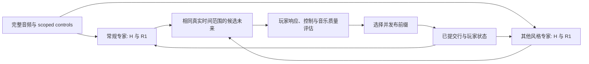

# 从零训练常规 4★ 专家，再融合完整续写

目标是先建立一个能稳定生成常规约 4★ 谱面的独立专家，再将它纳入最终的 2–6★、
多风格、可变 scope 控制系统。常规专家包含 TAP 的分组与流动、休息和转折、长 LN
背景上的其他手指编排，以及容易跟随的 LN stream。高 LN coverage 仍然可以常规；
“所有 LN 都变长”或“只生成 TAP”不构成成功。

这是新的研究路线，尚无合格的新 checkpoint。此前继承权重的对照已经留下明确反例：
短 LN 频率超界；更好的 factual NLL 与更坏的原生短尾并存；三个固定前缀位置对
LN 请求 .05→.8 的下一行响应很弱。其 256-update 计划在 MPS 卷积断言处中止，
最后持久化到 112 updates。新路线不以继续修补该运行作为前提。

## 1. 初始化与信息流

保留确定性 Mel、exact replay、完整行语法与发布协议。所有学习参数——音频网络、
H、R/R1、control 路径——重新初始化，不加载旧 actor、旧音频编码器或旧优化器状态。
隐藏层使用正常随机初始化；输出／残差零初始化与事件率初始偏置保留明确数学作用。
把全部神经元设成零会破坏学习所需的对称性打破，不是本方案中的“从零”。

第一版使用简单且可解释的两尺度音频编码：局部 Mel 网络与完整歌曲的粗时间音频
attention。训练与推理均读完整音频；训练更新音频参数后必须重新编码，不能沿用
以前冻结编码器时的跨更新缓存。

| 所有者 | 输入与职责 |
| --- | --- |
| H | 音频、已有 H 与请求条件，生成未来 head 时刻及其节奏；不指定列、和弦大小或 LN 数 |
| R1 | 直接音频、未来 H、已提交动作／占用／LN origins、条件，选择完整四列动作 |
| R | 使用同一个 R1 能量决定等待与释放，再由一致的完整行 law 决定释放集合 |
| continuation / frontier | 从相同已提交玩家状态比较真实时间内的实际候选，不把 actor 的 NLL 分数称作玩家压力 |

联合源谱学习保持完整因子：

$$
\log q_\theta(H,Y\mid A,c)
=\log q_H(H\mid A,c)+\log q_{R/R1}(Y\mid H,A,c).
$$

没有把释放 clock 的概率丢掉，也没有把未来源谱端点放入当前状态。首次启动从 BOS
直接生成；源数据中的真实启动片段进入训练，不构造虚假的 30 行上下文。

新的小模型从局部／长历史两条路径与每个私有计划的连续上下文开始。局部行历史连续
保留；四秒计划更新不再强制清空它，精确占用与 LN origins 同样持续。当前可执行
[bootstrap](../../src/ensomi_model/research/segment_audio_continuation/bootstrap.py)
支持真正的新初始化与联合 H/R1 梯度；它是待验证的起点，不是已确定的最终架构。

## 2. 先固定“4★”和“普通”的训练含义

第一阶段用整谱约 4★ 的真实谱及其安静、密集、过渡部分共同训练。整谱级别与局部
strain 读数是不同变量。旧 recipe 随机混用整谱标签和 16/32/64 秒局部读数，可能
改变请求难度所对应的条件分布；尚未完成隔离实验来量化它对持续密集生成的贡献。
新专家不把每个短窗都要求成同一个高压状态，也不因裁到安静段就改写其整体参照。

LN 比例仍以 LN heads / all heads 定义，与 coverage 分开。控制属于明确范围，
不是要求范围中每一小段比例恒定。STYX 的整谱 LN 比例约 .485，而真实的某个六秒
窗口完全是 TAP，正是需要学到的分配方式。

先按歌曲组与相同音频的连通分量划分，再选择教学源。当前 1,973 张 3.5–4.5★
候选中，训练 1,602 张／1,313 分量，独立验证 361 张／295 分量，既有原生评估音频
保留 10 张／6 分量。缺少一个缓存 entry 的真实谱通过原文件解析保留，没有静默删除。
这些是候选总体，不是已经人工认证的常规子集。

从真实图面确定普通 TAP、持键＋TAP、规律 LN body、呼吸／转折的教学样本。
时间与动作统计用于定位和抽样，不自动生成语义 style 标签。例如同时进入的 LN
有不同长度，若形成稳定节奏单元，仍可能容易跟随；不能要求所有 co-start 都同尾。
观察主 H 时钟及少量修饰，也不能把最细可拟合网格直接称作歌曲 BPM。

默认条件的数据按选定自然总体取样。显式条件的稀有层可以增加曝光，但条件缺失时
不能继承这种抽样分布。人工 style 标签只监督实际覆盖的片段：此前切段后 36/60
human-branch 视图落到标注外的错误必须由采样契约防止复发。

## 3. 三个学习阶段

**源谱能力检查。** 先在少量已核实的真实常规谱上，从新参数开始联合学习完整 H/R1
概率。包括真实 BOS、完整前缀和跨窗口持键，保留原始时间与尾部。这个检查回答
“当前表示和代码能否学会这些具体关系”，不建立跨歌曲泛化结论。随后扩大到独立
划分后的普通总体，并保持真实时间、歌曲和条件的抽样权重清楚。

**自身生成上的控制与压力学习。** 使用原生 H 和真实生成历史，检查 16 秒等真实
scope 内的难度、LN 数量、重复负荷、释放恢复与节奏组织。失误前缀不能接上原来的
source suffix 充当正确标签。DAgger 的相关启发是学习系统自身诱导的状态分布；
本任务没有能为任意错误前缀给出唯一正确下一行的专家 oracle，因此不能照搬其
标注步骤。[Ross 等，2011](https://proceedings.mlr.press/v15/ross11a.html)

在独立响应足够可靠后，可对实际候选未来进行排序或风险学习，同时保留源谱正例。
若更新影响 H 或共享音频，梯度必须包含相应 H/R/R1 因子；不能用 row-only
log probability 代替整个生成系统。控制响应要通过同音频、同前缀的 scope 改变
实验验证，而不是只看输入里有没有 control 向量。

**资格与扩大。** 多 seed、独立音频、不同控制范围、长程与高密度段都要过关。
完成训练、NLL 下降或一个好看的局部例子都不等于可玩。普通专家先解决明确的
基础分布，再扩大范围；最终仍要覆盖 2–6★ 和显式请求的丰富风格。

## 4. 坏 pattern eval 的三种用途

| 用途 | 应提供的证据 | 不能替代的判断 |
| --- | --- | --- |
| 教学总体审计 | 哪些源片段属于本次普通目标，哪些保留给专门风格；原始事件不修改 | 不把不入选的 ranked 谱自动标成 BAD |
| 独立回归 | 极短尾、release→attack、真实时间同指累积、节奏结构、比例、难度与速度分别报告 | 不让平均指标抵消严重局部失败 |
| 训练侧负例 | 新采样的实际坏续写、其上下文及可解释失败位置 | 不把现有绿灯直接视为完美 reward oracle |

训练侧负例与保留测试需要不同身份。固定测试暴露过的问题应转化为一般检测算法，
还要用新 seed／新曲目检查迁移，避免只修已知文件。

当前短尾回归已经有用：六个生成样本在 ≤80 ms 指标全部通过，却在 ≤40 ms 指标
全部失败；真实对照通过两项。但这两个坐标也不能代表全部 LN 组织。持续同指负荷
需要额外保留时间尺度：新训练总体的等歌曲分量统计中，整谱最高同指四秒 attack 数
99 分位为 23，八秒为 43。旧 work 评分却能放行四秒内 32 次单指按下。表示中
包含压力字段，不保证最终标量接受规则保留了这一区别。

这些分位数是数据观察，不直接成为所有风格通用的硬限制。新的 continuation
参照应同时验证真实正例、已知坏例和新生成样本，保留可检查的响应分量。单一
宽松总预算已经被反例否定，不能继续充当完整 frontier。

## 5. Fusion 的单位是一个连贯未来

让专家从相同真实前缀出发，各自提出兼容的 H 与 R1 完整未来：

$$
e\sim g(e\mid A,c,P_t),\qquad
(H_e,Y_e)\sim q_e(\cdot\mid A,c,P_t),\qquad
\mathcal C_0(P_t,t;Y_e,t+\tau).
$$

router 的选择保持一个真实时间区间，frontier 评价候选的实际动作与持续时间，再
发布所选前缀。时间抽象的 options 提供了相近的分层组织思路；本系统仍需自己的
精确行语法、跨段 LN 事实和控制语义，不能由该类比推导出质量保证。
[Sutton、Precup、Singh，1999](https://www.sciencedirect.com/science/article/pii/S0004370299000521)

expert 切换不清除 LN 占用、累计负荷或已经发布的动作。新专家要从真实前缀恢复
自己的神经缓存；未发布的尾部与私有计划可以重新考虑。中途 control 变化只作用于
其未来 scope，不把不同范围混成一个整体指标。

常规专家在 fusion 后仍有受保护的独立回归集。其他专家必须拿出通过评估的候选，
才会进入实际发布；不能因其覆盖特殊风格就默认可接受。若双模型的真实时延过高，
可在候选系统已合格后，把实际合格续写蒸馏到一个模型。多策略压缩的类比是
[Policy Distillation](https://arxiv.org/abs/1511.06295)；它不证明合并教师后仍然
可玩，蒸馏结果必须重新过完整回归。

## 6. 首个可执行实现的边界

新模型使用直接的未限幅 H 条件分数。旧 H 的有界历史修正适合限制自激，但在音频
基底不能区分时刻时，也会限制精确节奏的表达。以 150 ms 周期、每次一个 H 为例，
若诊断中各 native clock 的基底 logit 相同、峰值与其余时刻的 logit 差最多为 8，
即使可以任意安排峰的位置，最优的准确
下一 H 概率也只有约 .65。这个隔离例子不证明真实音频模型一定受同样上界约束；
它说明不能不加检查地把既有稳定性近似带入新的常规节奏模型。新 H 的密度和长程
稳定性必须由自身生成测试与独立响应来验证。

新的联合学习入口已经保留 source H 与 R1 的正确职责，并测试完整音频、H 与行
分支收到联合梯度。长前缀编码使用无效右 padding 稳定输入形状，读取真实最后一行，
不新增物理事件。这尚未被证明能解释或修复前次 MPS 断言；真实后端短跑仍须记录。
首个训练将从小规模、可检查的源谱能力验证开始，不直接将随机初始化后的模型放进
线上融合路径。
