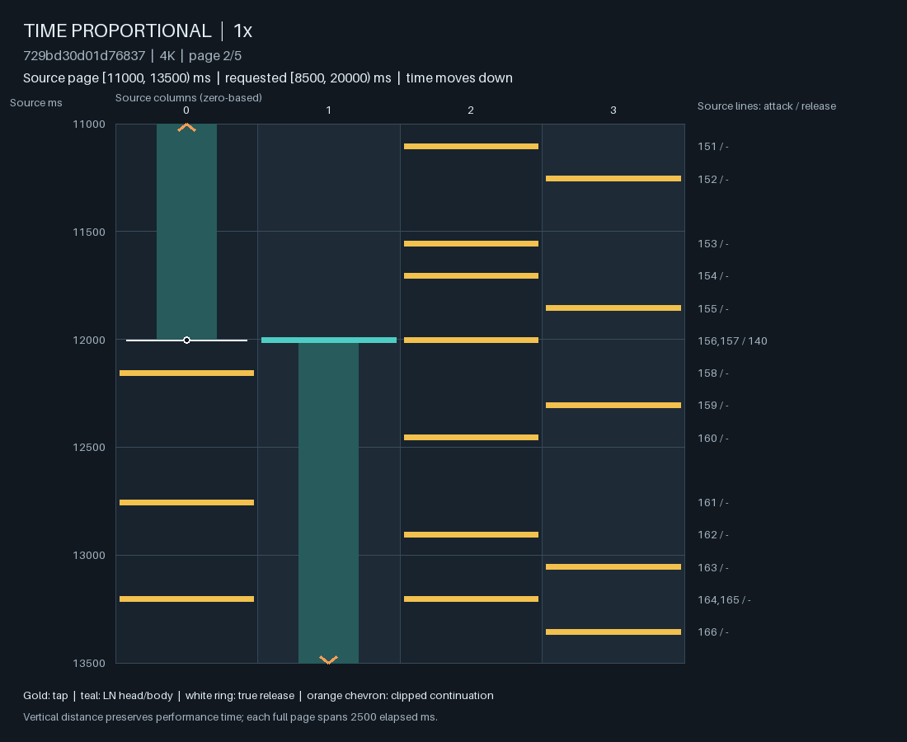
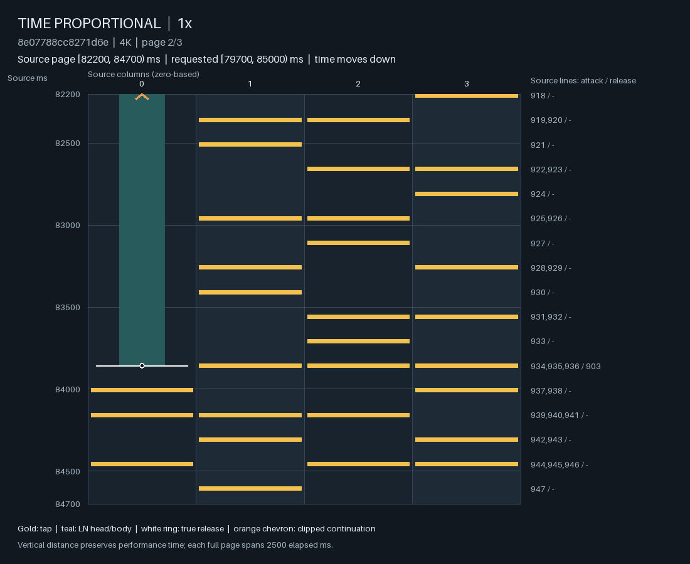
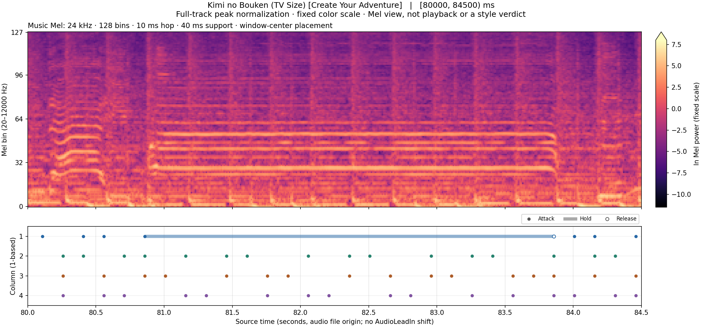

# 约 4★ ranked TRAIN 的 LN 编排：自然分布与准确源图

这批自然谱支持一个明确重心：普通约 4★ 编排里的 LN 常给出可以持续追踪的持有角色，释放后也常留有明显的同指再按余隙。一个长 LN 下面，其余三列仍能组织单点流、jump/single 交替或连续双键重复。多指 LN 的长短变化经常服务于共同进入、错时进入后的共同释放、以及按固定节奏交换持有角色。把这些关系压成长度均值，或拿少数很短的 LN 当作普通编排的代表，都会错过主要证据。

这些结果不推出统一的 LN 最短长度、生理阈值或可玩性分数。LN 主体谱的持续时间分布明显更短；短 LN 与不等长 LN 也确实存在，但有些依附于清楚的重复单元、共同尾组或非二进制节奏。正确的条件化对象包括谱面中 LN 的使用比例、真实毫秒速率和完整动作组织。

## 1. 范围、分母与权重

输入是既有 ranked TRAIN corpus 的 6,924 张谱；其 SHA-256 为 `13e4d8b7910f7d33ef18c078a27d12406317a2b7ecaf01fa9843752ef00dae9d`。使用已有 corpus census 按 **20241007 版 mania difficulty** 重算的整谱星级筛出闭区间 **3.5–4.5★**，得到 **1,973 张谱、1,614 个 song groups**；metadata 快照全部标为 ranked。没有扩展到 3–5★，没有加入 held-out 歌曲组，也没有将既有复杂 LN 选例当作自然抽样。

重新核对每张 `.osu` 的源 SHA，直接保留头、尾、列、原始 source line。全体共有 **3,430,578 个 heads、628,071 个 LN**；其中 **624,956 个 LN** 在同一列还有后继 head，才进入 release→next-same-column-head 统计。没有后继的情况未记为零。LN 比例指 LN heads / all heads，与占用时长不同。

分层边界只是描述性汇总方法，不是人工 style 标签：无 LN；LN heads 占比 (0,20%) 的 TAP 主体；[20,60%) 的混合；[60,100%] 的 LN 主体。报告的“歌曲等权”先让每个有机会的 song group 等权，再让组内该层的有机会谱等权，最后让谱内相关对象等权。这样既不会让同一首歌的众多难度重复增权，也不会让 LN 多的长谱主导全体 LN 分布。各条件层的歌曲组可重叠；它们的 group 数不能相加当作独立样本量。

| 描述层 | 谱数 / 条件 song groups | 全体 song-group 等权谱占比 | LN 数 | LN 持续中位数 [Q25,Q75] ms | 释放→下一同指 head 中位数 [Q25,Q75] ms |
| --- | ---: | ---: | ---: | ---: | ---: |
| 无 LN | 134 / 110 | 6.40% | 0 | 无机会 | 无机会 |
| TAP 主体，(0,20%) | 1,140 / 962 | 57.65% | 165,601 | 196 [150,337] | 242 [158,375] |
| 混合，[20,60%) | 636 / 564 | 32.89% | 387,033 | 162 [98,250] | 183 [125,319] |
| LN 主体，[60,100%] | 63 / 57 | 3.06% | 75,437 | 132 [94,220] | 167 [98,261] |

全部 LN 直接池化的持续中位数是 **164 ms**；歌曲→谱→LN 等权是 **176 ms**；只看 TAP 主体则是 **196 ms**。因此，“所有 LN 放在一起的普通 4★”会被 LN 数量多的混合／LN 主体谱拉向更短的长度。

在 TAP 主体层，歌曲等权的 LN 持续 ≤80 ms 占 **5.81%**，≤60 ms 占 **1.21%**，≤40 ms 占 **0.136%**；释放后下一同指 head 的空隙 ≤80 ms 占 **3.86%**，≤40 ms 仅 **0.0065%**。后一个池化分母是 164,052 次同指后继机会，其中只有 5 次 ≤40 ms。它们是自然分布的尾部描述，不能据此制定硬阈值。

每张谱中“两个及以上 LN 同时进入”的组，完全同尾的歌曲等权比例，在 TAP 主体／混合／LN 主体分别为 **73.4% / 52.1% / 34.2%**；这项比较只对有同入组的谱成立（916 / 630 / 63 张）。所有 LN 释放中，与任意 head 同时发生的比例分别为 **76.9% / 67.9% / 62.0%**。不少尾部与后续另一指的动作共同组织；也保留了明确的 release-only 时刻，不能把释放附会为“每个尾部都必须有新 onset”。

## 2. 节奏网格是描述，不是新的模型真值

相对于最近一条 uninherited redline，事件时刻依次归入整拍、半拍、四分之一拍、更细二进制位置，匹配容差为 **2 source ms**，每条红线重置相位。这里的“半拍”通常对应八分音符，“四分之一拍”通常对应十六分音符；网格位置不表示这些位置上都有音符，也不证明形成连续的某种 subdivision。

TAP 主体层 LN heads 约 **92.3%** 位于整拍或半拍，LN releases 约 **79.7%** 位于这两层、再有 **15.5%** 位于更细的四分之一拍位置。混合层对应的 LN-head 比例约 **84.9%**；LN 主体约 **74.9%**。这与下述真实片段中较清楚的低 subdivision 动作组织一致；它不能单独解释 Tech、难度或音乐对齐。

持续时间和同指余隙的 beat 数通过 tempo 变化积分。整数毫秒导致半拍附近出现 0.499… / 0.501…；因此本报告只用它们描述近似分位数模式，不把无取整容差的 `<=0.5 beat` 比例当作“短于半拍”的精确占比。未匹配二进制网格的事件也可能来自三连／非二进制 subdivision、摆动、偏移或红线因素，不能自动标成 Tech。红线在本次研究中是阅读参照，不是要求生成模型预测的额外 ground truth。

## 3. 准确源图中的实际关系

下列九个来源均独立于既有 LN-risk 选例。前三个从自然全集的“一条 ≥1 s LN、内部至少八个 TAP 行、其余三列都出现、没有另一条重叠 LN”的机械候选中按接近 4★检索，再分别查看单点、交替 jump 和连续双键组织。这个检索只定位问题相关片段，不证明整个形态在 corpus 中的频率。

其他来源按接近 4★和描述层选择；六秒局部窗在全谱的 15%–85% 时间区间内，以局部 LN 比例、LN 持续中位数和 head 密度接近该全谱的程度选取，再扩展进入／退出上下文。它们是解释性选例，不是随机局部质量样本。个别 community tags 只提供整谱探索线索，没有把标签自动移植到本窗口。

Lens canonical parser 对这九张完整源谱，与普查 parser 的每个 sourceLine/start/end/column/kind 全部相等。使用同一 harness revision `22e5c84f5cacb8493bdab5f1d0fdc09c5373dc60`，已实际查看全部 **31 页 time-proportional 图**；每个进入持有、跨页尾部和真实 release 都保留。图中列为 **0–3**，时间向下。

| 来源及整谱重算星级 | 已读核心 / 上下文，source ms | 准确动作组织 |
| --- | --- | --- |
| **Celestial Horizon [Heavenly]**，2131277，4.00355★，LN 7.49% | 核心 [9605,18906)；上下文 [8500,20000) | c0 9605→12005、c1 12005→14405、c2 14405→16805、c3 16805→18905。前面三个持有各 2.4 s（200 BPM 的 8 拍），每个内部有 13 个 TAP 行／14 个 TAP 动作，分布在另外三列，主体行间隔 150 ms。持有列轮换后，刚释放的手指重新参加 TAP。四个 tail 后下一同指 head 的余隙分别为 **150/150/450/300 ms**。末尾在 18905 结束持有，19205 进入三键动作；是一个完整的进入、交换、退出过程。 |
| **Kimi no Bouken [Create Your Adventure]**，1969732，4.01555★，LN 13.08% | 核心 [80858,83859)；上下文 [79700,85000) | c0 持有整整 **3 s**。从 80858 起到 83708，其他三列每 **150 ms** 连续出现 double→single 交替；内部 19 个 TAP 行、28 个动作、9 个 jump。double 的列组在 {12}/{13}/{23} 间轮换，single 随之衔接。这是长持有背景下持续的 jump/single 组织。83858 同时放 c0 并落 {123}；c0 在 **150 ms** 后重新加入。 |
| **Arakajime Ushinawareta Bokura no Ballad [Insane]**，1242637，3.97697★，LN 14.85% | 核心 [80503,82853)；上下文 [79400,84000) | c0 80503→82852 的持有下面，{23} 在 80806/81109/81412 连续重复，{13} 在 81715/82019/82322 连续重复，主要相隔 **303 ms**；随后 {23}→{12}→{13} 加密至 **151/152 ms**。这是有重复核心的双键／chordjack 式组件，其他三指并未因一指持有而停止组织。尾部位于附近 TAP 行之间，保持真实 release-only 时刻；c0 下一 head 是 **83029，余隙177 ms**。 |
| **Classic Pursuit [mint's Another]**，2576768，4.00000★，LN 21.72% | 核心 [96054,100125)；上下文 [93800,101300) | 先有 {023} 约214 ms 重复及短密集连接，再进入不同列的 LN+TAP 轮换。c2 97554→97768 与 c3 97661→97768 **错时进入、共同释放**；97768 接 c0 持有和 c1 TAP。后续多次约321 ms 的 LN 与周围107/214 ms TAP 单元连接。长度变化跟随可复现的节奏关系，不是每条 LN 各自选择一个不相关尾部。 |
| **Tell Me What You Want [I want Insane]**，3347992，4.00629★，LN 33.69% | 核心 [46000,52000)；上下文 [45000,53000) | 49353 起连续的 LN 头在 c0→c1→c2→c3 上以 **187/188 ms** 轮换，上一持有的尾部与另一列新头交接，旁边 TAP 保留。进入前还有 c1 46728→47009 和 c2 46915→47009 的共同尾，以及 48228 同入 c0/c1 后在 48415/48603 分拍放开的不同尾。共同头、共同尾和轮换在同一段里各有清楚作用。 |
| **Star Trip [Madoka's Starlight]**，2749961，3.98196★，LN 66.26% | 核心 [66074,72055)；上下文 [65000,73000) | 在约101 ms 的四分之一拍单元中形成多指进入、分组尾部、角色交换。c1 68202、c3 68304、c0 68506 三次进入后都在 **68608** 放开，下一组在 **68709** 进入。另一组 c3 69520、c1 69824、c2 70128 都到 **70229** 收束。持续长度不同，但共同的后续收束点明确；这属于 LN 主体层，不应代替普通 TAP 主体的分布。 |
| **Good-bye sengen [Independence]**，4217082，3.98022★，LN 70.45% | 核心 [116145,121616)；上下文 [115400,122900) | 很多 LN 只有 **88/89 ms**（170 BPM 的四分之一拍），但反复出现同一组合：一条约177 ms 的较长 LN 与一条88 ms短 LN 同入，短 LN 放开时另一列再进入，随后与长 LN 共同放开。例如 c2/c3 在116321同入，c3在116409放开并接c0，c2/c0在116498共同结束；116851及117380附近重复相似的角色关系。这解释短 LN 的具体组织，并不把它提升为普通4★的总体代表。 |
| **enchanted love [Selfish Heart]**，3175555，4.00008★，LN 56.67% | 核心 [64330,67804)；上下文 [61800,69300) | 先有约105 ms TAP 重复及局部约26 ms插入，随后 LN 交接，再到66856起的短 LN 双键组。66856 {02}、66961 {01}、67066 {03}、67172 {23}、67277 {12} 各持有约52/53 ms，组间约105 ms并保持组内共同尾。在190 BPM下对应明显的 **1/3、1/6拍**关系，局部还有更细连接。整谱有 community LN coordination(6票)/LN release(4票)线索；本阅读不新造 Tech 人工标签，也没有把非二进制网格等同 Tech。 |
| **1xMISS [COMBO BREAK]**，2069939，4.01193★，LN 32.20% | 核心 [146000,152000)；上下文 [145000,153000) | 整谱有 community Tech(2票)/technical hybrid(1票)线索，但这个按整谱描述量选出的局部仍以约142/284 ms 的 head 连接、213/284 ms LN 和少量71 ms插入为主。长短尾往往落在下一动作或其前一个可见节奏位置。整谱 Tech 标签不能推出每个窗口都高 subdivision，标签也不能替代窗口内的实际阅读。 |

另见 [Arakajime 的连续双键与真实尾部](assets/ordinary-fourstar/arakajime-1.png) 和
[Star Trip 的多指共同闭合](assets/ordinary-fourstar/startrip-1.png)。

## 4. 音乐关系的证据边界

两个来源另使用同一仓库的 music Mel frontend 读取完整音频，再截取与动作相同的源时间范围。
前端为 mono 24 kHz、128 Mel bins、10 ms hop、40 ms Hann support，完整音频先作 peak normalization。
frame i 的支持为 [10i,10i+40) ms，图中放在中心10i+20 ms；10 ms hop不等于10 ms起音精度。
没有施加 AudioLeadIn 偏移，没有音频聆听或乐器身份判断。

Celestial 的 [8800,19500) ms Mel 中，9605/12005/14405/16805 的持有交接与低频／谐波层的变化相呼应，
14405 附近尤其明显；TAP 穿过持续的音乐纹理。18905 放键并不等于后面约19200 ms的大变化本身。
这支持声音持续层与动作持续层的关系，同时不要求所有LN端点都选择最大的谱能峰。

Kimi 的 [80000,84500) ms Mel 中，80858→83858 的LN与一组强、连续、近水平的谐波带大致同起止，
尤其在Mel bins25–55附近。其他三列的TAP在这层持续声音下活动；83858附近谐波形态改变，持有结束。
这个源例直接展示了“持续声音角色与持续手指角色相呼应”；它不提供一个可泛化的乐器或音符转写标签。

这些是选定段落的视觉音频证据，不是全部LN都对应明确谱峰的总体估计。
其余七个来源只作谱面阅读；红线和谱面形态不能补出未知的音乐对应。

## 5. 对 proposal、continuation、frontier 的启发

**proposal 应学习可追踪的安排关系。** 事件时刻上的 count/layout 需要能表达“这一指保留为持续角色，另三指继续某个 TAP 组织；到一个较大节奏点再交换／结束”。在多指 LN 中，也要保留共同进入、短支路退出、不同进入最终共同收束等关系。只从各行边缘分布采样正确的 LN 比例、长度均值或星级，不保证生成这些关系。本观察支持这种表达需求，但没有完成任何新架构的因果验证。

**continuation 应保留尚未结束的组织。** Celestial 的持有可以跨过十多个其他列动作，Kimi 的同一持有贯穿20个head行；这些动作不应仅因为候选 H/R 次数多就失去持续性。Tell Me 和 Star Trip 的后续共同尾／角色交接则要求读取组的关系，而非把每根尾部当独立时钟。这里不是要求预先死定每条 LN 的完整尾部，也不是认定原模型存在某一种已隔离的因果故障。

**frontier 应读取动作的路径与可继续的空间。** LN 头到尾、尾到同指下一头的真实毫秒余隙很重要，但还要看谁在持续持有、谁在另一层活动、多指是否共同收束、刚释放的手指何时重新加入，以及一个局部动作怎样接入后续单元。同样的短长度，在固定重复单元中与不可追踪的零碎换位可能有不同含义；不能用单指均值或一个瞬时“压力总分”抹掉这些关系。

这些证据支持把“有余裕、持续角色和清楚的动作组织”作为普通约4★生成需要恢复的分布重心。
对复杂LN及非二进制节奏的表达能力仍要保留，但不能让它们成为常规控制下默认的零碎编排。

### 对模型分工的具体约束

H仍只决定head-bearing时刻；R提出纯释放时刻；R1负责head数量、列、TAP/LN类型与释放子集，
并同时读取音频和skeleton。上述三种自由手指组织都发生在R1内部。
不能为了恢复常规节奏，把jump、chord或分指计划提前塞进H。

在proposal里，应区别持续的编排记忆与玩家已经执行的状态。
可研究给每条开放LN保留一个角色表示$m_i$，其来源包括出生时的音频／编排上下文，
当前再结合完整音频、其他开放LN和下一段head timing决定继续或结束。
这个表示不能读取源谱未来尾巴，也不要求客户端预先收到尾部。
它的任务是让Kimi的持续层跨过多个TAP动作仍可被识别，
并让Star Trip的不同进入保留共同闭合的关系。

已有[HoldAudioCues](../../src/ensomi_model/research/controlled_audio_continuation/hold_audio.py)
已经提供每列origin audio、current audio、age与active bit，不能把“加入LN起点音频”重新当成新方案。
合适的对照是检验这个现成表示能否保留上述关系，再决定是否需要开放LN之间的attention
或更持久的角色表示。本研究没有证明新增模块优于现有实现。

玩家响应则应从已提交动作前缀$P_t$得到状态$\Phi_t$，评价一个真实时间范围内的完整候选：

$$
\Phi_t=F(P_t),\qquad
\widehat{\mathcal C}_0(\Phi_t;Y_{(t,t+\tau]},t+\tau).
$$

这里需要保留正在持有的手指、近期按放顺序、手内／手间节奏和实际恢复时间。
一个候选若改变持有角色，评价的是这次转换如何接入已有动作；
角色稳定也不能免除持续long jack的执行积累。
私有编排意图$m_i$不是玩家已经经历的事实，control切换也不清除$\Phi_t$。
这些是沿用[V3状态语义](../formulation/gameplay-state.md)的表示要求，尚非一个已标定的生理响应曲线。

H的常规节奏也需要序列层面的倾向：稳定脉冲、稀疏的subdivision选择和可延续的局部节奏单元，
同时保留非二进制与不规则时间。BeatThis可作为音频节拍证据的候选；
它的原论文也报告了continuity指标的局限，不能把beat logits自动视为正确谱面骨架。
参见[Beat This原论文](https://arxiv.org/abs/2407.21658)。
对本系统，红线只用于这次分布阅读；训练目标仍是真实note placement，
音频表示在训练和推理都应能使用完整歌曲。

### 后续评估应检查什么

这些source-linked段落适合成为固定正例：在一指持有期间保留另外三指的组织，
同一角色跨多次H仍可持续，以及不同进入能够形成共同闭合。
它们与生成的碎尾、错误anchor释放和持续单指压力一起评估，
比单独要求LN中位数变大更能区分改进。
[条件释放研究](ln_release_calibration.md)提供了head、释放数量、释放身份三项的精确诊断；
这些NLL项帮助定位学习退化，最终判断仍需要native输出和独立的响应／组织评估。

回归结果至少应按difficulty、明确的LN请求／未请求、style与control range分别报告。
本研究的描述层不能直接变成拒绝模板；特别是不能靠把LN主体谱生成成TAP谱，
或把难跟随的形态统一吸附到网格，制造表面上的分布改善。

## 6. 复查与局限

结果来自特定 ranked TRAIN 数据和一个固定星级实现；不是全部 ranked 普查、玩家能力实验或生理研究。整谱3.5–4.5★不等于每个局部都有同一难度；三种 LN 比例层也不能替代社区／专家 style 判断。九个图读例子帮助解释组织，不能估计这些组织在全体窗口中的发生率。

普查及汇总使用单CPU进程，耗时约28 s；没有模型训练。31页源谱图与两个Mel视图均实际检查。
两个Mel来源的source SHA分别为
`729bd30d01d76837f3acc556efb8398b09f06aa8f33726afa275c7fe6efb4cdc`（Celestial）及
`8e07788cc8271d6eb08b907b2f06a84fdf2a5daa283593b5a77fa1f7f9ee3134`（Kimi）。
音频SHA分别为
`b12cfa807af4b05214de2e09bbe95216fb23291bf8b9ee91fac4590365c47a4e` 和
`50555e04dba88ca254652a9a73c6ed552fc746dfac5ea539017f7eac80529f31`。
图及其关键关系已随文保留；本地原始输出缺失时仍可理解这些结果。

本地corpus owner为 `artifacts/joint-audio/20260928-ranked-fourstar-arrangement-v1`，
音频owner为 `artifacts/joint-audio/20260928-fourstar-audio-reading-v1`。
原summary保留：无LN层的几个无机会比例最初误写为0，v2修正为null；本文引用分布未因此改变。
两者均为探索性研究记录，没有新增人工评判、已校准的玩家代价或可玩性认证。

| 证据 | SHA-256 |
| --- | --- |
| corpus计划 | `89aa6eec5cdc27b37a2f1f5938f68bed9a22daced3d51d258072a6daae54c9b5` |
| 逐谱精确观察 | `592c4e684cc3e0c0c32ffcc559eb42875aeac4794e6e25a4eff6ec98c96afae6` |
| 推荐汇总v2 | `e630cd022cb19d96aabc8eb839dc0cf9fe25c2a90fc0c41db1fb95cede1966fa` |
| 来源与选样 | `24bb92db1f5fe0bd884c9a80a2c2e9e3ca27cd1887858f768701490a798ee91f` |
| 31页阅读记录 | `a152796288f19d88e085bc96eb3218b112ca24380d1f269863b887b3253785c6` |
| Celestial Mel证据 | `1e119809c1168bf56a45c3a24cf8818372efe22aea421f641a4242928037fc8e` |
| Kimi Mel证据 | `1d9637b413c3606e06f8f667a8e95f5295f4240ded91d1674ce583c6dccae5e9` |
| 两个Mel视读记录 | `a6f0e377614ab3c2e83476ef9044338ebb5adbe41adef2cccf60d48bc6e54baf` |
