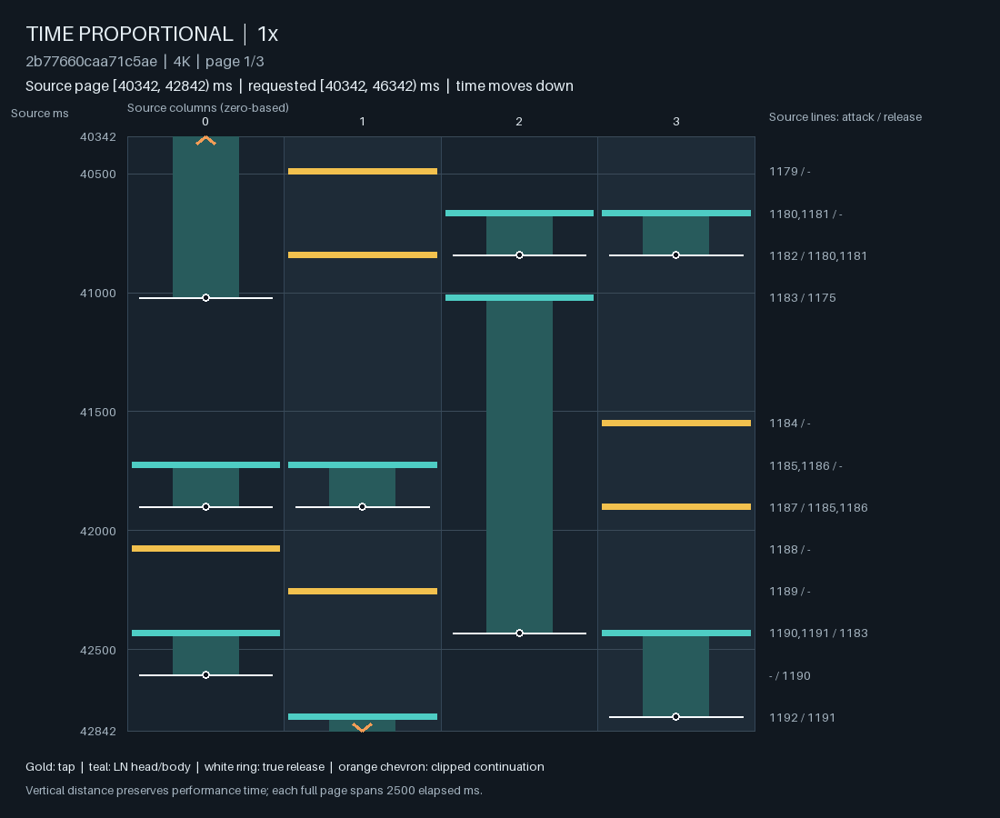
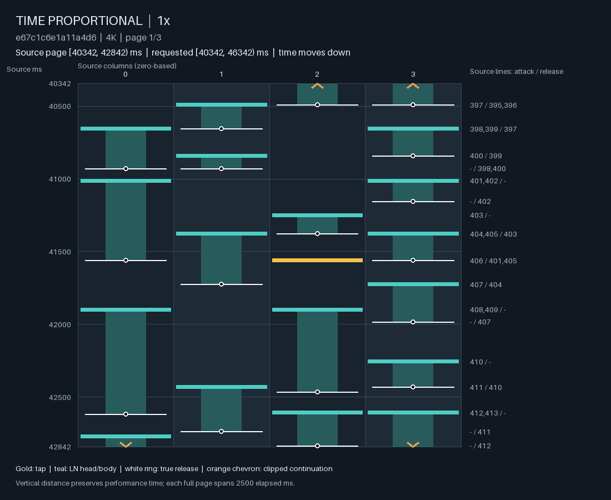
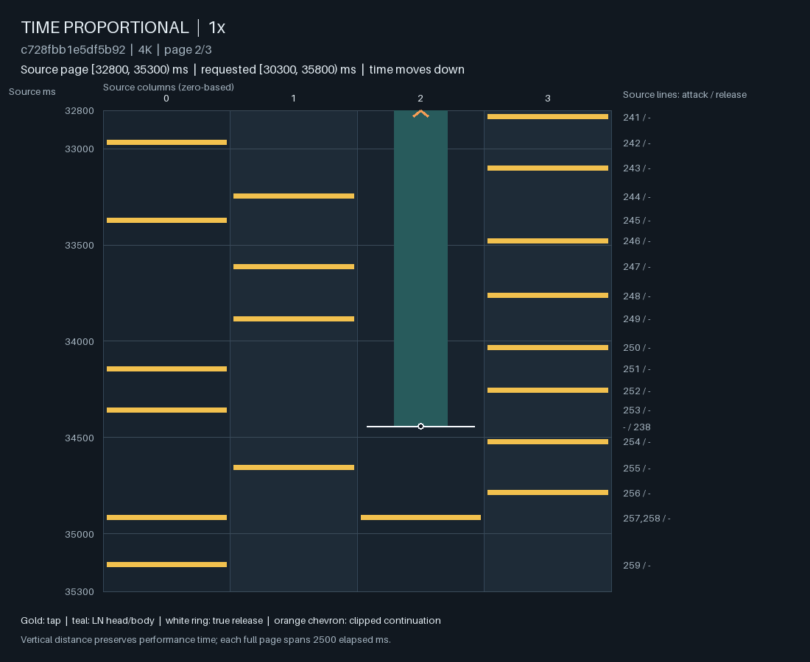
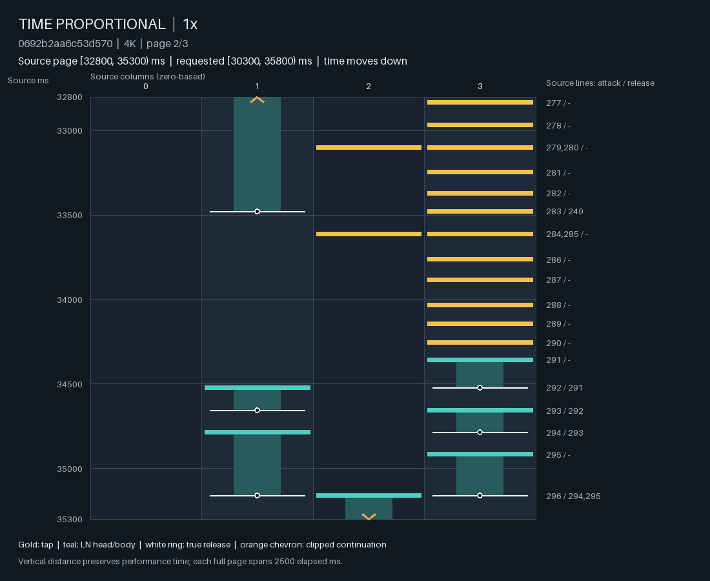
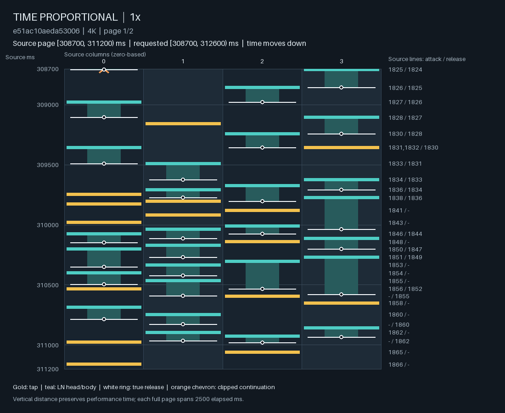

# 恢复释放支持与联合学习：数量收益、控制回归与骨架可达性

恢复真实 LN articulation 的支持、再联合学习 R/R1 或完整 audio/H/R/R1，仍未得到可晋级的 2–6★ 模型。R/R1 分支改善了部分 LN 总量，却重新生成了 21 次连续同列 head；完整联合分支的验证 NLL 更好，但低难控制和持续压力仍有明显失败。两分支都未达到预先规定的四星误差改善条件，且新增了控制回归。

本研究留下三个具体结论：真实释放关系确实会在进入优化器之前被支持过滤排除；同一骨架可能仍有未利用的 R1 选择空间，也可能已经使低星目标不可达；更少的全曲 H 不意味着更低的峰值难度。新增的星级下界将后两种情形分开。源谱 NLL 的改善未阻止生成历史上的组织退化。

目标仍是完整音频、从 BOS 开始、可按范围控制的可玩谱面。[V3 formulation](../formulation/README.md) 规定合法行、开放 LN 和不可撤销提交。H 选择新 head 时间，R 选择纯释放时间，R1 读取直接音频、H preview、历史、精确状态和 controls，负责完整行。所有 stars 使用仓库的 20241007 算法、4K、clock rate 1；metadata 分层和局部 difficulty proxy 单独标明。见证的列编号与 Lens 一致，为 0–3。

## 比较对象与实际学习

父模型为未通过质量检查的 [scoped-progress candidate](scoped_ln_allocation.md)：

| 条件 | HH/RH/HR，ms | 学习范围 |
| --- | --- | --- |
| Strict parent | 60/50/50 | 原父模型 |
| Profile only | 60/25/21 | 同权重，只恢复 release 支持 |
| R/R1 | 60/25/21 | R 时间／survival、完整 R1、范围分配模块；audio/H 冻结 |
| Joint | 60/25/21 | 完整 fine/coarse audio、H、R、R1 联合更新 |

四组均关闭 LN amount feedback，保留已有 empirical row preference。范围分配模块仍只是 R1 的 LN-count 偏移，不接管 head 数／分指，也不代表完整玩家 frontier。恢复值是研究支持，不是人体阈值。

支持 census 的 prepared TRAIN 总体有 6,923 张 metadata 2–6★ 谱，且已经过初始 37/25/21 筛选。60/50/50 与 457 张谱的至少一个关系冲突；60/25/21 剩下 27 张有 HH 冲突。按关系预测受影响的非空八秒窗口从 2,313 降至 135。抽取的 64 个预计恢复窗口，在真实 collator 中从 0 个可接受变为 64 个可接受。这不是全部窗口接受率的估计，定义见 [形式化分析](native_pattern_failure_analysis_zh.md#支持过滤确实改变了哪些真实监督)。

两分支共用新冻结的 1,024 个八秒事实窗口、736 张 TRAIN 谱、661 个 song groups；五个 native-panel 音频被排除。同音频的不同编排没有合并，生成历史没有接原谱后缀。实际曝光含 40 个旧支持会拒绝的窗口和 26 个无行窗口；后者均无持有，只提供 H 静默监督。其他窗口保留真实 R survival。

Population/human 抽样为 75/25，分支在重试中不变。Population 先按 metadata-star/LN 桶均衡，再按 group/chart 抽样，并有 10% BOS 强调；human 只用原标注范围。Controls 一半为全曲真实 stars/LN 比例，其余为真实 16/32/64 秒范围的 proxy/LN 读出；D、LN 和各 style 可独立缺失，没有扩大人类标注范围。

训练目标为实际时间上的联合 likelihood：

$$
\mathcal L=\mathbb E_{w\sim q_{\rm accepted}}
\omega_w\left(\mathcal L_H^{\rm event+survival}
+\mathcal L_R^{\rm event+survival}
+\mathcal L_{\rm deployed\ row}\right).
$$

Population 使用 IntervalExample.weight_per_second，human 使用实际窗口时长的每秒权重。BOS、标注、分层和拒绝采样共同定义研究测度，不能称为原 corpus 的无偏似然。冻结因子在 R/R1 分支没有参数梯度；两分支都可用完整音频。Joint 每步重算可微的全曲 coarse 编码及包含 halo 的 fine crop，没有复用旧权重的 learned audio cache。

每组 512 updates、batch 2，AdamW、weight decay $10^{-4}$、gradient cap 1。主要 composition/control/layout/scope 路径 LR 为 $10^{-4}$，其他 R/R1 为 $3\times10^{-5}$，Joint 的 audio/H 为 $10^{-5}$。可训练参数为 3,274,110 / 4,670,322。裁剪覆盖各分支的实际梯度，共享路径和梯度竞争也是干预的一部分，结果不能归给单独某层。

## 验证拟合改善，完整生成没有通过

22 个固定验证窗口仅作诊断，不用于挑 checkpoint。所有 native 成绩来自终点。从 BOS 生成的面板保留原 20 cases，增加 Classic、Zenithfall 两音频、两 seeds 的 D2/D6 请求。全曲数量与中途 override 分开评价，不让不同范围相抵。

| 条件 | Row NLL，macro nats/row | H NLL，nats/s | R NLL，nats/s | 19 个全曲 D4 请求的 star MAE | 6 个 LN 请求的 fraction MAE |
| --- | ---: | ---: | ---: | ---: | ---: |
| Strict parent | 1.571176 | 32.019126 | 1.310699 | .584489 | .099117 |
| Profile only | 1.571163 | 32.019126 | 1.319046 | .565435 | .106350 |
| R/R1 | 1.569606 | 32.019126 | 1.309521 | .583464 | .061129 |
| Joint | 1.564304 | 31.537794 | 1.313572 | .566763 | .089384 |

预设有用难度收益为 MAE 至少降低 .10。Joint 须同时优于 profile-only 和 R/R1；R/R1 也未比 profile-only 降低 .10。两者均失败。LN MAE 的改善是这个面板的实际结果，但 R/R1 新增四个、Joint 新增三个此前通过的数值检查失败，不能凭通过 case 总数或单个均值晋级。

| 全曲 LN 请求 | Strict parent，s0/s1 | R/R1 | Joint |
| --- | --- | --- | --- |
| Classic，.217153 | .319927 / .390197 | .202797 / .171806 | .136538 / .134853 |
| STYX，.485281 | .448020 / .538945 | .369538 / .495747 | .551587 / .362486 |
| Blizzard，.838046 | .962733 / .941320 | .930545 / .926410 | .950638 / .909744 |

比例误差按每个 seed 的 .1 容差独立判断。R/R1 的 STYX seed 0、Joint 的 STYX seed 1 新增该失败。局部片段不要求处处符合全曲比例。

中途 $[64000,96000)$ 请求 D4.5、LN fraction .6：

| 条件 | Override fraction | Override difficulty proxy |
| --- | ---: | ---: |
| Profile only | .897163 | 3.054401 |
| R/R1 | .795597 | 3.554666 |
| Joint | .763736 | 4.196048 |

两种学习都有数量改善，仍未达到 .6 请求。前段及恢复后的片段不是新 LN 总量请求，只作描述，不能另设配额。

## 数量校准与组织恢复没有等价关系

Lens 阅读覆盖 40 页预先固定的 Classic、STYX、Blizzard 源谱／双 seed／双分支对照，加上 36 页新增见证，共 76 页。所有页均实际读取，保留原始尾点和进入范围的持有；没有新增人类标签、听音或试玩结论。Classic/STYX/Blizzard 源谱分别约为 4.0000/4.0044/3.9277★。Zenithfall 源谱为 5.8735★，仅作同音频组织参照，不冒充匹配的 4★ 对照。

Classic 的 R/R1 seed 0 在 $[88589,93589)$ 全为 TAP，seed 1 也只有少量 LN；Joint 保留更多混合与成对持有。局部纯 TAP 可以符合全曲 LN 请求，不能自动标错；它也不能证明 LN 持续组织已修复。STYX 的 seed 间差异仍大，出现 TAP 块、混合块和较大面积 LN 进入。

Blizzard 的参考关系是持续单列 anchor，加上 TAP 重音和成对短 LN。两个端点、两个 seeds 在已读范围仍主要是不断更换的 LN，未恢复这条 anchor/TAP 关系。以下差异不意味着短 LN 或高 coverage 本身应受惩罚。

### 同 H 上重新出现 long jack

Zenithfall、D4 + Stream prominent、seed 271201 的 R/R1 输出，列 3 出现 **21 个连续 H 成员、20 TAP + 1 LN press**：31789–34357ms，持续 2.568s，median/max HH 为 127/162ms。整段只有两个其他列 head。列 1 在其中 13 个 head 时仍被持有，随后释放；其他列并非全部占用，释放后重复仍继续。

同 recovery、同 H、同 seed 的 profile-only 输出，整曲最长 run 为 7，R/R1 变为 21。下图来自同一 $[32800,35300)$ 范围。它们确立学习后的轨迹回归，但未隔离 R 参数、R1 参数和到达历史的各自贡献。

Joint 在该位置分散了攻击，对应全曲最长 run 为 4。不能由此宣布全面解决：Classic 的另一个 Stream case 出现 13 个同列 TAP，持续 2.027s、median HH 197.5ms、六个伴随 head，并随后转为另一列短块。它比 21-head 案例更慢、伴奏关系不同，需要分别判断。真实 ranked 已有带伴奏的 16-head anchor，见 [recurrence 对照](full_row_learning_and_difficulty_response.md#combining-the-broader-row-model-with-the-same-neural-offset)；不能设统一 run-length 禁令。

### 少了连续同列，也可能仍缺少恢复

Joint 的另一个 D4 Stream case，整曲最长 run 只有 5，攻击 excess 却为 .080000 秒。其 16 秒峰值窗口 $(235440,251440]$ 各列攻击数为 **67/91/86/66**，没有 LN；对应列 1 的 16 秒 excess episode 持续 **30.205s**。已读的整个 16 秒表现为持续跨列 TAP、频繁和弦和很少中断。没有 long jack 不能代替呼吸验收，所有持续 stream 也不因此自动判坏。

R/R1 的 STYX seed 0 则在 7358–8923ms 有列 2 的 11 次 TAP，其他列最多同时持有三条 LN，形成 25 个 continuing-hold/head pairs；全曲攻击 excess 仍为零。单一 press-rate 通道没有评价完整的持有／协调任务，独立 continuation response 仍未补齐。

## 低难度失败：H 的不可达部分与 R1 的剩余空间

新增 D2/D6 测试始终保持响应顺序，但仅 Joint 的 Classic seed 0 同时落在两个请求的 ±1★ 范围。以下为 D2，两个 seed 分开：

| 音频 | Strict parent | R/R1 | Joint |
| --- | --- | --- | --- |
| Classic | 3.2824 / 3.2897 | 3.2566 / 3.3035 | 2.9287 / 3.0985 |
| Zenithfall | 3.6646 / 3.3759 | 3.8957 / 3.9441 | 4.4602 / 4.1993 |

R/R1 与 Joint 的 Classic D6 seed 1 又分别降至 4.6572/4.8074，新增低估。D4 均值不能说明已覆盖 2–6★。

### 与网络无关的可复用下界

新增 [head_timing_star_lower_bound_20241007](../../src/ensomi_model/research/gameplay_evaluation/head_difficulty.py)。固定 H 后，每个已处理 head 至少增加 1 个 overall contribution，所选列 individual strain 至少为 2。沿用原衰减、首个 raw object 省略、400ms section 和正权重 peak pooling，得到

$$
\underline{\mathrm{SR}}(H)
\le \inf_{\mathcal B:\mathsf H(\mathcal B)=H}
\mathrm{SR}_{20241007}(\mathcal B).
$$

它不需要猜开放 LN 尾点，也可用于附加未来 H 之前的前缀下界。[完整推导与 API 限制](gameplay_regression_evaluation.md#star-feasibility-from-mandatory-h-timing) 说明它不是可达到的最小值、局部 scope 星级或可玩性评分。11 项测试覆盖首 chord、布局和合法 LN 变化、不同 rate、静默推进、prefix completion；本面板可计算的 whole stars 均不低于该界。

| D2 父模型 | H-only 下界 | 同 H、每次一键轮转 TAP 的合法见证 | 实际 stars |
| --- | ---: | ---: | ---: |
| Classic s0 | 1.8410 | 2.1132 | 3.2824 |
| Classic s1 | 1.9009 | 2.1884 | 3.2897 |
| Zenithfall s0 | 2.9288 | 3.5279 | 3.6646 |
| Zenithfall s1 | 2.6750 | 3.1934 | 3.3759 |

Classic 证明 R1 仍有更接近 D2 的材料化空间；轮转只是存在性构造，不是采用的生成规则或音乐质量结论。Zenithfall 连精确 2★ 都被 H 下界排除；这不等于证明 ±1★ 容差也不可达。上游必须参与难度控制，R1 仍拥有和弦、类型和分指，不能把这些决策移交 H。

### 更少的 H 没有消除峰值

Joint 的 Zenithfall D2 seed 1 将 H 从 **1,899 降到 1,399**，下界却从 **2.6750 变为 2.6855**，实际 stars 从 3.3759 升到 4.1993。seed 0 的 H 从 1,776 降到 1,739，下界从 2.9288 升到 2.9797。总量下降没有降低必有时间的峰值负担，R1 的其他选择又产生了额外后果。

这没有证明 NLL 改善只来自静默，也没有给模块分配因果百分比。它排除了“全曲更稀，所以低难和呼吸必然改善”的验收逻辑；真实时间、多尺度峰值、scope 和动作关系必须保留。

## 架构与 recipe 的具体含义

### 均衡曝光也改变未知控制的先验

排除面板音频的 6,906 张 metadata 2–6 TRAIN 谱中，LN-head fraction ≥ .5 的占比为等谱权重 **4.94%**、等 group 再等 chart 权重 **6.09%**。本次 population 曝光为 **33.90%**；LN request 被隐藏的 217 窗口中为 **30.41%**。这描述实际测度，尚未隔离对某个生成失败的因果份额。

令 $z$ 表示该编排属性，独立隐藏 LN request 不会撤回之前的重加权：

$$
q_{\rm train}(z\mid M_{\rm LN}=\mathrm{unknown})
\approx q_{\rm balanced}(z).
$$

它不会自动回到某个自然先验。均衡可帮助学习稀有条件，但 unknown 下希望得到的分布须单独定义；可以比较按 missingness 的权重，或把条件学习与显式 arrangement prior 分开。扩大 rare-style 曝光与保持默认先验不是同一性质。

本次已知 style 覆盖 534.694 秒，Stream-only prominent 仅 15.372 秒，来自原短标注范围；生成请求可覆盖整曲。不能认定已充分学会全曲 style/difficulty 联合控制。这个缺口也不能解释全部偏差，因为无 style 的 D2 cases 同样失败。

### H 音频基底的条件交互限制

令 $F_A(t)$ 为完整音频编码在当前时刻的查询，$c_t$ 为 control 编码，$w_j,W_c,\beta_j$ 为线性参数。本次 bounded-head 模型对毫秒相位 $j$ 的 base 为

$$
b_j(F_A(t),c_t)=w_j^\top(F_A(t)+W_c c_t)+\beta_j,\qquad
\frac{\partial^2b_j}{\partial F_A\,\partial c}=0.
$$

完整 logit 另加 $4g_t\tanh r_j(F_A+W_c c,H_{\rm past})$；$g_t$ 在 BOS 为零，随后按距上次 H 的一秒尺度衰减。这原本用于限制陈旧历史永久否决发音。[head_parts](../../src/ensomi_model/research/planned_audio_continuation/model.py) 与 [control 接入](../../src/ensomi_model/research/controlled_audio_continuation/model.py) 给出实际路径。

因此 base 的 difficulty 调节是加法 logit 偏移，不能直接按控制重选音频特征。残差仍有非线性交互，survival 也改变事件时间分布；不能说整个模型无交互或所有时刻的事件概率排序不变。这项 base 限制不会由更多相同形式的联合训练自动消失。

有理由比较的 primitive 是条件化 audio query、乘性调制或非线性 base，同时保留有界历史路径。它让 H 选择适合请求的声音／节奏证据，仍不决定 R1 的 head 数或布局。本实验未测试它；H 数下降而峰值不降只是动机，不是其根因或修复收益的证明。

最近的仓库内类比是 [R1 的条件／历史乘性交互](row_condition_interactions.md)。将条件交互用于 H 的声学基底，是不同决策范围上的适配；它不因此具有独立的新颖性或已有的质量保证。

### 真实条件学习与生成后果预测

同 H 的 21-head 回归说明只改善 timing 不足；更好 source NLL 也未保住新策略所到达状态上的选择。Local frontier 仍主要受行似然监督，已有 continuation response 主要覆盖攻击 excess。更长候选、更多参数或只新增 LN 输入，不会自动补足未定义／未训练的协调响应。

下一步应让前瞻性 control/gameplay response 读取真实已提交状态和候选未来，在真实时间 horizon 上比较后果。Corpus 学习继续提供表达和保真依据；生成状态使用自身实际后果，不能接原谱后缀当 gold。Scope 总量的未来符合度、玩家对未来动作的响应、音乐组织历史有不同语义，不能混成未校准 scalar。

结果不支持照原 recipe 继续放大并期待 NLL 自行解决全部问题。值得改变的候选是控制与音乐证据的交互、未知条件的训练测度、对实际未来后果的学习／选择。资源余量允许扩大这些模块，但扩大本身不能替代缺失监督。

## 运行、协议与证据身份

环境为 Apple M5 / 24 GiB / PyTorch 2.11；训练 MPS，native CPU 一线程，生成串行。两组 fit 共 1,338.75s；最大采样进程 footprint 为 6,091,968,880 bytes，不能与 MPS counters 相加。新增 92 份完整生成，另复用 20 份严格父模型输出，形成 112 份记录；新增 native 共 1,596.83s，均完成并通过导出/reparse 一致性和小于 20ms 同列 attack 检查。

Profile/RR1/Joint 最大 startup 为 .931/1.023/.897s，最大 service 为 .410/.422/.345s，均在两秒 qualifier 条件内。这是观察到的运行结果，不是速度改善的因果比较或完整客户端保证。

R/R1 与 profile-only 的 28 条 H 全部一致；与 strict parent 有 27 条一致。唯一差异为 live override：63999ms 公告、64000ms 生效，旧／新 recovery 保留无 H 覆盖到 64099/64059ms，首个重新采样 H 因而为 64260/64256ms，其余 H 相同。这来自 update_controls 的短期可行性保留，不是 R1 embedding 进入 H 网络。固定 controls 的分解不能代替协议路径检查。

codex/stream-generation-benchmark 的 4ec631ef71d1ca71e36e5c383d4997efffdebb05 是独立运行基线，其 worktree 未改。该 ref 的 loader 不认识新的 player_state/scope_allocation options，benchmark 还默认开启旧 LN feedback。本轮端点要求当前 probability implementation 与 feedback-off 设置，不能只换旧 benchmark 的 checkpoint 文件名。30 行／8 秒 readiness、watermark 和完整客户端路径仍须集成验收。

训练/native source 为 265358048481fcd69c75fd4b0de5302853f616a5；下界 evaluator 为 dcc21bdc3a1f7c40d36d8302d26a706b30ed5bc2。首次评分 wrapper 将 padding 行传入实际行评分器，在更新前被拦下；修正为只评分真实行，保留失败并重新冻结 revision 2。另一个 post-hoc 检查误期望 live H 也完全相同；保留失败并记录协议原因，没有改结果制造一致。

实验 owner 为 20260928-release-support-learning-v1。二进制、音频和 raw runs 是本地研究资产；正文定义、结论和选定图形可在普通 clone 阅读。

| 证据 | SHA-256 |
| --- | --- |
| Revision-2 learning plan | 210cbf5320e370e8d6c4679322555bab635c2ab215eb68b8d7e8636adcbfc6a4 |
| Factual draws | 1b59345d6760294685e9475dc6431797f6a6094417ae24f9c89eb04425a15871 |
| R/R1 checkpoint | 6537341d698071ac0c7dfc41d46ffa6bac39ddfc42cb2e703c11fdb9e62a2583 |
| Joint checkpoint | 209aa9c29b97b9850ad50928418bc1830ef5dea552b853dfdebf5fb43872b69c |
| Terminal validation | a6cda7b7003cf4e5d9ea1fecb41447599b787b4eac43a5b6b5a1fb114af7d7e5 |
| Profile-only cases | 6ac009c49a065c492415d8dc1a679d25e3703133a56e9db1cac1191a64abdd22 |
| R/R1 cases | 8d96488b4743a4bdbde5874870717b48523875242224580657dddaee5212abf1 |
| Joint cases | 5ecb95f59e36159e178c22390190495046fdde15028897afd45018e0d052213c |
| Scope comparison | 8bd6920ab2557f7d923bc35c778615ea99ec1a2a5e5d34e967f324c5815d9857 |
| H floor / pairing | cecdaa4d43747f1aee704b9ea5db49c153525168a8e8d687c2317ebe81aec06e |
| Prior exposure | 288b163235f058b856cf223b430928a25402bb4248d79a3b03dd36f05c5fb5be |
| Main 40-page reading | aacc8367d062dad22c0985ac81b12dabab04eab4762190225fca7e82b56c9cc3 |
| Additional 27-page reading | b8b1cc4a3abce9b361414a6ceb156631358482115c1cbb8123e8b41228a4f91b |

Lens harness 为 22e5c84f5cacb8493bdab5f1d0fdc09c5373dc60。两端点仅作为研究记录保留，未替换默认模型。
