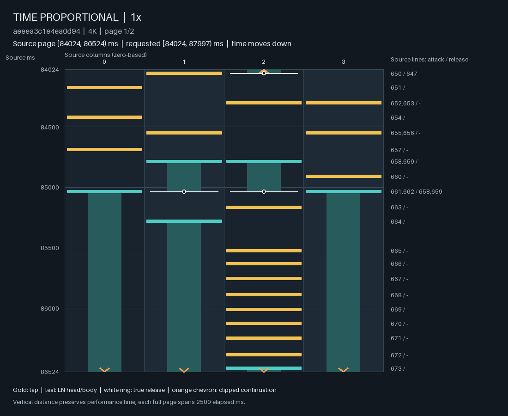

# Learned LN allocation from scoped progress

Learned scoped allocation reduces six native LN-fraction errors from a mean
.153796 to .099117. A matched module without allocation observations also reaches
.114877; the extra information's .015759 gain misses the prespecified .02
comparison, and live override control remains poor. Neither endpoint is
promoted. The experiment establishes an observable information gap and partial
amount improvement, not a repaired player response or stable playable system.

H still owns head times. R1 owns complete rows. The new 64-hidden MLP reads the
current full-audio query, R1 context, H preview, controls and scoped observations,
and returns one conditional LN-count log-odds shift. A matched context arm has
the same architecture with accounting observations zeroed. Both are disabled
unless explicitly selected in checkpoint probability options.

## Factual state and control ownership

Each LN-bearing control span has a stable identity, even when another span
uses the same numeric fraction. Partial style/difficulty overrides do not create
a new LN request. The last active LN-bearing assignment is the effective owner.
An interrupted request resumes its existing counters.

The immutable state keeps two pairs of counts for every announced LN request:

- Declared counts include all heads and LN starts inside its original interval,
  including intervals controlled by an override.
- Owned counts include only heads and LN starts while this request was the
  effective LN owner.

The current owner's readout contains asinh-scaled head/LN counts, observed
fraction and a nonempty flag for both pairs. It also contains elapsed owned time
as a fraction of total announced owned time and asinh-scaled remaining owned
seconds. Count scale is 32 heads; time scale is one second. The ordinary control
tensor already contains the original interval clocks and missingness.

These are descriptions of what happened and what control program is announced.
Neither count pair imposes a prefix quota, and the module does not redefine how
whole or interrupted scopes are evaluated. It may learn that local pure TAP
or pure LN passages are compatible with the requested full-range result.

Future control announcements are unavailable until received. A later update can
change remaining owned time but never rewrite counters or committed rows.
Factual scoring must use the control program available at the query; replaying
an earlier query with a subsequently announced override is a different input.
Teacher examples whose complete schedule is announced initially can use it
throughout. Full audio is available in both cases.

## Probability law

Let $q(a)$ be the neural row law after local frontier normalization,
$\gamma(a)=(n_H(a),n_R(a))$, and let $b_\psi$ be the new readout. For a known LN
request the module returns

$$
\widetilde q(a)
=q(\gamma(a))
\frac{q(a\mid\gamma(a))\exp[b_\psi n_{LN}(a)]}
{\mathbb E_{q(\cdot\mid\gamma(a))}\exp[b_\psi n_{LN}]}.
$$

This preserves neural head/release-count mass and relative layout odds inside
each full head/LN/release-count family. Recovery preference follows this layer
and can change final deployed family mass through layout/cost correlations.
There is no assertion that the whole generated trajectory preserves counts:
new LN choices change occupation and subsequent histories.

The final MLP projection is initialized to zero. Unknown LN requests return the
original neural probabilities exactly, regardless of learned weights. Thus an
adapter-only fit cannot change an unknown-LN native trajectory with identical
base tensors, controls and random streams. This is particularly relevant to the
existing Stream-only gains. The layer neither masks patterns nor supplies an
independent LN-coordination judgment.

## Source scoring and fixed-base learning

Checkpoint option `scope_allocation` is `none` by default and omitted from old
probability metadata. `context` and `progress` instantiate the matched arms.
`ControlledSession` maintains the immutable accounting state, including private
forks and live control changes.

Training supplies `allocation_features` through `score_interval`'s
`history_options` callback for row queries. Use
`features_before_rows(actual_rows, announced_controls, query_times)`: current
target rows and future LN endpoints never enter their own features. The helper
preserves query order and supports repeated times.

The initial comparison freezes the entire inherited model and trains only this
MLP. Its pre-layer probabilities, audio/context/preview/control inputs and
recovery preference are therefore constant on a factual source query and may
be cached. The adapter and its normalization must be recomputed at current
weights. This shortcut becomes invalid if any upstream weights or the factual
history change. Recover the actual deployed row law after the learned layer;
do not optimize an unnormalized tilt as though it were a likelihood.

## What the current checks establish

Two legal prefixes can have identical exact replay, head/row totals and more
than 511 common final rows, while their earlier scope LN-start counts differ
by 64. This supplies a concrete observability gap for the existing finite
history. It does not establish that the gap caused native quantity drift.

Focused checks cover this collision, override/resumption identities, strict
pre-query observations, immutable private state, zero initialization, unknown
condition identity, CPU/MPS gradients, neural family invariance, checkpoint
round-tripping and native versus partitioned factual probability reconstruction.
The completed fit and native observations below bound the actual benefit.
Larger R1/audio learning and independent continuation response remain separate
needs described in the [formal diagnosis](native_pattern_failure_analysis_zh.md).

## Matched learning and native results

The parent is the broader full-R1 arrangement candidate, SHA
5206b1e4dcbff9820a1e84ecf1ba02aee22c60105cae93d8f648ab6458780ea5.
All 4,600,369 inherited parameters remain bitwise unchanged. Each arm trains
only 69,953 new parameters, with the same initialization and 512 factual
eight-second windows from 425 charts and 392 song groups. These are previously
used parent-training windows, not a new-data coverage experiment. The five
native-panel audios were excluded from that parent phase; this does not assert
they were never exposed to an ancestor or used in earlier development.

There are 383 population and 129 human-annotation draws, 418 windows with an LN
request and 252 whole-song control programs. Training uses 256 updates, batch
two, AdamW learning rate .0005, weight decay .0001, gradient cap one and seed
280031. Source deployed-row NLL is normalized per second; LN feedback is off.
Recovery remains HH/RH/HR 60/50/50 ms. The same 22 validation windows give macro
nats/row 1.572470 / 1.570957 / 1.571176 for parent/context/progress.

These results require the feedback-off law: use `ln_feedback=None` with
`ControlledSession` or `ln_feedback=False` in the qualifier. Loading the
checkpoint does not disable older feedback defaults in other entrypoints.

Forty complete native outputs use the unchanged twenty-case panel for both
terminal checkpoints, without checkpoint selection by validation likelihood.
All H timelines match the parent. All eleven unknown-LN cases per arm also match
parent exported objects exactly. This retains the prior Stream routing gains
and the prior unresolved style/difficulty failures.

| Whole-song LN request | Parent, seeds 0 / 1 | Context only | With progress |
| --- | --- | --- | --- |
| Classic .217153 | .360472 / .437791 | .297396 / .393103 | .319927 / .390197 |
| STYX .485281 | .564394 / .696268 | .448020 / .650460 | .448020 / .538945 |
| Blizzard .838046 | .968517 / .976295 | .962733 / .943987 | .962733 / .941320 |

The progress arm improves mean absolute fraction error by .054679 against the
parent, exceeding the .04 condition, but only .015759 against the matched context
arm. Its relative benefit is concentrated in STYX seed 1; Classic seed 0 is
worse than the context arm. These six development cases do not establish a
population effect. No previously passing numeric gate fails, but pre-existing
amount, difficulty and override failures remain.

The live program must be assessed separately. Its override requests D4.5 and
LN fraction .6 on [64000,96000) ms:

| Override observation | Parent | Context only | With progress |
| --- | ---: | ---: | ---: |
| LN fraction | .940984 | .901186 | .897163 |
| Scoped difficulty proxy | 3.432769 | 3.236606 | 3.285719 |

Amount improves slightly while that difficulty proxy worsens. The progress
arm's preceding/restored fractions are .299180/.156642, versus parent
.147727/.123833. These fragments are diagnostic, not newly declared quotas.
They must not be pooled with the override to hide its error.

## The information is present, but recovery supervision is scarce

The 512 programs contain **zero overlapping LN-bearing requests**. Consequently
declared and effective-owner counts agree throughout these source examples,
although they can diverge after a real override. Implementing two correct
counters does not train their distinct meanings on such a dataset.

Of 23,736 known-LN H queries with nonempty source prefixes, 4.80% have cumulative
fraction error above .2. In the later half of the request, only **28/11,398,
or .246%**, do. That does not mean genuine local TAP/LN passages are invalid;
it describes how rarely factual imitation sees a large late allocation error
that still needs recovery.

A local sensitivity probe uses 991 held-out factual H queries. Holding audio,
history, controls, head totals and time fixed, it varies the continuous readout
coordinates corresponding to the observed LN fraction. Every measured
derivative is negative; mean $\partial b_\psi/\partial\rho_{\rm prefix}$ is
-.0610, and the later-half mean is -.0644. Thus the readout does use progress in
a corrective direction. The first-order effect of a .2 surplus is only about
-.012 log-odds at the average observed query.

For a fixed neural family $\gamma$, the tilt obeys

$$
\frac{\partial}{\partial b}
\mathbb E_{\widetilde q}[n_{LN}\mid\gamma]
=\operatorname{Var}_{\widetilde q}(n_{LN}\mid\gamma).
$$

This explains the local role of the learned shift; it is not a monotonicity
guarantee for a full rollout, whose states and deployed family mass also change.
The sensitivity probe is an infinitesimal input analysis, not a valid-history
counterfactual or an attribution of native quality. More training on the same
near-consistent factual states would not, by itself, supply missing evidence
about current-policy recovery or interrupted requests.

## Organization and the recurrence distinction exposed by Lens

Inspection covers 40 declared source/generated pages, with 34 distinct images,
and 18 additional witness/corpus pages. Action views retain original endpoints
and entering holds. These are agent readings, not new human style judgments,
listening tests or playtest results.

Classic retains mixed TAP/LN arrangements in both arms. The inspected STYX
episodes at [1800,7800) are identical between arms within each seed, despite the
whole-song amount difference: seed 0 is mixed, seed 1 remains mostly LN.
Blizzard [40342,46342) remains mostly changing holds, rather than the reference's
sustained anchors under TAP accents and paired short holds. That is an unresolved
relational difference, not a requirement that every generated chart copy the
source or that high coverage be penalized.

A new STYX progress-arm witness is more informative than the global amount.
At column 2, [85524,86497] ms contains eight TAPs followed by one LN press,
median/max HH gaps 121/140 ms. Other columns have no new heads during that run,
but **all three remain held**: columns 0 and 3 began at 85035, column 1 at 85280.
Parent and context arms use the same H times differently. The progress chart's
whole stars are 3.552520 and attack excess only .0000703125 seconds; neither
number describes the complete occupied-finger task.

Occupation does not make that full run unavoidable under the supplied H.
At 85524 ms, the alternative row `(0,3,1,0)` can release column 1 while tapping
column 2; at the next H, 85630 ms, `(0,1,0,0)` can tap the freed column 1.
Both pass exact replay and the same short-support check. This is existence of
an alternative allocation, not a sampled coverage estimate or proof that its
complete future is preferable. R1 retains these release/layout decisions.

The recurrence observer now preserves continuing other holds, their original
starts, simultaneous releases, recurrent TAP/LN types and every column's release
count within the observed run span. A zero companion-head count therefore no
longer invites the inference that other fingers were free. This is descriptive
context for a response model, not a new automatic BAD label.

Ranked retrieval provides important contrasts. It examines the top eight stored
run witnesses per chart in 1,972 TRAIN maps with metadata stars [3.5,4.5).
A narrow query for a similar run under nearly three held fingers retrieves no
match; that is not an exhaustive absence result. A broader query retrieves four
witnesses, including three independently recomputed source examples:

| Source | Whole stars | Recurrent heads | Timing and other roles |
| --- | ---: | --- | --- |
| Touhou EX Boss Rush!! +a Kouhen, Phantasm Stage | 4.160033 | 8 TAP + 1 LN press, 225682–227103 ms | Median HH 158 ms; up to two other holds and three companion heads |
| Bug Thief, Toaph's Swarm | 4.009425 | 9 LN presses, 100122–101406 ms | Median HH 160.5 ms; repeated 80/81-ms holds, changing occupied roles and seven companion heads |
| Without Boundaries, Wandering through spiritual space... | 4.485903 | 14 LN presses, 115483–117038 ms | Median HH 120 ms; one other sustained hold, no companion heads, thirteen intervening closes before the last head |

The last case's [first page](assets/scoped_ln_allocation/ranked-ln-recurrence-0.png)
and [continuation](assets/scoped_ln_allocation/ranked-ln-recurrence-1.png)
show why both held context and articulation matter. A nine-head limit would
erase genuine ranked organization. The generated nine-head witness and these
references differ in cadence, TAP/LN articulation, held-finger count, history
and surrounding flow; this study has not assigned an independent overall
preference between them.

The additional Classic LN-variation witnesses include a sustained hold beneath
other actions and a long hold over a sparse-H passage. A large duration-change
descriptor is therefore not treated as a negative label.

## A concrete support restriction found in the reference

The fourteen repeated LNs in Without Boundaries have durations
38, 40, 42, 44, 46, 48, 50, 52, 54, 56, 58, 60, 71 and 75 ms. Six actual closes
fall below the study's hard 50-ms head-to-release floor. Those transitions have
zero current support, regardless of network size or source NLL; factual loss
windows containing them cannot all be accepted by the current profile.

This does not prove the profile caused the generated STYX witness, nor does it
make every shorter hold appropriate. It supplies a concrete ranked example of
the broader support/exposure caveat: the full LN-jack articulation cannot be
learned faithfully while these targets are hard-excluded. Other windows from
the same chart can remain usable. Relaxing support, learning its preference and
checking native consequences are separate from declaring a pattern good.

## Interpretation and further work

Retain the factual accounting interface and both endpoints as research
artifacts; neither becomes the default. The matched result does not justify
scaling this source-only adapter recipe unchanged.

Two dependencies now have direct evidence. To learn scope recovery, examples
must cover actual reached allocation errors and the announced control programs,
including interruption/resumption. Outcomes must belong to their generated
histories and complete declared scopes; original source suffixes cannot be
substituted as gold after changing a prefix. To preserve intended LN expression,
training support must be audited against real articulation, while continuation
responses retain held roles, releases and accumulated attacks rather than only
amount or a single star scalar. These changes can be designed jointly, with
the existing unknown-LN arrangement gains and realtime contract retained as
separate checks.

## Resources and provenance

Implementation, fit and native source:
c0db49c142612750e04b586cfbd396a2e9036126. The held-context observer is added at
2cb03e6eb2bdd574f20043a5500eb2e64c2ed511; subsequent articulation fields are
read-only evaluator additions, not a new model sampling law.

On Apple M5 / 24 GiB / Torch 2.11, a first MPS-cache process stops at 174.70s
and 12,904,709,504-byte footprint before any optimizer update. Its failure is
preserved. CPU frozen-input extraction plus MPS adapter learning completes in
344.93s, peak 3,663,892,320 bytes. The forty CPU one-thread generations take
587.03s. Maximum qualifier startup/service are .841/.356s for context and
.810/.373s for progress. These use the two-second qualifier, not the separate
30-row/eight-second benchmark or the complete client path.

Run owner: 20260928-scoped-ln-allocation-v1. Checkpoint identities:

- Context: 40fb120d6debf7ba4aeefcc3c108b3b7a7a96cd58d5075ea10fd9e5a2c184196.
- Progress: 8898c51714474f82171b570cd2c8867bb07e911a59dfbae91b2642687de6a4ca.

| Evidence | SHA-256 |
| --- | --- |
| Revised frozen plan | 8e9cab84b87c324ef07ddfa1d7cb7f8bca3a66eea99b2bda1d4382cb809b1c3a |
| Context native cases | f704c76da13fbe4937c5b64a45cec81e1c04dd1dec8f6df25652968138c9962e |
| Progress native cases | daecd5bfb7613ea48bda480b5da89d4a697a6f8350cf73cd16be3d2dc66049e6 |
| Factual progress exposure | bc956bdf0dbd7e78b5b23bdd9bd8ae28167168a8bde0fdac1d63b12b41fd8ecf |
| Readout sensitivity | 9d1d4fb4bddcba723eb4fac1e61a227d615dd172a260dcf7d79dc34bb65a29ad |
| Ranked articulation | 424415b4bd7163ffd9485a1e646c308d7cddebac4815887d6db59ba2966c682c |
| Lens reading | f316e657b96e26c5b621917939f3e84ed1da28ce3d4ec9e8e0fef167669d8b89 |

The three ranked source SHA values in table order are
14f52a5457b157446ad2b6eef0eb84e2e183ee259d884d08cc3098e5afdc1ad4,
9a9eda5808f0624b8c412ed863537ffacdd7ae2f34feb4f20696f90c573ad015 and
b3f79f3899b2c8d9841e701a503c412607f51fd28dfea5fb987d9079fba19a2d.
Lens revision is 22e5c84f5cacb8493bdab5f1d0fdc09c5373dc60. Local binary
checkpoints and full outputs are not part of a fresh clone; the observations,
comparison definitions and selected figures above are.
